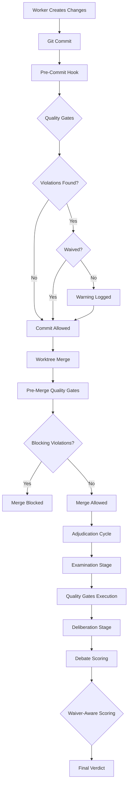

# CAWS Quality Gates Integration Summary

**Author:** @darianrosebrook  
**Date:** 2025-01-XX  
**Status:** Complete

## Overview

This document summarizes the integration of CAWS quality gates with waiver recognition into the agent-agency orchestration system. The integration ensures that quality gate violations are properly recognized and waived violations are correctly handled throughout the adjudication and worktree management processes.

## Integration Points

### 1. Quality Gates Script (`scripts/quality-gates/run-quality-gates.mjs`)

**Status:** ✅ Complete

**Changes:**
- Added `yaml` import from `js-yaml` for waiver file parsing
- Added `activeWaivers` property to `QualityGateRunner` class
- Implemented `loadActiveWaivers()` method to load waivers from `.caws/waivers/active-waivers.yaml`
- Implemented `isViolationWaived()` method to check violations against active waivers
- Updated `reportResults()` to:
  - Check waivers for each violation
  - Separate waived vs blocking violations
  - Report waived violations separately
  - Only block on non-waived violations
- Updated exit condition to only fail on blocking violations

**Waiver Recognition:**
- Waivers loaded from `.caws/waivers/active-waivers.yaml` and individual `.yaml` files
- Expired waivers automatically filtered out
- Violations matched against waivers by gate, file pattern, and violation type
- Waived violations annotated with waiver details (`waivedBy`, `waiverTitle`, `waiverExpires`)

### 2. Exception Framework (`scripts/quality-gates/shared-exception-framework.mjs`)

**Status:** ✅ Already Complete

**Existing Functionality:**
- Already includes `loadCawsWaivers()` function
- Already merges CAWS waivers with standard exceptions
- Already handles `waiver_` prefixed exceptions
- Already normalizes exception dates

**No changes needed** - this file already had full waiver support.

### 3. CAWS Quality Gates Executor (`src/planning/caws_quality_gates.rs`)

**Status:** ✅ Complete

**New Module:**
- `CawsQualityGateExecutor` struct for invoking quality gates script
- `execute_quality_gates()` method that runs the script and parses JSON output
- `CawsQualityGateResult` struct with waiver-aware violation information
- `QualityGateViolation` struct with waiver details
- `WaiverInfo` struct for active waiver tracking

**Features:**
- Executes quality gates script in different contexts (commit, push, ci)
- Parses JSON output to extract violations and waiver information
- Handles script execution errors gracefully
- Returns structured results for integration with other systems

### 4. Adjudication Cycle (`src/planning/caws_adjudication_cycle.rs`)

**Status:** ✅ Complete

**Changes:**
- Added `quality_gates_executor` field to `CawsAdjudicationCycle` struct
- Integrated quality gates execution in `stage_examination()`:
  - Executes quality gates with waiver recognition
  - Logs waived vs blocking violations
  - Returns quality gate results for use in deliberation
- Updated `stage_deliberation()` to:
  - Accept quality gate results as parameter
  - Pass quality gate results to debate scorer
  - Use waiver-aware scoring when quality gates are available

**Integration Flow:**
1. Examination stage executes quality gates
2. Quality gate results (with waiver info) passed to deliberation
3. Deliberation uses quality gate results in debate scoring
4. Only blocking (non-waived) violations affect scoring

### 5. Debate Scorer (`src/planning/caws_debate_scorer.rs`)

**Status:** ✅ Complete

**Changes:**
- Added `score_solution_with_claims_and_gates()` method:
  - Accepts optional `CawsQualityGateResult`
  - Uses waiver-aware gate integrity scoring when available
- Added `calculate_gate_integrity_with_waivers()` method:
  - Only penalizes blocking (non-waived) violations
  - Maintains or boosts score when all violations are waived
  - Applies proportional penalty based on blocking violation rate
- Updated `score_solution_with_claims()` to delegate to new method

**Scoring Logic:**
- Base gate integrity score calculated from artifacts
- Adjusted based on CAWS quality gate results
- Only blocking violations reduce score
- Waived violations don't affect score (maintains minimum 0.8 when all waived)
- Quality gate pass boosts score by up to 20%

### 6. Worktree Manager (`src/planning/worktree_manager.rs`)

**Status:** ✅ Complete

**Changes:**
- Added `quality_gates_executor` field to `WorktreeManager` struct
- Initialized quality gates executor in constructor
- Added pre-merge quality gates check in `merge_worktree()`:
  - Executes quality gates before merge
  - Blocks merge if blocking violations found
  - Allows merge if all violations are waived
  - Logs waived violations for audit trail

**Pre-Merge Validation:**
- Quality gates executed in "push" context before merge
- Only blocking violations prevent merge
- Waived violations logged but don't block merge
- Graceful degradation if quality gates fail to execute

### 7. Pre-Commit Hook (`.githooks/pre-commit`)

**Status:** ✅ Complete

**Changes:**
- Added CAWS quality gates execution to pre-commit hook
- Runs quality gates in "commit" context (warns but doesn't block)
- Displays waived vs blocking violations
- Allows commit to proceed (warn-only mode for pre-commit)
- Can be bypassed with `--no-verify` flag

**Hook Behavior:**
- Pre-commit: Warns about violations (doesn't block)
- Push: Blocks on blocking violations (enforced by worktree manager)
- Waived violations logged but don't block commits

## Integration Flow Diagram

## Waiver Recognition Flow

1. **Waiver Loading:**
   - Waivers loaded from `.caws/waivers/active-waivers.yaml`
   - Individual waiver files in `.caws/waivers/` directory
   - Expired waivers automatically filtered

2. **Violation Matching:**
   - Each violation checked against active waivers
   - Matched by gate name, file pattern, and violation type
   - Waived violations annotated with waiver details

3. **Enforcement:**
   - Pre-commit: Warns but allows commit (waived violations logged)
   - Pre-merge: Blocks merge if blocking violations exist
   - Adjudication: Only blocking violations affect scoring
   - Debate: Waiver-aware gate integrity scoring

## Key Benefits

1. **Waiver Recognition:** Violations covered by active waivers don't block commits or merges
2. **Audit Trail:** All waived violations logged with waiver details
3. **Flexible Enforcement:** Different enforcement levels for commit vs merge vs CI
4. **Graceful Degradation:** System continues to function if quality gates fail to execute
5. **Integrated Scoring:** Quality gate results integrated into debate scoring algorithm

## Testing Recommendations

1. **Unit Tests:**
   - Test waiver loading and expiration filtering
   - Test violation matching against waivers
   - Test waiver-aware scoring calculations

2. **Integration Tests:**
   - Test pre-commit hook with waived violations
   - Test pre-merge blocking with blocking violations
   - Test adjudication cycle with quality gate results

3. **End-to-End Tests:**
   - Test complete workflow with waived violations
   - Test merge blocking with blocking violations
   - Test debate scoring with waiver-aware results

## Future Enhancements

1. **Waiver Management UI:** Add UI for creating and managing waivers
2. **Waiver Analytics:** Track waiver usage and effectiveness
3. **Automatic Waiver Expiration:** Notify when waivers are about to expire
4. **Waiver Templates:** Pre-defined waiver templates for common scenarios
5. **Waiver Approval Workflow:** Multi-level approval for waivers

## Related Files

- `scripts/quality-gates/run-quality-gates.mjs` - Main quality gates script
- `scripts/quality-gates/shared-exception-framework.mjs` - Exception/waiver framework
- `src/planning/caws_quality_gates.rs` - Quality gates executor
- `src/planning/caws_adjudication_cycle.rs` - Adjudication cycle integration
- `src/planning/caws_debate_scorer.rs` - Debate scorer with waiver-aware scoring
- `src/planning/worktree_manager.rs` - Worktree manager with pre-merge checks
- `.githooks/pre-commit` - Pre-commit hook with quality gates

## Conclusion

The CAWS quality gates integration with waiver recognition is now complete across all integration points in the agent-agency orchestration system. Waivers are properly recognized and applied throughout the commit, merge, and adjudication processes, ensuring that waived violations don't block workflow while maintaining quality standards.

