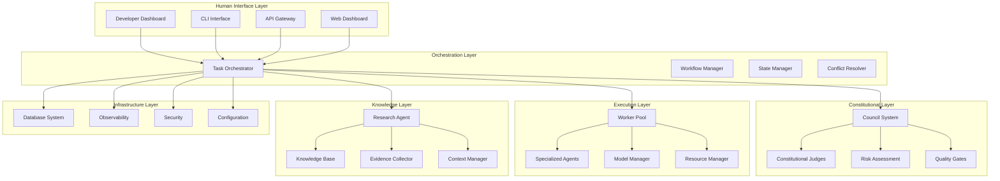
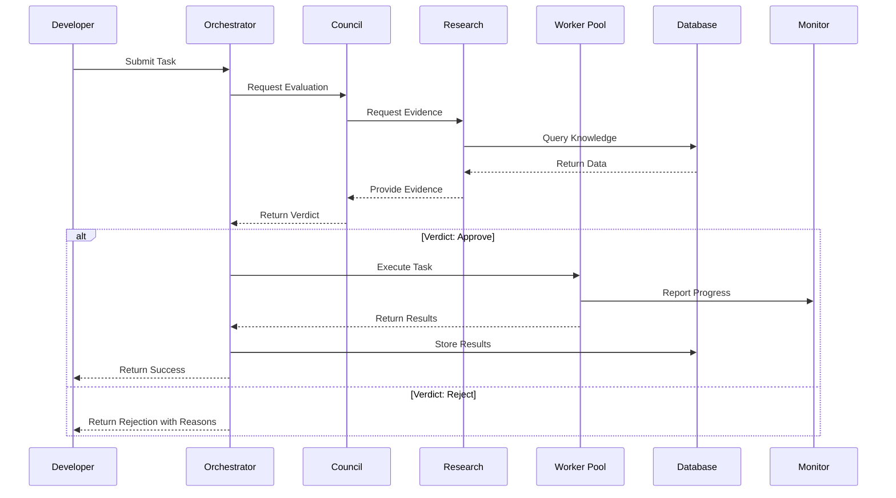
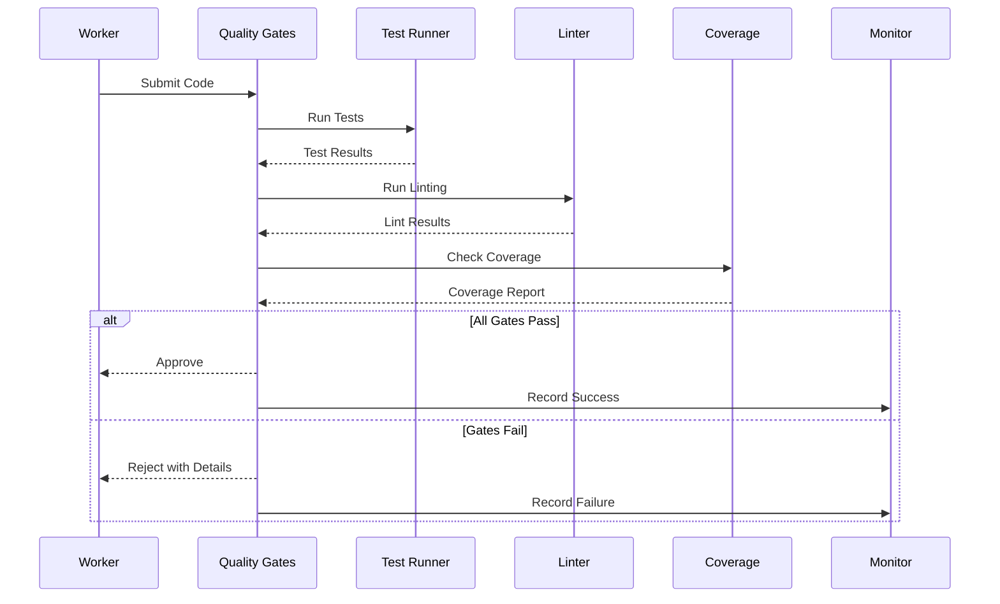
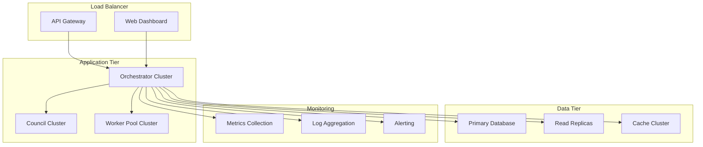
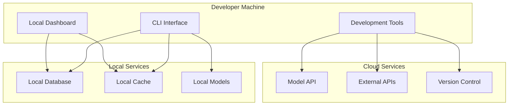

# End-to-End Architecture

**Author:** @darianrosebrook  
**Purpose:** Complete architectural overview of the Agent Agency v3 system from high-level concepts to implementation details

---

## System Vision

Agent Agency v3 is a **constitutional AI system** that enables autonomous software development through multi-agent orchestration, governed by the Coding-Agent Working Standard (CAWS). The system combines specialized AI agents with rigorous quality gates, safety mechanisms, and human oversight to deliver production-ready software.

## High-Level Architecture



## Core Principles

### 1. Constitutional AI Governance

The system operates under a **constitutional framework** where all AI decisions are governed by explicit rules, quality standards, and safety mechanisms. This ensures:

- **Transparency:** All decisions are explainable and auditable
- **Safety:** Multiple layers of validation and approval
- **Quality:** Rigorous testing and compliance enforcement
- **Accountability:** Complete provenance and audit trails

### 2. Multi-Agent Specialization

Different AI agents specialize in specific domains:

- **Frontend Specialists:** React, Vue, Angular development
- **Backend Specialists:** API design, database operations
- **Database Specialists:** Schema design, migrations, optimization
- **Testing Specialists:** Unit, integration, E2E testing
- **DevOps Specialists:** CI/CD, deployment, infrastructure

### 3. Human-AI Collaboration

The system maintains **human oversight** through:

- **Approval Gates:** Human review for critical decisions
- **Intervention Points:** Manual override capabilities
- **Progress Monitoring:** Real-time visibility into agent activities
- **Quality Assurance:** Human validation of agent outputs

## Detailed Component Architecture

### Constitutional Layer

#### Council System

The **Council System** serves as the constitutional authority, making all high-level decisions through a multi-judge framework:

```rust
pub struct CouncilCoordinator {
    pub judges: Vec<Box<dyn Judge>>,
    pub risk_assessor: RiskAssessor,
    pub consensus_engine: ConsensusEngine,
    pub caws_validator: CawsValidator,
}

impl CouncilCoordinator {
    pub async fn evaluate_task(&self, task: &Task) -> Result<Verdict, CouncilError> {
        // 1. Collect evidence from Research Agent
        let evidence = self.research_agent.collect_evidence(&task).await?;
        
        // 2. Assess risk level
        let risk_level = self.risk_assessor.assess(&task, &evidence).await?;
        
        // 3. Route to appropriate judges based on risk tier
        let judges = self.select_judges_for_risk_tier(risk_level);
        
        // 4. Collect verdicts from judges
        let verdicts = self.collect_verdicts(judges, &task, &evidence).await?;
        
        // 5. Reach consensus
        let consensus = self.consensus_engine.reach_consensus(verdicts).await?;
        
        // 6. Validate CAWS compliance
        self.caws_validator.validate_verdict(&consensus).await?;
        
        Ok(consensus)
    }
}
```

#### Constitutional Judges

Four specialized judges evaluate different aspects of proposed changes:

**Logic Judge**
- Evaluates logical consistency and reasoning
- Checks for algorithmic correctness
- Validates data flow and dependencies
- Ensures proper error handling

**Security Judge**
- Assesses security implications and vulnerabilities
- Validates authentication and authorization
- Checks for data exposure risks
- Ensures secure coding practices

**Performance Judge**
- Reviews performance impact and optimization
- Validates resource usage patterns
- Checks for scalability concerns
- Ensures efficient algorithms

**Compliance Judge**
- Ensures CAWS compliance and quality standards
- Validates testing requirements
- Checks documentation standards
- Ensures code quality metrics

### Execution Layer

#### Worker Pool System

The **Worker Pool** manages specialized agents that execute specific tasks:

```rust
pub struct WorkerPoolManager {
    pub workers: HashMap<WorkerId, Box<dyn Worker>>,
    pub task_queue: TaskQueue,
    pub resource_monitor: ResourceMonitor,
    pub model_manager: ModelManager,
}

impl WorkerPoolManager {
    pub async fn execute_task(&self, task: Task) -> Result<TaskResult, WorkerError> {
        // 1. Select appropriate worker based on task requirements
        let worker = self.select_worker(&task).await?;
        
        // 2. Allocate resources
        let resources = self.resource_monitor.allocate(&task).await?;
        
        // 3. Load appropriate model
        let model = self.model_manager.load_model(&task.model_requirements).await?;
        
        // 4. Execute task with safety guardrails
        let result = worker.execute_with_guardrails(task, model, resources).await?;
        
        // 5. Validate output quality
        self.validate_output(&result).await?;
        
        // 6. Release resources
        self.resource_monitor.release(resources).await?;
        
        Ok(result)
    }
}
```

#### Specialized Workers

Each worker type has specific capabilities and constraints:

**Frontend Worker**
```rust
pub struct FrontendWorker {
    pub framework: FrontendFramework,
    pub tools: Vec<FrontendTool>,
    pub quality_standards: QualityStandards,
}

impl Worker for FrontendWorker {
    async fn execute_task(&self, task: Task) -> Result<TaskResult, WorkerError> {
        match task.specialty {
            TaskSpecialty::ComponentDevelopment => {
                self.develop_component(task).await
            }
            TaskSpecialty::Styling => {
                self.implement_styling(task).await
            }
            TaskSpecialty::Testing => {
                self.write_tests(task).await
            }
            _ => Err(WorkerError::IncompatibleSpecialty)
        }
    }
}
```

**Backend Worker**
```rust
pub struct BackendWorker {
    pub language: ProgrammingLanguage,
    pub framework: BackendFramework,
    pub database_engine: DatabaseEngine,
}

impl Worker for BackendWorker {
    async fn execute_task(&self, task: Task) -> Result<TaskResult, WorkerError> {
        match task.specialty {
            TaskSpecialty::ApiDesign => {
                self.design_api(task).await
            }
            TaskSpecialty::DatabaseOperations => {
                self.implement_database_operations(task).await
            }
            TaskSpecialty::Authentication => {
                self.implement_authentication(task).await
            }
            _ => Err(WorkerError::IncompatibleSpecialty)
        }
    }
}
```

### Knowledge Layer

#### Research Agent

The **Research Agent** provides context and evidence for decision-making:

```rust
pub struct ResearchAgent {
    pub knowledge_base: Arc<KnowledgeBase>,
    pub retrieval_engine: Arc<RetrievalEngine>,
    pub evidence_collector: Arc<EvidenceCollector>,
    pub context_manager: Arc<ContextManager>,
}

impl ResearchAgent {
    pub async fn collect_evidence(&self, claim: &Claim) -> Result<Vec<Evidence>, ResearchError> {
        // 1. Search knowledge base for relevant information
        let knowledge_items = self.knowledge_base.search(&claim.query).await?;
        
        // 2. Analyze codebase for supporting evidence
        let code_evidence = self.analyze_codebase(&claim.scope).await?;
        
        // 3. Collect performance and quality metrics
        let metrics = self.collect_metrics(&claim.scope).await?;
        
        // 4. Gather test results and coverage data
        let test_evidence = self.collect_test_evidence(&claim.scope).await?;
        
        // 5. Compile comprehensive evidence package
        let evidence = EvidencePackage {
            knowledge_items,
            code_evidence,
            metrics,
            test_evidence,
            confidence_score: self.calculate_confidence(&knowledge_items),
        };
        
        Ok(vec![evidence])
    }
}
```

#### Knowledge Base

The **Knowledge Base** stores and retrieves information about the codebase:

```rust
pub trait KnowledgeBase {
    async fn index_document(&self, doc: Document) -> Result<(), KnowledgeError>;
    async fn search(&self, query: &SearchQuery) -> Result<Vec<SearchResult>, KnowledgeError>;
    async fn get_context(&self, item_id: &ItemId) -> Result<Context, KnowledgeError>;
    async fn update_index(&self, changes: &[Change]) -> Result<(), KnowledgeError>;
}

pub struct SemanticKnowledgeBase {
    pub vector_store: Arc<VectorStore>,
    pub text_index: Arc<TextIndex>,
    pub graph_index: Arc<GraphIndex>,
    pub metadata_store: Arc<MetadataStore>,
}
```

### Infrastructure Layer

#### Database System

The **Database System** provides persistence and state management:

```rust
pub struct DatabaseSystem {
    pub artifact_store: Arc<ArtifactStore>,
    pub state_manager: Arc<StateManager>,
    pub backup_validator: Arc<BackupValidator>,
    pub migration_manager: Arc<MigrationManager>,
}

impl DatabaseSystem {
    pub async fn store_artifact(&self, artifact: Artifact) -> Result<ArtifactId, DatabaseError> {
        // 1. Validate artifact integrity
        self.validate_artifact(&artifact).await?;
        
        // 2. Generate unique identifier
        let artifact_id = ArtifactId::generate();
        
        // 3. Store in artifact store
        self.artifact_store.store(artifact_id.clone(), artifact).await?;
        
        // 4. Update metadata
        self.update_metadata(&artifact_id, &artifact.metadata).await?;
        
        // 5. Trigger backup if needed
        if self.should_backup(&artifact) {
            self.trigger_backup(&artifact_id).await?;
        }
        
        Ok(artifact_id)
    }
}
```

#### Observability System

The **Observability System** provides monitoring and alerting:

```rust
pub struct ObservabilitySystem {
    pub metrics_collector: Arc<MetricsCollector>,
    pub health_monitor: Arc<HealthMonitor>,
    pub alert_manager: Arc<AlertManager>,
    pub trace_collector: Arc<TraceCollector>,
}

impl ObservabilitySystem {
    pub async fn record_execution_metrics(&self, execution: &TaskExecution) -> Result<(), ObservabilityError> {
        // Record performance metrics
        self.metrics_collector.record_metric(Metric {
            name: "task_execution_duration",
            value: execution.duration.as_secs_f64(),
            tags: execution.tags.clone(),
        }).await?;
        
        // Record resource usage
        self.metrics_collector.record_metric(Metric {
            name: "cpu_usage",
            value: execution.cpu_usage,
            tags: execution.tags.clone(),
        }).await?;
        
        // Record memory usage
        self.metrics_collector.record_metric(Metric {
            name: "memory_usage",
            value: execution.memory_usage,
            tags: execution.tags.clone(),
        }).await?;
        
        // Check for alerts
        self.check_alerts(execution).await?;
        
        Ok(())
    }
}
```

## Data Flow Architecture

### Task Execution Flow



### Quality Assurance Flow



## Safety and Security Architecture

### Multi-Layer Safety

1. **Constitutional Layer:** Council system enforces high-level policies
2. **Execution Layer:** Worker pool enforces task-specific constraints
3. **Infrastructure Layer:** Database and observability enforce system-wide limits
4. **Human Layer:** Developer oversight and intervention capabilities

### Security Mechanisms

```rust
pub struct SecurityManager {
    pub policy_enforcer: Arc<PolicyEnforcer>,
    pub auth_system: Arc<AuthSystem>,
    pub risk_assessor: Arc<RiskAssessor>,
    pub audit_logger: Arc<AuditLogger>,
}

impl SecurityManager {
    pub async fn validate_operation(&self, operation: &Operation) -> Result<SecurityDecision, SecurityError> {
        // 1. Authenticate user
        let user = self.auth_system.authenticate(&operation.user).await?;
        
        // 2. Check authorization
        let authorized = self.check_authorization(&user, &operation).await?;
        
        // 3. Assess risk
        let risk_level = self.risk_assessor.assess(&operation).await?;
        
        // 4. Enforce policies
        let policy_decision = self.policy_enforcer.enforce(&operation, &risk_level).await?;
        
        // 5. Log audit trail
        self.audit_logger.log_operation(&operation, &policy_decision).await?;
        
        Ok(policy_decision)
    }
}
```

## Performance Architecture

### Scalability Design

1. **Horizontal Scaling:** Worker pool can scale based on demand
2. **Vertical Scaling:** Individual workers can use more resources
3. **Caching:** Aggressive caching at multiple layers
4. **Load Balancing:** Intelligent task distribution
5. **Resource Management:** Dynamic resource allocation

### Performance Optimization

```rust
pub struct PerformanceOptimizer {
    pub cache_manager: Arc<CacheManager>,
    pub load_balancer: Arc<LoadBalancer>,
    pub resource_optimizer: Arc<ResourceOptimizer>,
    pub model_optimizer: Arc<ModelOptimizer>,
}

impl PerformanceOptimizer {
    pub async fn optimize_execution(&self, task: &Task) -> Result<OptimizationPlan, OptimizationError> {
        // 1. Analyze task requirements
        let requirements = self.analyze_requirements(task).await?;
        
        // 2. Select optimal model
        let model = self.model_optimizer.select_model(&requirements).await?;
        
        // 3. Allocate resources
        let resources = self.resource_optimizer.allocate(&requirements).await?;
        
        // 4. Configure caching
        let cache_config = self.cache_manager.configure(&task).await?;
        
        // 5. Create optimization plan
        let plan = OptimizationPlan {
            model,
            resources,
            cache_config,
            parallelization_strategy: self.determine_parallelization(&task),
        };
        
        Ok(plan)
    }
}
```

## Deployment Architecture

### Production Deployment



### Development Environment



## Integration Patterns

### External System Integration

1. **Version Control:** Git integration for code management
2. **CI/CD:** Jenkins, GitHub Actions integration
3. **Cloud Services:** AWS, Azure, GCP integration
4. **Monitoring:** Prometheus, Grafana integration
5. **Communication:** Slack, Teams integration

### API Design

```rust
// RESTful API for external integration
pub struct AgentAgencyAPI {
    pub task_service: Arc<TaskService>,
    pub worker_service: Arc<WorkerService>,
    pub monitoring_service: Arc<MonitoringService>,
}

impl AgentAgencyAPI {
    // Task management endpoints
    pub async fn create_task(&self, request: CreateTaskRequest) -> Result<TaskResponse, APIError>;
    pub async fn get_task_status(&self, task_id: &TaskId) -> Result<TaskStatus, APIError>;
    pub async fn cancel_task(&self, task_id: &TaskId) -> Result<(), APIError>;
    
    // Worker management endpoints
    pub async fn list_workers(&self) -> Result<Vec<WorkerInfo>, APIError>;
    pub async fn get_worker_status(&self, worker_id: &WorkerId) -> Result<WorkerStatus, APIError>;
    
    // Monitoring endpoints
    pub async fn get_metrics(&self, query: &MetricsQuery) -> Result<MetricsResponse, APIError>;
    pub async fn get_health(&self) -> Result<HealthStatus, APIError>;
}
```

---

This end-to-end architecture provides a comprehensive view of the Agent Agency v3 system, from high-level concepts to implementation details, enabling developers and users to understand the complete system capabilities and design.

