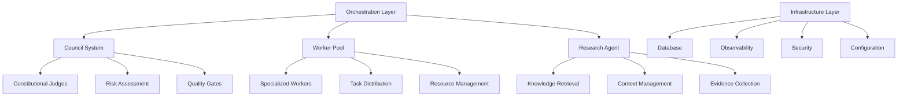
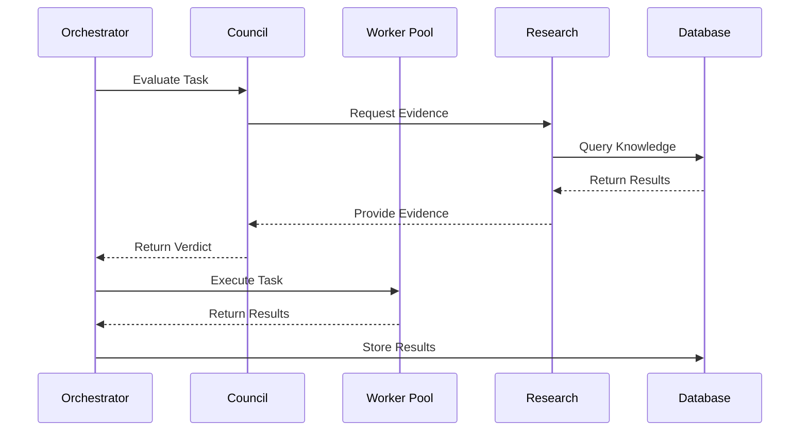

# Module Capabilities Reference

**Author:** @darianrosebrook  
**Purpose:** Comprehensive reference for all v3 modules, their capabilities, APIs, and integration points

---

## Architecture Overview

The Agent Agency v3 system is built as a modular architecture with specialized components for different aspects of autonomous agent operation.



## Core Modules

### 1. Council System (`council/`)

**Purpose:** Constitutional oversight and decision-making framework

#### Key Components

**Constitutional Judges**
- **Logic Judge:** Evaluates logical consistency and reasoning
- **Security Judge:** Assesses security implications and vulnerabilities  
- **Performance Judge:** Reviews performance impact and optimization
- **Compliance Judge:** Ensures CAWS compliance and quality standards

**Risk Assessment Framework**
- **Tier 1 (Critical):** Authentication, billing, data migrations
- **Tier 2 (Standard):** Features, APIs, data operations
- **Tier 3 (Low Risk):** UI changes, internal tools

#### API Reference

```rust
// Council Coordinator
pub struct CouncilCoordinator {
    pub judges: Vec<Box<dyn Judge>>,
    pub risk_assessor: RiskAssessor,
    pub consensus_engine: ConsensusEngine,
}

impl CouncilCoordinator {
    pub async fn evaluate_task(&self, task: &Task) -> Result<Verdict, CouncilError>;
    pub async fn assess_risk(&self, change: &Change) -> Result<RiskLevel, CouncilError>;
    pub async fn reach_consensus(&self, verdicts: Vec<Verdict>) -> Result<Consensus, CouncilError>;
}

// Individual Judge Interface
pub trait Judge {
    async fn evaluate(&self, evidence: &Evidence) -> Result<JudgeVerdict, JudgeError>;
    fn get_specialty(&self) -> JudgeSpecialty;
    fn get_risk_tier(&self) -> RiskTier;
}
```

#### Integration Points

- **CAWS Runtime Validator:** Receives compliance data
- **Research Agent:** Provides evidence and context
- **Worker Pool:** Receives task evaluations
- **Database:** Stores verdicts and audit trails

### 2. Worker Pool System (`workers/`)

**Purpose:** Specialized agent execution and task distribution

#### Key Components

**Autonomous Executor**
- Task execution with safety guardrails
- Model hot-swapping capabilities
- Resource management and monitoring
- Error handling and recovery

**Specialized Workers**
- **Frontend Worker:** React, Vue, Angular development
- **Backend Worker:** API design, database operations
- **Database Worker:** Schema design, migrations, optimization
- **Testing Worker:** Unit, integration, E2E testing
- **DevOps Worker:** CI/CD, deployment, infrastructure

#### API Reference

```rust
// Worker Pool Manager
pub struct WorkerPoolManager {
    pub workers: HashMap<WorkerId, Box<dyn Worker>>,
    pub task_queue: TaskQueue,
    pub resource_monitor: ResourceMonitor,
}

impl WorkerPoolManager {
    pub async fn submit_task(&self, task: Task) -> Result<TaskId, WorkerError>;
    pub async fn get_worker_status(&self, worker_id: &WorkerId) -> Result<WorkerStatus, WorkerError>;
    pub async fn scale_workers(&self, count: usize) -> Result<(), WorkerError>;
}

// Worker Interface
pub trait Worker {
    async fn execute_task(&self, task: Task) -> Result<TaskResult, WorkerError>;
    fn get_specialty(&self) -> WorkerSpecialty;
    fn get_capabilities(&self) -> Vec<Capability>;
    fn get_resource_requirements(&self) -> ResourceRequirements;
}
```

#### Integration Points

- **Council System:** Receives task evaluations
- **Research Agent:** Accesses knowledge and context
- **Database:** Stores task results and metrics
- **Observability:** Reports execution metrics

### 3. Research Agent (`research/`)

**Purpose:** Knowledge retrieval, context management, and evidence collection

#### Key Components

**Knowledge Retrieval**
- Semantic search across codebase
- Documentation and comment analysis
- Pattern recognition and similarity matching
- Context-aware information extraction

**Evidence Collection**
- Code analysis and metrics
- Test coverage and quality data
- Performance benchmarks
- Security scan results

#### API Reference

```rust
// Research Agent
pub struct ResearchAgent {
    pub knowledge_base: Arc<KnowledgeBase>,
    pub retrieval_engine: Arc<RetrievalEngine>,
    pub evidence_collector: Arc<EvidenceCollector>,
}

impl ResearchAgent {
    pub async fn search_knowledge(&self, query: &str, context: &SearchContext) -> Result<Vec<KnowledgeItem>, ResearchError>;
    pub async fn collect_evidence(&self, claim: &Claim) -> Result<Vec<Evidence>, ResearchError>;
    pub async fn analyze_codebase(&self, scope: &Scope) -> Result<CodebaseAnalysis, ResearchError>;
}

// Knowledge Base Interface
pub trait KnowledgeBase {
    async fn index_document(&self, doc: Document) -> Result<(), KnowledgeError>;
    async fn search(&self, query: &SearchQuery) -> Result<Vec<SearchResult>, KnowledgeError>;
    async fn get_context(&self, item_id: &ItemId) -> Result<Context, KnowledgeError>;
}
```

#### Integration Points

- **Council System:** Provides evidence for decisions
- **Worker Pool:** Supplies context for tasks
- **Database:** Stores and retrieves knowledge
- **File System:** Monitors and indexes changes

### 4. Orchestration Core (`orchestration/`)

**Purpose:** High-level coordination and workflow management

#### Key Components

**Task Orchestrator**
- End-to-end task execution
- Workflow coordination
- State management
- Error handling and recovery

**Arbiter System**
- Multi-agent coordination
- Conflict resolution
- Resource allocation
- Quality assurance

#### API Reference

```rust
// Task Orchestrator
pub struct TaskOrchestrator {
    pub council: Arc<CouncilCoordinator>,
    pub worker_pool: Arc<WorkerPoolManager>,
    pub research: Arc<ResearchAgent>,
    pub state_manager: Arc<StateManager>,
}

impl TaskOrchestrator {
    pub async fn execute_task(&self, task: Task) -> Result<TaskResult, OrchestrationError>;
    pub async fn coordinate_workflow(&self, workflow: Workflow) -> Result<WorkflowResult, OrchestrationError>;
    pub async fn handle_conflict(&self, conflict: Conflict) -> Result<Resolution, OrchestrationError>;
}

// Workflow Definition
pub struct Workflow {
    pub steps: Vec<WorkflowStep>,
    pub dependencies: Vec<Dependency>,
    pub quality_gates: Vec<QualityGate>,
    pub rollback_strategy: RollbackStrategy,
}
```

#### Integration Points

- **All Core Modules:** Coordinates between all systems
- **Database:** Manages workflow state
- **Observability:** Reports orchestration metrics
- **Configuration:** Manages system settings

## Infrastructure Modules

### 5. Database System (`database/`)

**Purpose:** Data persistence, caching, and state management

#### Key Components

**Artifact Store**
- Code artifact storage
- Version management
- Metadata indexing
- Search capabilities

**Backup Validator**
- Data integrity verification
- Backup validation
- Recovery testing
- Consistency checks

#### API Reference

```rust
// Database Client
pub struct DatabaseClient {
    pub pool: Arc<Pool>,
    pub artifact_store: Arc<ArtifactStore>,
    pub backup_validator: Arc<BackupValidator>,
}

impl DatabaseClient {
    pub async fn store_artifact(&self, artifact: Artifact) -> Result<ArtifactId, DatabaseError>;
    pub async fn retrieve_artifact(&self, id: &ArtifactId) -> Result<Artifact, DatabaseError>;
    pub async fn search_artifacts(&self, query: &SearchQuery) -> Result<Vec<Artifact>, DatabaseError>;
    pub async fn validate_backup(&self, backup_id: &BackupId) -> Result<ValidationResult, DatabaseError>;
}
```

### 6. Observability System (`observability/`)

**Purpose:** Monitoring, metrics, and system health

#### Key Components

**Metrics Collection**
- Performance metrics
- Resource utilization
- Error rates and patterns
- Custom business metrics

**Health Monitoring**
- System health checks
- Component status
- Alert management
- SLO monitoring

#### API Reference

```rust
// Observability Manager
pub struct ObservabilityManager {
    pub metrics_collector: Arc<MetricsCollector>,
    pub health_monitor: Arc<HealthMonitor>,
    pub alert_manager: Arc<AlertManager>,
}

impl ObservabilityManager {
    pub async fn record_metric(&self, metric: Metric) -> Result<(), ObservabilityError>;
    pub async fn check_health(&self, component: &Component) -> Result<HealthStatus, ObservabilityError>;
    pub async fn send_alert(&self, alert: Alert) -> Result<(), ObservabilityError>;
}
```

### 7. Security System (`security/`)

**Purpose:** Authentication, authorization, and security enforcement

#### Key Components

**Policy Enforcer**
- Security policy validation
- Access control enforcement
- Risk assessment
- Compliance monitoring

**Authentication System**
- API key management
- Token validation
- Session management
- Multi-factor authentication

#### API Reference

```rust
// Security Manager
pub struct SecurityManager {
    pub policy_enforcer: Arc<PolicyEnforcer>,
    pub auth_system: Arc<AuthSystem>,
    pub risk_assessor: Arc<RiskAssessor>,
}

impl SecurityManager {
    pub async fn validate_access(&self, request: &AccessRequest) -> Result<AccessDecision, SecurityError>;
    pub async fn enforce_policy(&self, action: &Action) -> Result<PolicyDecision, SecurityError>;
    pub async fn assess_risk(&self, operation: &Operation) -> Result<RiskAssessment, SecurityError>;
}
```

## Specialized Modules

### 8. Apple Silicon Optimization (`apple-silicon/`)

**Purpose:** Core ML integration and Apple Silicon acceleration

#### Key Components

**Core ML Manager**
- Model loading and optimization
- ANE acceleration
- Memory management
- Performance monitoring

**Model Hot-Swapping**
- Runtime model switching
- Context preservation
- Performance optimization
- Fallback mechanisms

#### API Reference

```rust
// Core ML Manager
pub struct CoreMLManager {
    pub model_registry: Arc<ModelRegistry>,
    pub optimization_engine: Arc<OptimizationEngine>,
    pub performance_monitor: Arc<PerformanceMonitor>,
}

impl CoreMLManager {
    pub async fn load_model(&self, model_path: &Path) -> Result<ModelRef, CoreMLError>;
    pub async fn optimize_model(&self, model: &ModelRef) -> Result<OptimizedModel, CoreMLError>;
    pub async fn hot_swap_model(&self, from: ModelRef, to: ModelRef) -> Result<(), CoreMLError>;
}
```

### 9. MCP Integration (`mcp-integration/`)

**Purpose:** Model Context Protocol integration for tool discovery and execution

#### Key Components

**Tool Discovery**
- Dynamic tool registration
- Capability detection
- Interface validation
- Version management

**Tool Registry**
- Tool catalog management
- Usage tracking
- Performance monitoring
- Error handling

#### API Reference

```rust
// MCP Integration Server
pub struct MCPIntegrationServer {
    pub tool_registry: Arc<ToolRegistry>,
    pub discovery_service: Arc<DiscoveryService>,
    pub execution_engine: Arc<ExecutionEngine>,
}

impl MCPIntegrationServer {
    pub async fn discover_tools(&self) -> Result<Vec<Tool>, MCPError>;
    pub async fn register_tool(&self, tool: Tool) -> Result<ToolId, MCPError>;
    pub async fn execute_tool(&self, tool_id: &ToolId, params: &Params) -> Result<ToolResult, MCPError>;
}
```

### 10. Workspace State Manager (`workspace-state-manager/`)

**Purpose:** Workspace detection, monitoring, and state management

#### Key Components

**State Capture**
- Full filesystem scanning
- Git-based indexing
- Incremental updates
- Hybrid approaches

**File System Monitoring**
- Real-time change detection
- Event classification
- Pattern matching
- Metadata collection

#### API Reference

```rust
// Workspace State Manager
pub struct WorkspaceStateManager {
    pub config: WorkspaceConfig,
    pub storage: Box<dyn StateStorage>,
    pub workspace_root: PathBuf,
}

impl WorkspaceStateManager {
    pub async fn capture_state(&self) -> Result<StateId, WorkspaceError>;
    pub async fn get_state(&self, state_id: &StateId) -> Result<WorkspaceState, WorkspaceError>;
    pub async fn monitor_changes(&self) -> Result<ChangeStream, WorkspaceError>;
}
```

## Integration Patterns

### Module Communication



### Data Flow

1. **Task Submission:** Orchestrator receives task
2. **Council Evaluation:** Council requests evidence from Research
3. **Evidence Collection:** Research queries knowledge base
4. **Decision Making:** Council evaluates and makes decision
5. **Task Execution:** Worker Pool executes approved task
6. **Result Storage:** Results stored in database
7. **Monitoring:** Observability tracks metrics

### Error Handling

```rust
// Error propagation pattern
pub enum SystemError {
    Council(CouncilError),
    Worker(WorkerError),
    Research(ResearchError),
    Database(DatabaseError),
    Orchestration(OrchestrationError),
}

impl From<CouncilError> for SystemError {
    fn from(err: CouncilError) -> Self {
        SystemError::Council(err)
    }
}
```

## Performance Characteristics

### Module Performance Profiles

| Module | CPU Usage | Memory Usage | I/O Intensity | Latency |
|--------|-----------|---------------|----------------|---------|
| Council | Medium | High | Low | High |
| Worker Pool | High | High | Medium | Medium |
| Research | Medium | High | High | Medium |
| Database | Low | Medium | High | Low |
| Observability | Low | Low | Medium | Low |

### Optimization Strategies

1. **Caching:** Aggressive caching in Research and Database modules
2. **Parallelization:** Worker Pool uses parallel execution
3. **Lazy Loading:** On-demand loading in Research module
4. **Connection Pooling:** Database connection management
5. **Resource Limits:** Configurable limits per module

## Configuration

### Module Configuration

```yaml
# Module-specific configuration
modules:
  council:
    judges:
      - logic
      - security
      - performance
      - compliance
    consensus_threshold: 0.75
    
  worker_pool:
    max_workers: 8
    worker_timeout: 300s
    resource_limits:
      cpu: "80%"
      memory: "4GB"
      
  research:
    knowledge_base:
      max_documents: 10000
      search_timeout: 30s
    evidence_collection:
      max_evidence_items: 100
      
  database:
    connection_pool:
      min_connections: 5
      max_connections: 20
    backup:
      interval: "1h"
      retention: "7d"
```

### Environment-Specific Settings

```yaml
# Development
development:
  modules:
    council:
      debug_mode: true
      verbose_logging: true
    worker_pool:
      max_workers: 2
    database:
      connection_pool:
        max_connections: 5

# Production  
production:
  modules:
    council:
      debug_mode: false
      consensus_threshold: 0.8
    worker_pool:
      max_workers: 16
    database:
      connection_pool:
        max_connections: 50
```

---

This reference provides comprehensive documentation of all v3 modules, their capabilities, APIs, and integration points, enabling developers to understand and effectively use the system.

