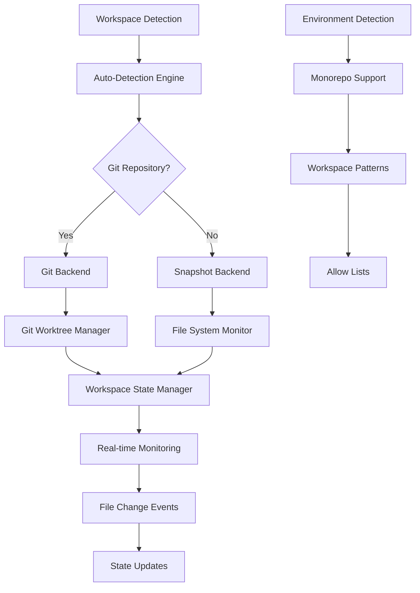

# Workspace Indexing System

**Author:** @darianrosebrook  
**Purpose:** Comprehensive documentation of how the v3 system discovers, indexes, and manages workspace environments for autonomous agents

---

## Overview

The Agent Agency v3 system uses a sophisticated multi-layered workspace indexing system that automatically discovers, monitors, and manages the development environment where autonomous agents operate. This system is critical for ensuring agents understand their context and can safely perform file operations.

## Architecture



## Core Components

### 1. Workspace Auto-Detection

**Location:** `iterations/v3/self-prompting-agent/src/sandbox/workspace_manager.rs`

The system automatically detects the workspace type and selects the appropriate backend:

```rust
impl WorkspaceManager {
    pub async fn auto_detect(workspace_root: PathBuf) -> Result<Self, WorkspaceError> {
        // Check if workspace is a Git repository
        let git_dir = workspace_root.join(".git");
        let is_git = git_dir.exists() && git_dir.is_dir();

        let backend = if is_git {
            // Use Git worktree backend for version control
            let worktree = GitWorktree::new(&workspace_root).await?;
            WorkspaceBackend::Git(worktree)
        } else {
            // Use snapshot backend for non-Git workspaces
            let snapshot_manager = SnapshotManager::new(&workspace_root).await?;
            WorkspaceBackend::Snapshot(snapshot_manager)
        };
        // ...
    }
}
```

**Detection Methods:**
- **Primary:** `process.cwd()` (Node.js) / `std::env::current_dir()` (Rust)
- **Git Detection:** Checks for `.git` directory existence
- **Environment Variables:** Supports `AGENT_AGENCY_WORKSPACE` override
- **Fallback:** Current working directory

### 2. Multi-Backend Architecture

#### Git Backend
- **Purpose:** Version-controlled workspaces with rollback capability
- **Features:** 
  - Git worktree isolation
  - Branch management
  - Commit tracking
  - Rollback mechanisms
- **Use Case:** Production development environments

#### Snapshot Backend
- **Purpose:** Non-Git workspaces with file system monitoring
- **Features:**
  - File system snapshots
  - Change tracking
  - Backup mechanisms
- **Use Case:** Temporary workspaces, non-versioned projects

### 3. Workspace State Management

**Location:** `iterations/v3/workspace-state-manager/src/manager.rs`

The system maintains comprehensive workspace state through multiple capture methods:

#### Capture Methods

1. **Full Filesystem Scan** (`capture_full_scan`)
   - Recursive directory traversal
   - File metadata collection
   - Complete workspace inventory

2. **Git-Based Indexing** (`capture_git_based`)
   - Git index traversal
   - Tracked file monitoring
   - Commit-aware state tracking

3. **Incremental Updates** (`capture_incremental`)
   - Change detection
   - Delta state updates
   - Performance optimization

4. **Hybrid Approach** (`capture_hybrid`)
   - Combines multiple methods
   - Optimizes for different workspace types
   - Adaptive strategy selection

### 4. Monorepo Support

**Location:** `iterations/v3/apps/tools/caws/shared/gate-checker.ts`

The system includes intelligent monorepo detection:

```typescript
private findReportDirectory(startPath: string = this.getWorkingDirectory()): string {
    // Priority 1: Check if current directory has reports
    if (this.hasCoverageReports(startPath) || 
        this.hasMutationReports(startPath) || 
        this.hasTestResults(startPath)) {
        return startPath;
    }

    // Priority 2: Check for npm workspaces configuration
    const packageJsonPath = path.join(startPath, "package.json");
    if (this.pathExists(packageJsonPath)) {
        const packageJson = this.readJsonFile<any>(packageJsonPath);
        if (packageJson?.workspaces) {
            // Handle workspace patterns (e.g., ["packages/*", "iterations/*"])
            // ...
        }
    }
}
```

**Supported Patterns:**
- **npm workspaces:** `package.json` workspace configuration
- **pnpm workspaces:** `pnpm-workspace.yaml` detection
- **Lerna workspaces:** `lerna.json` configuration
- **Custom patterns:** Configurable workspace detection

### 5. Real-Time File System Monitoring

**Location:** `iterations/v3/ingestors/src/file_watcher.rs`

The system provides real-time workspace monitoring:

```rust
async fn scan_directory(&self, root: &Path, tx: &mpsc::Sender<FileEvent>) -> Result<()> {
    let mut dirs_to_scan = vec![root.to_path_buf()];

    while let Some(current_dir) = dirs_to_scan.pop() {
        if !current_dir.is_dir() {
            continue;
        }

        for entry in std::fs::read_dir(&current_dir)? {
            let entry = entry?;
            let path = entry.path();

            if path.is_file() && !Self::should_ignore_file(&path, &self.config.ignore_patterns) {
                if let Some(ingestor_type) = Self::get_ingestor_type(&path) {
                    let file_event = FileEvent {
                        path,
                        event_type: FileEventType::Created,
                        ingestor_type,
                        file_size: metadata.len(),
                        timestamp: chrono::Utc::now(),
                    };
                    let _ = tx.send(file_event).await;
                }
            }
        }
    }
}
```

**Monitoring Features:**
- **File Change Detection:** Real-time file system events
- **Pattern Matching:** Configurable ignore patterns
- **Event Classification:** File type detection and categorization
- **Metadata Collection:** Size, timestamps, permissions

### 6. Environment Detection

**Location:** `iterations/v3/config/src/environment.rs`

The system includes environment-aware detection:

```rust
pub fn auto_detect() -> Result<Environment> {
    // Try environment variable first
    if let Ok(env) = detect_from_env() {
        return Ok(env);
    }
    
    // Try file detection
    if let Ok(env) = detect_from_file(".env") {
        return Ok(env);
    }
    
    // Fallback to hostname detection
    detect_from_hostname()
}
```

**Detection Sources:**
- **Environment Variables:** `AGENT_AGENCY_ENV`, `NODE_ENV`, `ENVIRONMENT`
- **Configuration Files:** `.env` files
- **Hostname Analysis:** Production/staging/test detection
- **Manual Override:** Explicit configuration

## Safety and Security

### Allow Lists
The system enforces strict allow lists for file operations:

```rust
pub async fn apply_changes(&mut self, changeset: ChangeSet) -> Result<ChangeSetReceipt, WorkspaceError> {
    // INVARIANT 1: Validate all paths in allow-list
    for change in &changeset.changes {
        if !self.is_path_allowed(&change.path) {
            return Err(WorkspaceError::OutOfScope(change.path.clone()));
        }
    }
    // ...
}
```

### Budget Enforcement
Change budgets are enforced at the workspace level:

```rust
// INVARIANT 2: Check budgets (fail fast, no writes if exceeded)
if self.budget_checker.would_exceed(&changeset).await? {
    return Err(WorkspaceError::BudgetExceeded {
        current: self.budget_checker.current_state().await?,
        proposed: self.budget_checker.projected_state(&changeset).await?,
        limit: self.budget_checker.limits(),
    });
}
```

### Atomic Operations
All file operations are atomic with rollback capability:

```rust
// INVARIANT 3: Atomic apply with transactional budget update
// Save budget state for potential rollback
let old_budget_state = self.budget_checker.current_state()?;
```

## Performance Characteristics

### Optimization Strategies

1. **Incremental Updates:** Only processes changed files
2. **Parallel Processing:** Concurrent file system operations
3. **Caching:** Workspace state caching for repeated operations
4. **Lazy Loading:** On-demand file content loading

### Resource Management

- **Memory Usage:** Configurable memory limits for large workspaces
- **CPU Usage:** Background processing with configurable thread pools
- **Disk I/O:** Optimized file system access patterns
- **Network:** Minimal network usage (local-first design)

## Configuration

### Workspace Configuration

```yaml
# .caws/workspace-config.yaml
workspace:
  detection:
    method: "auto"  # auto, git, snapshot, hybrid
    git_preferred: true
    fallback_to_snapshot: true
  
  monitoring:
    real_time: true
    ignore_patterns:
      - "node_modules/**"
      - ".git/**"
      - "target/**"
      - "dist/**"
  
  safety:
    allow_list:
      - "src/**"
      - "tests/**"
      - "docs/**"
    budget_limits:
      max_files: 100
      max_loc: 10000
```

### Environment Configuration

```yaml
# Environment-specific settings
environments:
  development:
    monitoring: true
    real_time: true
    safety_mode: "permissive"
  
  production:
    monitoring: true
    real_time: false
    safety_mode: "strict"
    require_approval: true
```

## Integration Points

### CAWS Integration
The workspace system integrates with CAWS for compliance:

- **Scope Validation:** Ensures operations stay within defined scope
- **Budget Tracking:** Monitors file and LOC changes
- **Quality Gates:** Enforces testing and linting requirements
- **Provenance:** Tracks all workspace changes

### Council Integration
Workspace state feeds into the Council system:

- **Decision Context:** Provides workspace context for decisions
- **Change Impact:** Assesses impact of proposed changes
- **Risk Assessment:** Evaluates risk based on workspace state
- **Compliance:** Ensures adherence to workspace policies

## Troubleshooting

### Common Issues

1. **Workspace Detection Failures**
   - Check current working directory
   - Verify Git repository status
   - Review environment variables

2. **Permission Errors**
   - Verify file system permissions
   - Check allow list configuration
   - Review safety mode settings

3. **Performance Issues**
   - Monitor memory usage
   - Check ignore patterns
   - Review monitoring configuration

### Debugging Tools

```bash
# Check workspace detection
cargo run --bin workspace-detector -- --debug

# Monitor file system events
cargo run --bin file-monitor -- --verbose

# Validate workspace state
cargo run --bin workspace-validator -- --check
```

## Future Enhancements

### Planned Features

1. **Distributed Workspaces:** Support for remote workspaces
2. **Cloud Integration:** Cloud-based workspace synchronization
3. **Advanced Monitoring:** Machine learning-based change prediction
4. **Collaborative Features:** Multi-user workspace support

### Research Areas

- **Predictive Indexing:** Anticipate file changes
- **Intelligent Caching:** Smart cache invalidation
- **Conflict Resolution:** Automated merge conflict handling
- **Performance Optimization:** Advanced indexing algorithms

---

This workspace indexing system is the foundation that enables autonomous agents to safely and effectively operate within development environments while maintaining security, performance, and compliance with CAWS standards.

