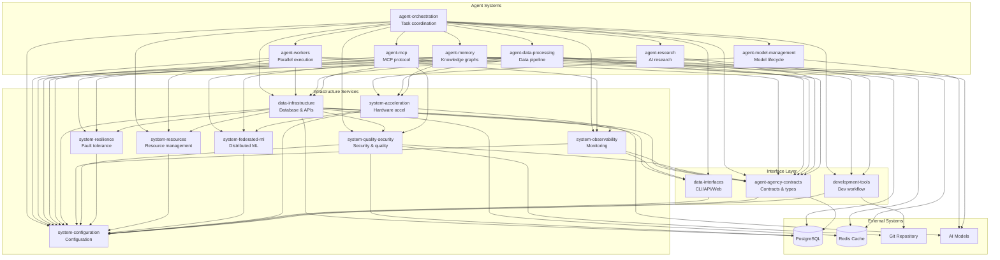

# V3 Constitutional AI System Architecture

## Overview

Agent Agency V3 implements a **modular constitutional AI system** with 17 specialized crates providing comprehensive autonomous agent capabilities. The system leverages CoreML-optimized Mistral models with Apple Neural Engine acceleration for local inference. CoreML/ANE is available and functional, with performance characteristics (0.95-1.01x speedup) accepted as platform limits for FP16 Mistral models. The system ensures ethical compliance, technical quality, and system coherence through evidence-based decision making.

The architecture consists of specialized Rust crates with clear responsibilities, communicating via well-defined contracts, with PostgreSQL persistence, comprehensive provenance tracking, and monitoring capabilities.

## Core Problems Solved

### Autonomous Agent Safety & Governance
Modern AI agent systems lack robust safety mechanisms and accountability:

- **Execution Safety**: No safe modes for testing agent behavior without real-world impact
- **Quality Assurance**: Manual code review doesn't scale with autonomous operations
- **Intervention Gaps**: Limited ability to pause, modify, or cancel running agent tasks
- **Audit Trail Deficits**: Poor traceability of agent decisions and actions
- **Compliance Challenges**: Difficulty ensuring ethical and legal compliance in autonomous operations

V3 provides complete governance through constitutional oversight, execution modes, and comprehensive monitoring.

## Core Design Principles

### 1. Modular Crate Architecture
**Problem**: Monolithic codebases become unmaintainable and hard to test.

**Solution**: 17 specialized crates with single responsibilities and clear interfaces.

**Crate Categories**:
- **Agent Systems** (7 crates): Core agent functionality and orchestration
- **Infrastructure Services** (7 crates): Database, security, observability, resilience
- **Interface Layer** (3 crates): APIs, contracts, and user interfaces

**Benefits**:
- Independent development and testing of components
- Clear dependency boundaries and interfaces
- Scalable architecture for team collaboration
- Simplified maintenance and upgrades

### 2. Execution Mode Safety
**Problem**: Autonomous agents need safe testing without real-world impact.

**Solution**: Three execution modes provide graduated safety levels:
- **Dry-Run Mode**: Complete simulation without filesystem changes
- **Auto Mode**: Automatic execution with quality gate validation
- **Strict Mode**: Manual approval required for execution phases

**Benefits**:
- Safe testing and validation of agent behavior
- Risk-appropriate governance intensity
- Graduated trust model for agent operations
- Protection against unintended consequences

### 3. Constitutional Council Governance
**Problem**: Need for ethical and quality oversight in autonomous operations.

**Solution**: Multi-crate council system for governance oversight distributed across specialized components.

**Governance Distribution**:
- **agent-orchestration**: Council coordination and decision aggregation
- **system-quality-security**: Quality gates and compliance validation
- **agent-agency-contracts**: Structured contracts for governance decisions
- **data-infrastructure**: Provenance tracking and audit storage

**Benefits**:
- Distributed governance with specialized expertise
- Scalable validation across different concern areas
- Modular governance components for different deployment scenarios
- Comprehensive audit trails with provenance tracking

### 4. Contract-Based Communication
**Problem**: Tight coupling between components leads to brittle systems.

**Solution**: Well-defined contracts with JSON Schema validation.

**Contract Features**:
- **agent-agency-contracts**: Centralized type definitions and interfaces
- **JSON Schema Validation**: Runtime contract validation
- **Version Compatibility**: Backward-compatible contract evolution
- **Cross-Crate Consistency**: Standardized interfaces across all crates

**Benefits**:
- Loose coupling between components
- Runtime validation of component interactions
- Clear API boundaries and expectations
- Simplified testing and integration

## System Architecture

### 17-Crate Modular Architecture

The system is organized into 17 focused crates with clear responsibilities:

#### Agent Systems (Core Functionality)
- **agent-orchestration**: Task coordination and council-based decision making
- **agent-workers**: Parallel task execution and MCP-based worker management
- **agent-model-management**: Model lifecycle management, inference, and hot-swapping
- **agent-data-processing**: Data ingestion, enrichment, indexing, and knowledge processing
- **agent-memory**: Agent memory system with knowledge graphs and embeddings
- **agent-research**: Advanced AI research capabilities and reflexive learning
- **agent-mcp**: Model Context Protocol implementation and tool orchestration

#### Infrastructure Services (Supporting Systems)
- **data-infrastructure**: PostgreSQL persistence, API interfaces, and data transformation
- **system-observability**: Monitoring, metrics collection, distributed tracing, and alerting
- **system-quality-security**: Authentication, authorization, quality gates, and integrity verification
- **system-resilience**: Fault tolerance, recovery, and content-addressable storage
- **system-resources**: Resource management and production hardening
- **system-configuration**: Configuration management and common utilities
- **system-federated-ml**: Distributed ML and runtime optimization
- **system-acceleration**: Hardware acceleration (Apple Silicon, quantization)

#### Interface Layer (User Interaction)
- **data-interfaces**: CLI, API, and web interface components
- **agent-agency-contracts**: Type definitions and API contracts
- **development-tools**: Development workflow and code analysis tools

### Architecture Diagram

## Component Implementation Status

### Agent Systems - Core Functionality

**agent-orchestration**
- Task coordination and council-based decision making
- Execution mode enforcement (Dry-Run, Auto, Strict)
- Progress tracking and intervention capabilities
- Provenance tracking integration

**agent-workers**
- Parallel task execution with MCP-based worker management
- Circuit breaker patterns for fault tolerance
- Resource-aware worker allocation
- Execution result aggregation and reporting

**agent-model-management**
- Model lifecycle management and hot-swapping
- Inference coordination across different model types
- Performance monitoring and optimization
- Model registry and versioning

**agent-data-processing**
- Data ingestion pipeline with multiple source support
- Content enrichment and entity extraction
- Vector indexing and similarity search
- Knowledge graph construction

**agent-memory**
- Persistent agent memory with knowledge graphs
- Vector embeddings for semantic search
- Temporal reasoning and decay management
- Context offloading for long-horizon tasks

**agent-research**
- Advanced claim extraction and verification
- Multi-modal evidence analysis
- Strategic planning and decision optimization
- Self-prompting research capabilities

**agent-mcp**
- Model Context Protocol implementation
- Tool discovery and orchestration
- Cross-model communication and coordination
- Standardized AI agent interfaces

### Infrastructure Services - Supporting Systems

**data-infrastructure**
- PostgreSQL persistence with ACID transactions
- RESTful API interfaces with OpenAPI documentation
- Multi-level caching (memory, Redis, database)
- Vector storage and similarity search
- File operations and streaming

**system-observability**
- Comprehensive metrics collection and aggregation
- SLO monitoring and alerting
- Distributed tracing and performance analysis
- Health monitoring and incident response

**system-quality-security**
- Multi-factor authentication and role-based access control
- Input validation and sanitization
- Quality gates and automated testing
- Provenance tracking and audit trails
- Secret management and encryption

**system-resilience**
- Circuit breaker patterns and fault tolerance
- Automatic recovery and failover
- Content-addressable storage
- Resource isolation and cleanup

**system-resources**
- Resource allocation and optimization
- Production hardening and deployment
- Capacity planning and scaling
- Performance monitoring and tuning

**system-configuration**
- Environment-based configuration management
- Type-safe configuration with validation
- Hot-reloading capabilities
- Multi-environment deployment support

**system-federated-ml**
- Distributed machine learning coordination
- Runtime optimization and acceleration
- Model federation and privacy-preserving learning
- Cross-device model synchronization

**system-acceleration**
- Apple Silicon optimization (ANE, CoreML) - Available and functional (0.95-1.01x speedup accepted as platform limit)
- Hardware acceleration framework
- Quantization and model optimization
- Performance profiling and tuning

### Interface Layer - User Interaction

**data-interfaces**
- Command-line interface for task execution
- RESTful API for programmatic access
- Web dashboard for monitoring and control
- Real-time WebSocket communication

**agent-agency-contracts**
- Comprehensive type definitions and schemas
- JSON Schema validation for all contracts
- Cross-crate interface standardization
- API contract evolution and versioning

**development-tools**
- Development workflow automation
- Code analysis and quality checking
- Testing infrastructure and utilities
- CI/CD integration and deployment tools

## Data Flow Architecture

### Task Execution Flow
1. **Task Submission**: CLI/API receives task with execution mode and requirements
2. **Validation**: agent-orchestration validates against quality gates via system-quality-security
3. **Planning**: agent-research performs strategic planning and optimization
4. **Routing**: agent-orchestration selects appropriate workers via agent-workers
5. **Execution**: agent-workers coordinate task execution across available resources
6. **Processing**: agent-data-processing handles data transformation and enrichment
7. **Storage**: data-infrastructure persists results with provenance tracking
8. **Monitoring**: system-observability provides real-time metrics and alerts

### Governance Flow
1. **Constitutional Review**: agent-orchestration coordinates council evaluation
2. **Quality Gates**: system-quality-security enforces compliance and standards
3. **Evidence Analysis**: agent-research provides evidence-based validation
4. **Contract Validation**: agent-agency-contracts ensures interface compliance
5. **Consensus Decision**: agent-orchestration aggregates verdicts and makes final decisions
6. **Audit Trail**: system-quality-security records complete provenance

## Performance Characteristics

### Scalability Metrics
- **Concurrent Tasks**: 100+ simultaneous task executions
- **API Throughput**: 1000+ requests per minute
- **Database Performance**: Sub-10ms query response times
- **Memory Efficiency**: Optimized resource usage across all crates

### Reliability Features
- **Fault Tolerance**: Circuit breakers and automatic recovery in system-resilience
- **Data Consistency**: ACID transactions in data-infrastructure
- **Quality Assurance**: Automated testing and validation in system-quality-security
- **Monitoring Coverage**: Comprehensive observability in system-observability

## Development Workflow

### Modular Development
Each crate can be developed and tested independently:
- Clear dependency boundaries defined in Cargo.toml
- Contract-based interfaces via agent-agency-contracts
- Independent CI/CD pipelines for each crate
- Integration testing at the workspace level

### Quality Gates
- **system-quality-security**: Enforces quality standards across all crates
- **testing-validation**: Comprehensive testing framework
- **system-observability**: Performance monitoring and alerting
- **development-tools**: Automated code analysis and validation

## See Also

- **[system-overview.md](./system-overview.md)** - Complete system capabilities and status
- **[interaction-contracts.md](./interaction-contracts.md)** - API contracts and data schemas
- **[contracts/README.md](./contracts/README.md)** - Contract definitions and schemas
- **[../../README.md](../../README.md)** - Project overview and setup instructions
- **[../../docs/quality-assurance/README.md](../../docs/quality-assurance/README.md)** - CAWS and testing framework
