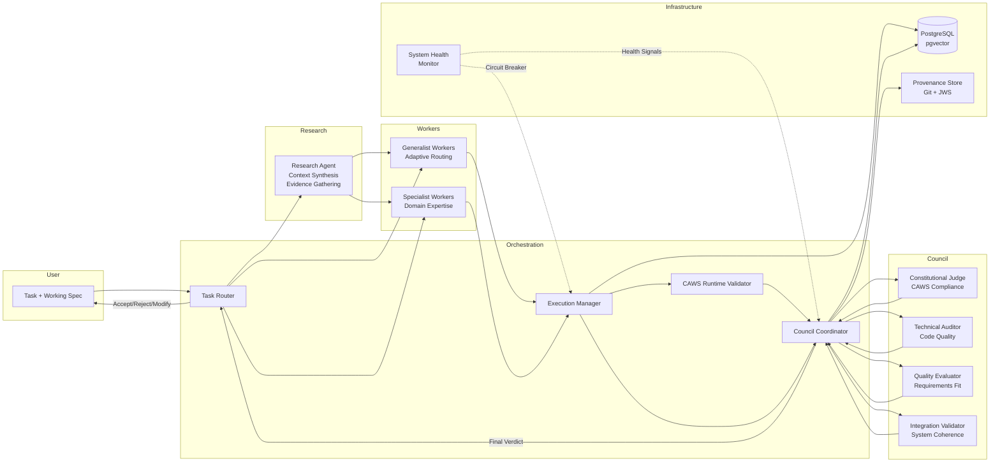
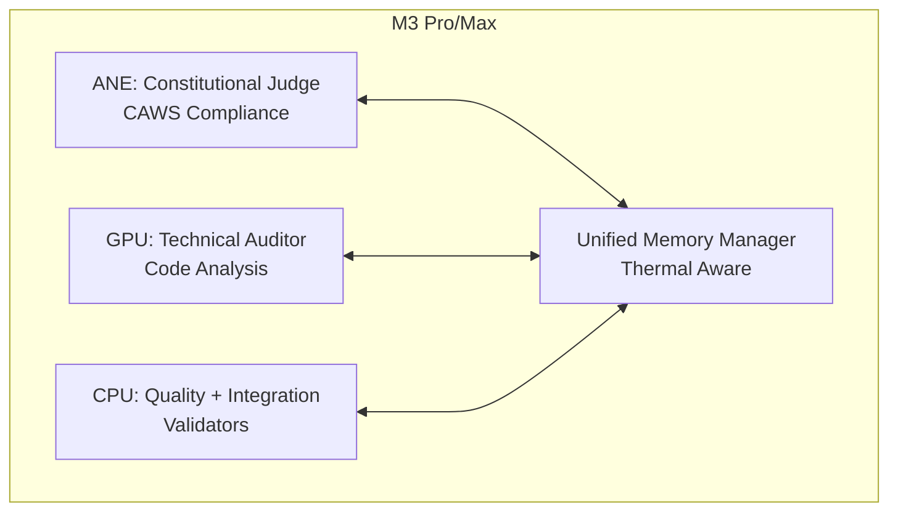

# V3 Constitutional AI System Architecture

## Overview

Agent Agency V3 implements a **production-ready constitutional AI system** with complete task execution pipelines, real-time governance oversight, and comprehensive monitoring capabilities. The system provides three execution modes (Strict, Auto, Dry-Run) for different risk levels, with constitutional council oversight ensuring ethical compliance and quality standards.

The architecture consists of Rust-based services communicating via HTTP APIs, with PostgreSQL persistence, comprehensive provenance tracking, and a web dashboard for monitoring and control.

## Core Problems Solved

### The Agent Coordination Crisis
Traditional multi-agent systems suffer from fundamental coordination failures:

- **Race Conditions**: Agents compete for resources, leading to unpredictable behavior
- **Safety Gaps**: No runtime enforcement of ethical or legal constraints
- **Quality Bottlenecks**: Manual review doesn't scale with agent proliferation
- **Learning Conflicts**: Experience-driven improvement can compromise safety
- **Audit Nightmares**: Lack of accountability in complex agent interactions

V3's constitutional approach provides the missing governance layer.

## Design Principles

### 1. Constitutional Concurrency
**Problem**: Traditional parallelism leads to resource conflicts and unpredictable agent behavior.

**Solution**: Constitutional concurrency establishes agreed-upon bounds before execution, preventing conflicts through principled coordination rather than post-hoc resolution.

**Benefits**:
- Zero race conditions between agents
- Predictable resource utilization
- Safe parallel execution within constitutional limits
- Auditability of all coordination decisions

### 2. Council-Based Governance
**Problem**: Single orchestrators create bottlenecks and single points of failure in agent governance.

**Solution**: Four specialized AI judges provide independent, parallel oversight with consensus-based decision making.

**Judge Roles**:
- **Constitutional Judge**: Enforces ethical guidelines, legal compliance, and CAWS principles
- **Technical Auditor**: Validates code quality, security standards, and system contracts
- **Quality Evaluator**: Assesses correctness, completeness, and requirement satisfaction
- **Integration Validator**: Ensures system coherence, API compatibility, and architectural integrity

### 3. Risk-Tiered Execution Model
**Problem**: One-size-fits-all governance treats all operations equally, wasting resources on low-risk tasks and risking safety on high-risk ones.

**Solution**: Three-tiered execution model matches governance intensity to operational risk.

**Execution Tiers**:
- **Tier 1 (High Risk)**: Sequential judge evaluation with debate protocol and maximum oversight
- **Tier 2 (Medium Risk)**: Limited parallel evaluation with consensus checkpoints
- **Tier 3 (Low Risk)**: High parallel evaluation with minimal coordination overhead

### 4. Apple Silicon Acceleration Platform
**Problem**: AI governance requires significant computational resources, creating performance bottlenecks.

**Solution**: Native hardware acceleration leveraging all Apple Silicon capabilities for optimal performance.

**Acceleration Features**:
- **ANE Integration**: Neural Engine acceleration for constitutional judge inference
- **GPU Orchestration**: Metal-based parallel processing for complex analysis tasks
- **Unified Memory**: Efficient data sharing across CPU, GPU, and ANE
- **Thermal Management**: Performance scaling based on system temperature and power constraints
- **Core ML Optimization**: Hardware-specific model deployment and quantization

## System Architecture Diagram

## Apple Silicon Hardware Acceleration

## Implementation Architecture

### Core Components (23 Crates)

**Coordination Layer:**
- `council/`: Consensus coordination and debate protocol implementation
- `orchestration/`: Task routing and execution management
- `workers/`: Agent pool lifecycle and execution coordination

**Domain Services:**
- `research/`: Context synthesis and evidence gathering algorithms
- `claim-extraction/`: V2 pipeline port for claim processing and disambiguation
- `reflexive-learning/`: Multi-turn learning coordination and adaptation
- `model-benchmarking/`: Performance evaluation and comparative scoring

**Infrastructure Layer:**
- `database/`: PostgreSQL/pgvector persistence with connection pooling
- `provenance/`: Git-backed audit trails with JWS cryptographic signing
- `apple-silicon/`: Hardware-accelerated inference with ANE/GPU/CPU orchestration
- `system-health-monitor/`: Agent monitoring with circuit breaker patterns
- `security-policy-enforcer/`: Security controls and audit logging framework
- `context-preservation-engine/`: Multi-tenant context management and synthesis
- `workspace-state-manager/`: Repository state tracking and diff computation
- `embedding-service/`: Vector embedding computation and caching
- `minimal-diff-evaluator/`: AST-based change assessment and impact analysis
- `integration-tests/`: Cross-component validation and contract testing
- `config/`: Configuration management with validation and hot-reloading
- `resilience/`: Circuit breaker and retry pattern implementations
- `observability/`: Metrics collection and monitoring infrastructure
- `mcp-integration/`: Model Context Protocol server implementation

### Component Maturity Levels

**Stable Implementation:**
- Database schema and migration framework
- Basic council coordination and judge evaluation
- Worker pool management and routing
- Provenance recording and audit trails

**Active Development:**
- Constitutional concurrency coordination patterns
- Apple Silicon hardware optimization
- Cross-component integration testing
- Configuration management and validation

**Early Implementation:**
- Advanced learning signal processing
- Multi-tenant context isolation
- Performance benchmarking automation
- Security policy enforcement

### Key Architectural Patterns

**Constitutional Concurrency:**
- Risk-tiered parallelism (Tier 1: sequential, Tier 2: checkpoint, Tier 3: parallel)
- Consensus-driven coordination vs traditional race conditions
- Constitutional boundaries prevent agent conflicts

**Apple Silicon Optimization:**
- Native ANE/GPU/CPU acceleration with unified memory
- Thermal-aware execution scheduling
- Hardware-specific model quantization and placement

**CAWS Compliance & Provenance:**
- Runtime CAWS validation with evidence enrichment
- Git-backed provenance with JWS signing
- Constitutional audit trails for all decisions

**Database & Persistence:**
- PostgreSQL with pgvector for semantic search
- Multi-tenant context isolation
- Transactional integrity across all operations

## Component Interaction Patterns

### Task Execution Flow
1. **Task Submission** → Router analyzes scope and risk tier
2. **Research Gathering** → Context synthesis and evidence collection
3. **Worker Execution** → Parallel or sequential based on risk tier
4. **CAWS Validation** → Runtime compliance checking
5. **Council Review** → Judge evaluation with debate protocol
6. **Final Verdict** → Consensus decision with audit trail

### Concurrency Coordination
- **Low Risk (Tier 3)**: High parallelism, minimal coordination
- **Medium Risk (Tier 2)**: Limited parallel with consensus checkpoints
- **High Risk (Tier 1)**: Sequential execution with continuous oversight

### Error Recovery Patterns
- Circuit breaker patterns for component failures
- Graceful degradation based on risk tier
- Automatic rollback capabilities with provenance tracking

## Performance Characteristics

- **Constitutional Judge**: <100ms inference (ANE-optimized)
- **Technical Auditor**: <500ms analysis (GPU-accelerated)
- **Quality Evaluator**: <200ms assessment
- **Integration Validator**: <150ms coherence checking
- **Council Consensus**: <1s for Tier 2/3, <3s for Tier 1 tasks
- **Worker Execution**: <2s per request with parallel workers

## See Also

- **[CONCURRENT_AGENT_OPERATIONS.md](../CONCURRENT_AGENT_OPERATIONS.md)** - Agent isolation and coordination framework
- **[coordinating-concurrency.md](./coordinating-concurrency.md)** - Constitutional concurrency patterns
- **[BUILD_OPTIMIZATION.md](./BUILD_OPTIMIZATION.md)** - Build performance and agent isolation
- **[components/](./components/)** - Detailed component documentation
- **[interaction-contracts.md](./interaction-contracts.md)** - API contracts and interaction patterns
- **[contracts/](./contracts/)** - JSON schemas and data contracts
