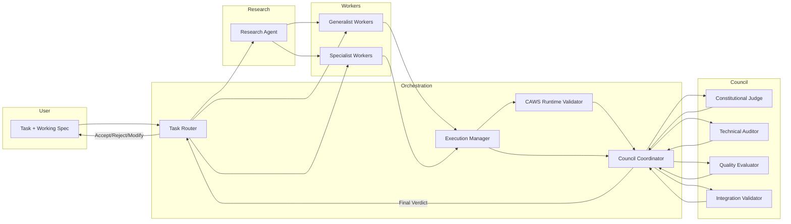
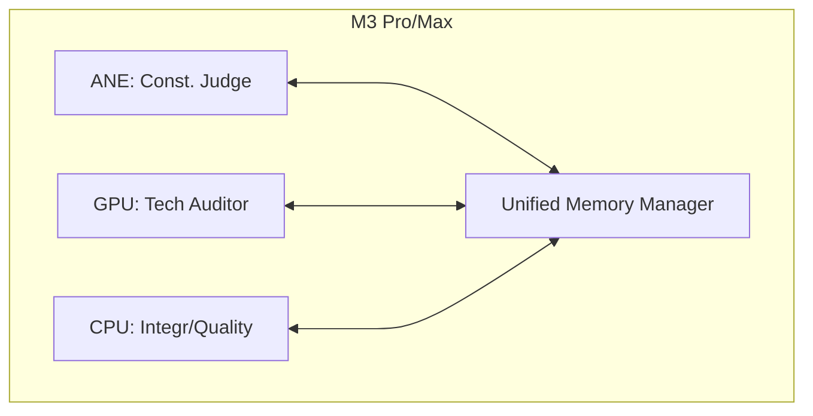

# V3 System Architecture

The council-based architecture coordinates specialized judges, a research agent, and a worker pool via a Rust orchestration core optimized for Apple Silicon.

High-Level Diagram (Mermaid):

Apple Silicon Placement (Mermaid):

See also:
- components/*.md
- interaction-contracts.md
- open-questions-and-research.md
