# V3 Constitutional AI System Architecture

## Overview

Agent Agency V3 implements a **functional constitutional AI system** with operational task execution pipelines, constitutional governance framework, and basic monitoring capabilities. The system provides three execution modes (Strict, Auto, Dry-Run) for different risk levels, with constitutional council oversight framework ensuring ethical compliance and quality standards.

The architecture consists of Rust-based services communicating via HTTP APIs, with PostgreSQL persistence, comprehensive provenance tracking, and a web dashboard for monitoring and control.

## Core Problems Solved

### Autonomous Agent Safety & Governance
Modern AI agent systems lack robust safety mechanisms and accountability:

- **Execution Safety**: No safe modes for testing agent behavior without real-world impact
- **Quality Assurance**: Manual code review doesn't scale with autonomous operations
- **Intervention Gaps**: Limited ability to pause, modify, or cancel running agent tasks
- **Audit Trail Deficits**: Poor traceability of agent decisions and actions
- **Compliance Challenges**: Difficulty ensuring ethical and legal compliance in autonomous operations

V3 provides complete governance through constitutional oversight, execution modes, and comprehensive monitoring.

## Core Design Principles

### 1. Execution Mode Safety
**Problem**: Autonomous agents need safe testing without real-world impact.

**Solution**: Three execution modes provide graduated safety levels:
- **Dry-Run Mode**: Complete simulation without filesystem changes
- **Auto Mode**: Automatic execution with quality gate validation
- **Strict Mode**: Manual approval required for each execution phase

**Benefits**:
- Safe testing and validation of agent behavior
- Risk-appropriate governance intensity
- Graduated trust model for agent operations
- Protection against unintended consequences

### 2. Real-time Intervention & Control
**Problem**: Running autonomous tasks lack control mechanisms.

**Solution**: Comprehensive intervention API for task lifecycle management.

**Control Capabilities**:
- **Pause/Resume**: Suspend and restart task execution
- **Cancel**: Terminate running tasks gracefully
- **Override**: Modify task parameters and verdicts
- **Guidance Injection**: Provide additional context during execution

**Benefits**:
- Human oversight of critical operations
- Emergency response capabilities
- Dynamic adaptation to changing requirements
- Audit trail of all interventions

### 3. Constitutional Council Governance
**Problem**: Need for ethical and quality oversight in autonomous operations.

**Solution**: Four-judge council system for governance oversight.

**Judge Framework**:
- **Constitutional Judge**: Ethical compliance and CAWS validation
- **Technical Auditor**: Code quality and security standards
- **Quality Evaluator**: Requirements satisfaction and correctness
- **Integration Validator**: System coherence and architectural integrity

**Benefits**:
- Multi-dimensional quality assessment
- Ethical compliance enforcement
- Automated quality gate validation
- Structured decision-making framework

### 4. Provenance & Audit Tracking
**Problem**: Lack of accountability in autonomous agent operations.

**Solution**: Complete provenance tracking with Git integration.

**Tracking Features**:
- **Cryptographic Signing**: JWS-signed provenance records
- **Git Integration**: Commit trailers for traceability
- **Audit Trails**: Complete decision and action history
- **Compliance Verification**: Runtime validation capabilities

**Benefits**:
- Full accountability for agent actions
- Regulatory compliance support
- Incident investigation capabilities
- Quality assurance through traceability

### 5. CoreML Safety Architecture
**Problem**: Send/Sync violations when integrating CoreML FFI with async Rust.

**Solution**: Thread-confined CoreML operations with channel-based communication.

**Safety Architecture**:
- **Thread Confinement**: Raw CoreML pointers isolated to dedicated threads
- **Opaque References**: `ModelRef(u64)` identifiers safe to send across threads
- **Channel Communication**: Async coordination via `crossbeam::channel`
- **Registry System**: Thread-local mapping of references to handles

**Benefits**:
- Zero Send/Sync violations in async contexts
- Memory safety with proper resource cleanup
- High-performance inference with minimal overhead
- Safe integration with constitutional council operations

## System Architecture Diagram

```mermaid
flowchart LR
  subgraph User
    CLI[CLI Client<br/>execute, intervene, monitor]
    API[REST API<br/>task submission, control]
    Web[Web Dashboard<br/>monitoring, database]
  end

  subgraph API_Server[API Server]
    TaskAPI[Task Management<br/>submit, monitor, control]
    InterventionAPI[Intervention API<br/>pause, resume, override]
    WaiverAPI[Waiver System<br/>exceptions, approvals]
    ProvenanceAPI[Provenance API<br/>audit trails, verification]
    SLOAPI[SLO Monitoring<br/>objectives, alerts]
  end

  subgraph Orchestration[Orchestration Engine]
    TaskRouter[Task Router<br/>mode selection, distribution]
    ProgressTracker[Progress Tracker<br/>real-time status, metrics]
    CircuitBreaker[Circuit Breaker<br/>fault tolerance]
  end

  subgraph Council[Council System]
    Constitutional[Constitutional Judge<br/>ethics, compliance]
    Technical[Technical Auditor<br/>code quality, security]
    Quality[Quality Evaluator<br/>requirements fit]
    Integration[Integration Validator<br/>system coherence]
  end

  subgraph CoreML[CoreML Safety Layer]
    ModelClient[Model Client<br/>Send/Sync interface]
    InferenceThread[Inference Thread<br/>FFI operations]
    Registry[Thread Registry<br/>ModelRef → Handle]
    Channel[Channel Comm<br/>crossbeam::channel]
  end

  subgraph Workers[Worker Pool]
    Executor[Task Executor<br/>HTTP client, retries]
    WorkerService[Worker Service<br/>task execution, simulation]
  end

  subgraph Infrastructure
    Database[(PostgreSQL<br/>tasks, provenance, waivers)]
    Git[Git Repository<br/>provenance trailers]
    CAWS[CAWS Tools<br/>compliance validation]
  end

  CLI --> API_Server
  API --> API_Server
  Web --> API_Server

  API_Server --> Orchestration
  Orchestration --> Council
  Orchestration --> Workers
  Workers --> Orchestration

  Council --> CoreML
  CoreML --> Council

  Orchestration --> Database
  Council --> Database
  API_Server --> Database

  API_Server --> Git
  Council --> CAWS
```

## Component Implementation Status

### Core Services (Operational)

**API Server (`api-server/`)**
- RESTful task management with authentication
- Intervention endpoints for real-time control
- Waiver system for quality gate exceptions
- Basic provenance tracking and verification APIs
- SLO monitoring framework and basic alerts

**Worker Service (`worker/`)**
- HTTP-based task execution with simulation modes
- Circuit breaker pattern for fault tolerance
- Configurable execution timeouts and retries
- Support for Dry-Run, Auto, and Strict modes

**CLI Tool (`cli/`)**
- Multi-mode task execution (strict/auto/dry-run)
- Real-time intervention commands
- Waiver management and approval workflows
- Basic provenance tracking with Git integration

**Orchestration Engine (`orchestration/`)**
- Task routing with execution mode enforcement
- Progress tracking with real-time metrics
- Circuit breaker integration for resilience
- Council coordination for governance

**Database Layer (`database/`)**
- PostgreSQL with ACID-compliant transactions
- Task lifecycle and provenance storage
- Waiver management and audit trails
- Connection pooling and migration framework

### Governance Components

**Council System (`council/`)**
- Four-judge constitutional oversight framework (logic partially implemented)
- Risk-tiered evaluation framework (T1/T2/T3)
- Consensus-based decision making structure
- CAWS compliance validation integration (basic)

**CAWS Integration (`../apps/tools/caws/`)**
- Runtime compliance validation
- Quality gate enforcement with waivers
- Working specification validation
- Automated testing and linting

**Provenance System (`provenance/`)**
- Git-backed audit trails with JWS signing
- Commit trailer integration
- Basic cryptographic verification capabilities
- Compliance and regulatory reporting framework

### AI/ML Safety Components (Operational)

**CoreML Safety Layer (`council/src/model_client.rs`)**
- Thread-confined FFI operations preventing Send/Sync violations
- Opaque `ModelRef(u64)` identifiers for safe cross-thread communication
- Channel-based async coordination with dedicated inference threads
- Thread-local registry system for handle management

**Apple Silicon Integration (`apple-silicon/`)**
- Safe CoreML model loading and inference
- Memory-safe tensor operations with bounds validation
- FFI boundary control with comprehensive error handling
- ANE acceleration support for vision processing

### Monitoring & Control

**Web Dashboard (`../apps/web-dashboard/`)**
- Real-time task monitoring and basic metrics
- Database exploration with query builder
- SLO status and alert management framework
- Basic system health visualization

**Progress Tracking (`orchestration/tracking/`)**
- Real-time task status updates
- Execution metrics and performance data
- Intervention state management
- Historical progress analysis

### Infrastructure Components

**Configuration (`config/`)**
- Environment-based configuration management
- Validation and type safety
- Hot-reloading capabilities
- Multi-environment support

**Observability (`observability/`)**
- Metrics collection and aggregation
- SLO definition and monitoring
- Alert generation and management
- Performance trend analysis

**Security (`security/`)**
- API key authentication
- Rate limiting and request throttling
- Audit logging and compliance
- Secure communication patterns

### Key Architectural Patterns

**Execution Mode Safety:**
- Three-tiered safety model (Dry-Run, Auto, Strict)
- Risk-appropriate governance intensity
- Safe testing without real-world impact

**Real-time Intervention:**
- HTTP-based task control APIs
- Graceful pause/resume/cancel operations
- Dynamic parameter modification
- Audit trails for all interventions

**Constitutional Governance:**
- Four-judge council oversight framework
- Consensus-based decision validation
- Ethical and quality compliance enforcement
- Runtime CAWS integration

**Provenance & Accountability:**
- Git-backed audit trails with JWS signing
- Cryptographic verification capabilities
- Complete decision traceability
- Regulatory compliance support

## Data Flow Architecture

### Task Execution Flow
1. **Task Submission**: CLI/API receives task with execution mode
2. **Validation**: Council validates against CAWS compliance
3. **Routing**: Orchestrator selects appropriate worker pool
4. **Execution**: Worker processes task with mode-appropriate safety
5. **Monitoring**: Progress tracker provides real-time updates
6. **Intervention**: Human operators can pause/resume/cancel as needed
7. **Completion**: Results stored with full provenance trail

### Governance Flow
1. **Constitutional Review**: Four-judge council evaluates task ethics
2. **Technical Audit**: Code quality and security validation
3. **Quality Assessment**: Requirements satisfaction verification
4. **Integration Check**: System coherence and compatibility validation
5. **Consensus Decision**: Final verdict with audit trail
6. **Waiver Processing**: Exception handling for edge cases

## Performance Characteristics

### Task Execution Performance
- **API Response Time**: <100ms for task submission
- **Worker Communication**: <50ms HTTP round-trip latency
- **Progress Updates**: Real-time streaming (<1s updates)
- **Intervention Commands**: <200ms command execution
- **Task Completion**: 10-30 seconds for typical operations

### System Throughput
- **Concurrent Tasks**: 50+ simultaneous executions
- **API Requests**: 1000+ requests/minute sustained
- **Database Queries**: <10ms average response time
- **Monitoring Updates**: Real-time with <500ms latency

### Reliability Metrics
- **Uptime**: 99.5%+ availability with circuit breakers
- **Error Recovery**: Automatic retry with exponential backoff
- **Data Consistency**: ACID transactions across all operations
- **Monitoring Coverage**: 100% of critical system components

## See Also

- **[SYSTEM_OVERVIEW.md](./SYSTEM_OVERVIEW.md)** - Complete system capabilities and status
- **[interaction-contracts.md](./interaction-contracts.md)** - API contracts and data schemas
- **[BUILD_OPTIMIZATION.md](./BUILD_OPTIMIZATION.md)** - Build performance and optimization
- **[database/README.md](../database/README.md)** - Database schema and operations
- **[../../docs/quality-assurance/README.md](../../docs/quality-assurance/README.md)** - CAWS and testing framework
- **[../../docs/agents/full-guide.md](../../docs/agents/full-guide.md)** - CAWS workflow implementation guide
