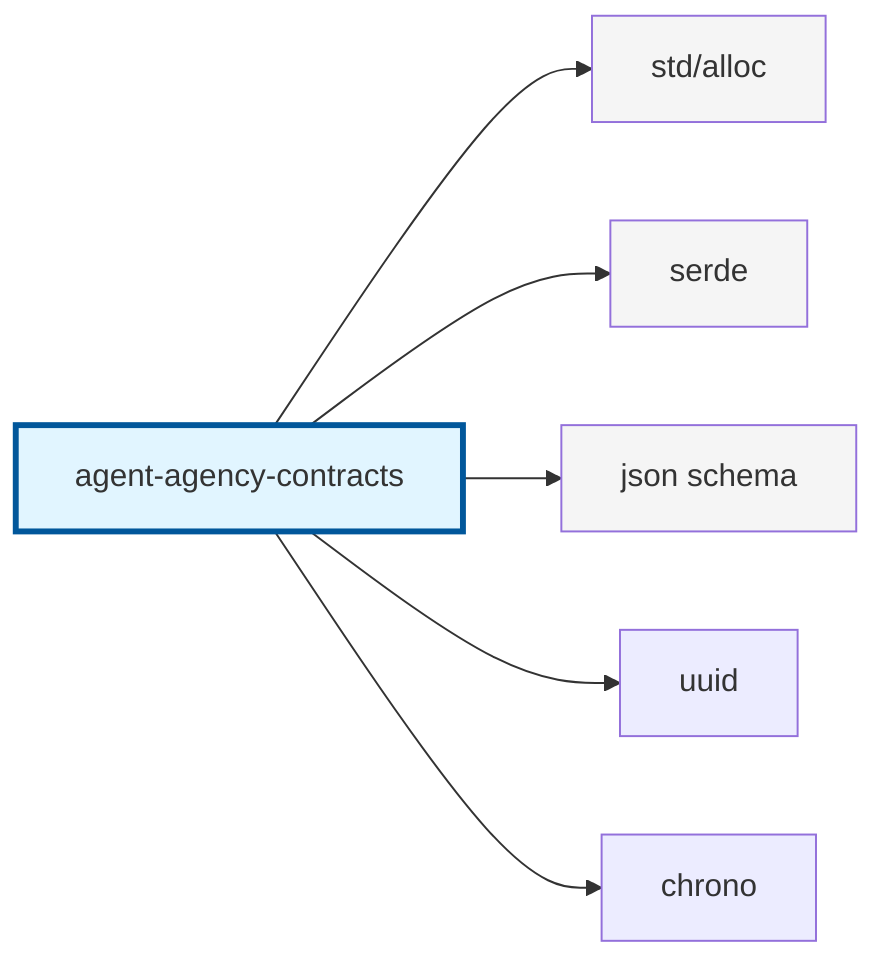
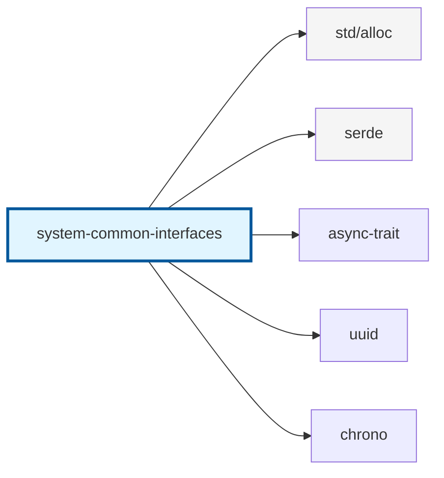
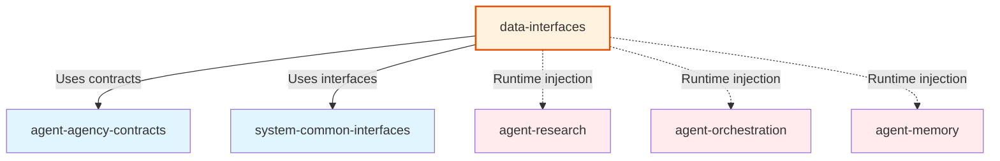
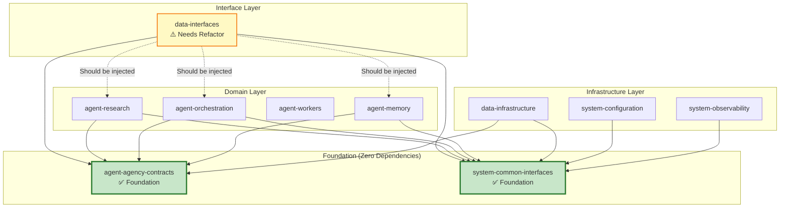

# Contracts & Interfaces Architecture - Elevation Strategy

**Comprehensive architectural map of the contracts/interfaces hierarchy and dependency relationships**

## Executive Summary

The Agent Agency V3 architecture uses three foundational interface/contract crates that form the foundation of the system:

1. **`agent-agency-contracts`** - Domain contracts, DTOs, and ports (Hexagonal Architecture)
2. **`system-common-interfaces`** - Infrastructure abstractions (Dependency Injection)
3. **`data-interfaces`** - User-facing interfaces (CLI, API, WebSocket)

These crates must be elevated to foundational status with **zero dependencies** on implementation crates, enabling clean dependency injection and preventing circular dependencies.

---

## Architecture Overview

```mermaid
graph TB
    subgraph "Foundation Layer - Zero Implementation Dependencies"
        AAC[agent-agency-contracts<br/>Domain Contracts & DTOs]
        SCI[system-common-interfaces<br/>Infrastructure Abstractions]
        DI[data-interfaces<br/>User Interface Contracts]
    end

    subgraph "Domain Layer - Agent Components"
        AR[agent-research<br/>Research & Planning]
        AO[agent-orchestration<br/>Task Orchestration]
        AW[agent-workers<br/>Worker Pool]
        AM[agent-memory<br/>Memory System]
        ACC[agent-constitutional-council<br/>Decision Making]
        ADP[agent-data-processing<br/>Data Processing]
    end

    subgraph "Infrastructure Layer - System Services"
        SI[system-configuration<br/>Config Management]
        SO[system-observability<br/>Metrics & Logging]
        SQ[system-quality-security<br/>Security & Quality]
        SR[system-resilience<br/>Resilience Patterns]
        SF[system-federated-ml<br/>ML Coordination]
        SA[system-acceleration<br/>Performance]
    end

    subgraph "Implementation Layer - Concrete Services"
        DIN[data-infrastructure<br/>Database & File Ops]
        EM[engine-coreml<br/>ML Runtime]
        DT[development-tools<br/>Dev Tools]
    end

    subgraph "Interface Layer - User Facing"
        AMCP[agent-mcp<br/>MCP Protocol]
        AME[agent-model-management<br/>Model Management]
    end

    %% Foundation dependencies
    AAC -.->|"No dependencies"| AAC
    SCI -.->|"No dependencies"| SCI
    DI -->|"Uses contracts"| AAC
    DI -->|"Uses interfaces"| SCI

    %% Domain layer dependencies
    AR -->|"Contracts"| AAC
    AR -->|"Interfaces"| SCI
    AO -->|"Contracts"| AAC
    AO -->|"Interfaces"| SCI
    AW -->|"Contracts"| AAC
    AM -->|"Contracts"| AAC
    AM -->|"Interfaces"| SCI
    ACC -->|"Contracts"| AAC
    ADP -->|"Contracts"| AAC
    ADP -->|"Interfaces"| SCI

    %% Infrastructure dependencies
    SI -->|"Interfaces"| SCI
    SO -->|"Interfaces"| SCI
    SQ -->|"Interfaces"| SCI
    SR -->|"Interfaces"| SCI
    SF -->|"Interfaces"| SCI
    SA -->|"Interfaces"| SCI

    %% Implementation dependencies
    DIN -->|"Implements"| SCI
    DIN -->|"Uses contracts"| AAC
    EM -->|"Implements"| SCI
    DT -->|"Uses contracts"| AAC
    DT -->|"Uses interfaces"| SCI

    %% Interface layer dependencies
    AMCP -->|"Contracts"| AAC
    AMCP -->|"Interfaces"| SCI
    AME -->|"Contracts"| AAC
    AME -->|"Interfaces"| SCI

    %% User interface
    DI -->|"Consumes"| AR
    DI -->|"Consumes"| AO
    DI -->|"Consumes"| AM

    style AAC fill:#e1f5ff,stroke:#01579b,stroke-width:3px
    style SCI fill:#e1f5ff,stroke:#01579b,stroke-width:3px
    style DI fill:#fff3e0,stroke:#e65100,stroke-width:2px
```



---

## Layer 1: Foundation Contracts (`agent-agency-contracts`)

### Purpose
**Domain contracts and data transfer objects (DTOs) for agent system interoperability**

### Responsibilities
- ✅ Define all shared data structures (TaskRequest, WorkingSpec, JudgeVerdict, etc.)
- ✅ Provide port traits (interfaces) for hexagonal architecture
- ✅ JSON Schema validation for runtime contract checking
- ✅ Type consolidation (QueryType, EntityType, ValidationIssue)
- ✅ Error definitions and error codes

### Current State
- **Dependencies**: Minimal (serde, uuid, chrono, jsonschema)
- **Consumers**: All agent-* crates, data-interfaces, system-* crates
- **Status**: ✅ **Foundation-ready** - Zero implementation dependencies

### Key Exports
```rust
// Types
pub use types::prelude::*;
pub use task_request::TaskRequest;
pub use working_spec::WorkingSpec;
pub use quality_report::QualityReport;

// Ports (traits)
pub use ports::planning_engine::PlanningEngine;
pub use ports::memory_system::MemorySystem;
pub use ports::council_coordinator::CouncilCoordinator;

// Validation
pub use schema::*;
pub use contract_errors::ContractError;
```

### Dependency Rules


**Rule**: `agent-agency-contracts` MUST NOT depend on any `agent-*`, `system-*`, or `data-*` crates.

---

## Layer 2: Infrastructure Interfaces (`system-common-interfaces`)

### Purpose
**Infrastructure abstractions for dependency injection and breaking circular dependencies**

### Responsibilities
- ✅ Define trait interfaces for infrastructure services (Database, Observability, Health)
- ✅ Provide shared configuration types
- ✅ Abstract away implementation details
- ✅ Enable runtime dependency injection

### Current State
- **Dependencies**: Minimal (serde, async-trait, uuid, chrono)
- **Consumers**: All system-* crates, agent-memory, data-infrastructure, agent-mcp
- **Status**: ✅ **Foundation-ready** - Zero implementation dependencies

### Key Exports
```rust
// Database abstraction
pub use database::DatabaseInterface;

// Observability abstraction
pub use observability::ObservabilityInterface;

// Health checks
pub use health::HealthCheckRegistry;

// File operations
pub use file_operations::FileOperationsInterface;

// Learning & ML
pub use learning::AlgorithmConfig;
pub use model_orchestration::ModelOrchestrator;

// Common types
pub use types::*;
```

### Dependency Rules


**Rule**: `system-common-interfaces` MUST NOT depend on any implementation crates. It provides **traits only**, implementations live in consuming crates.

---

## Layer 3: User Interface Contracts (`data-interfaces`)

### Purpose
**User-facing interface contracts and implementations (CLI, REST API, WebSocket)**

### Responsibilities
- ✅ Define interface contracts for CLI, API, WebSocket
- ✅ Provide serialization/deserialization for interfaces
- ✅ Input validation and formatting
- ✅ User experience patterns

### Current State
- **Dependencies**: `agent-agency-contracts`, `system-common-interfaces`, and implementation crates
- **Consumers**: End users, external systems
- **Status**: ⚠️ **Needs elevation** - Currently depends on implementation crates

### Key Exports
```rust
// API contracts
pub use api::ApiServer;
pub use endpoints::*;

// CLI contracts
pub use commands::*;

// WebSocket contracts
pub use websocket::WebSocketManager;

// Validation
pub use validation::ContractValidator;
```

### Dependency Rules


**Rule**: `data-interfaces` SHOULD depend only on contracts/interfaces. Implementation dependencies should be **runtime-injected** via traits.

---

## Dependency Flow Analysis

### Current Dependency Graph



---

## Elevation Strategy

### Phase 1: Foundation Contracts Elevation ✅ (COMPLETE)

**Status**: `agent-agency-contracts` is already foundation-ready

**Actions Completed**:
- ✅ Type consolidation (QueryType, EntityType, ValidationIssue)
- ✅ Zero implementation dependencies
- ✅ Port traits defined
- ✅ JSON Schema validation

**Remaining Work**:
- ⚠️ Migrate remaining crates to use contracts types
- ⚠️ Complete port implementations in consuming crates

---

### Phase 2: Infrastructure Interfaces Elevation ✅ (COMPLETE)

**Status**: `system-common-interfaces` is already foundation-ready

**Actions Completed**:
- ✅ Trait-only interfaces defined
- ✅ Zero implementation dependencies
- ✅ Dependency injection patterns established

**Remaining Work**:
- ⚠️ Ensure all implementations live in consuming crates
- ⚠️ Document injection patterns

---

### Phase 3: User Interface Contracts Elevation ⚠️ (IN PROGRESS)

**Status**: `data-interfaces` needs refactoring

**Current Issues**:
1. Direct dependencies on implementation crates:
   ```toml
   agent-workers = { path = "../agent-workers" }
   agent-orchestration = { path = "../agent-orchestration" }
   agent-research = { path = "../agent-research" }
   ```

2. Binaries depend on concrete implementations instead of traits

**Refactoring Strategy**:

#### 3.1: Extract Interface Contracts
```rust
// data-interfaces/src/contracts.rs

// Define service traits instead of concrete types
pub trait ResearchService {
    async fn execute_task(&self, task: TaskRequest) -> Result<TaskResponse>;
}

pub trait OrchestrationService {
    async fn orchestrate(&self, spec: WorkingSpec) -> Result<ExecutionResult>;
}

pub trait WorkerService {
    async fn execute_worker(&self, assignment: WorkerAssignment) -> Result<WorkerOutput>;
}
```

#### 3.2: Use Dependency Injection
```rust
// data-interfaces/src/api.rs

pub struct ApiServer {
    research_service: Arc<dyn ResearchService>,
    orchestration_service: Arc<dyn OrchestrationService>,
    worker_service: Arc<dyn WorkerService>,
}

impl ApiServer {
    pub fn new(
        research: Arc<dyn ResearchService>,
        orchestration: Arc<dyn OrchestrationService>,
        workers: Arc<dyn WorkerService>,
    ) -> Self {
        Self {
            research_service: research,
            orchestration_service: orchestration,
            worker_service: workers,
        }
    }
}
```

#### 3.3: Move Implementations to Adapters
```rust
// Create new crate: data-interfaces-adapters
// Contains concrete implementations that bridge contracts to implementations

use agent_agency_contracts::ports::ResearchEvidenceCollector;
use agent_research::ResearchAgent;

pub struct ResearchServiceAdapter {
    agent: Arc<ResearchAgent>,
}

impl ResearchService for ResearchServiceAdapter {
    async fn execute_task(&self, task: TaskRequest) -> Result<TaskResponse> {
        // Adapt between contracts and implementation
        self.agent.execute(task).await
    }
}
```

---

## Dependency Hierarchy Rules

### Rule 1: Foundation Layer
**Crates**: `agent-agency-contracts`, `system-common-interfaces`

**Rules**:
- ✅ MUST have zero dependencies on `agent-*`, `system-*`, or `data-*` crates
- ✅ MAY depend on standard library and minimal external crates (serde, uuid, chrono)
- ✅ MUST define traits/interfaces, not implementations
- ✅ MUST be stable and versioned independently

### Rule 2: Domain Layer
**Crates**: `agent-*` crates

**Rules**:
- ✅ MUST depend on `agent-agency-contracts` for domain types
- ✅ MUST depend on `system-common-interfaces` for infrastructure abstractions
- ✅ MUST NOT depend on other `agent-*` crates directly (use contracts instead)
- ✅ MUST implement contracts ports traits

### Rule 3: Infrastructure Layer
**Crates**: `system-*` crates, `data-infrastructure`

**Rules**:
- ✅ MUST depend on `system-common-interfaces` for abstractions
- ✅ MUST implement trait interfaces from `system-common-interfaces`
- ✅ MUST NOT depend on `agent-*` crates (use contracts for communication)

### Rule 4: Interface Layer
**Crates**: `data-interfaces`

**Rules**:
- ✅ MUST depend on `agent-agency-contracts` for domain types
- ✅ MUST depend on `system-common-interfaces` for infrastructure abstractions
- ⚠️ SHOULD NOT depend on implementation crates (use dependency injection)
- ✅ MUST use trait-based dependency injection for services

---

## Migration Checklist

### Foundation Contracts (`agent-agency-contracts`)
- [x] Zero implementation dependencies
- [x] Type consolidation complete
- [x] Port traits defined
- [ ] All crates migrated to use contracts types
- [ ] Port implementations documented

### Infrastructure Interfaces (`system-common-interfaces`)
- [x] Zero implementation dependencies
- [x] Trait-only interfaces
- [ ] All implementations extracted to consuming crates
- [ ] Dependency injection patterns documented

### User Interface Contracts (`data-interfaces`)
- [ ] Extract service traits to contracts
- [ ] Remove direct dependencies on implementation crates
- [ ] Implement dependency injection pattern
- [ ] Create adapter crate for implementations
- [ ] Update binaries to use injected services

---

## Recommended Crate Structure

```
iterations/v3/
├── agent-agency-contracts/          # Foundation: Domain contracts
│   ├── src/
│   │   ├── types/                   # DTOs and data structures
│   │   ├── ports/                   # Trait interfaces
│   │   ├── schema/                  # JSON Schema validation
│   │   └── ...
│   └── Cargo.toml                   # Minimal deps only
│
├── system-common-interfaces/         # Foundation: Infrastructure abstractions
│   ├── src/
│   │   ├── database.rs              # DatabaseInterface trait
│   │   ├── observability.rs         # ObservabilityInterface trait
│   │   ├── health.rs                # HealthCheck traits
│   │   └── ...
│   └── Cargo.toml                   # Minimal deps only
│
├── data-interfaces/                  # Interface: User-facing contracts
│   ├── src/
│   │   ├── contracts.rs             # Service trait definitions
│   │   ├── api.rs                   # REST API (uses traits)
│   │   ├── cli.rs                   # CLI (uses traits)
│   │   └── ...
│   └── Cargo.toml                   # Deps: contracts + interfaces only
│
└── data-interfaces-adapters/         # NEW: Implementation adapters
    ├── src/
    │   ├── research_adapter.rs      # Adapts ResearchAgent to ResearchService
    │   ├── orchestration_adapter.rs # Adapts Orchestrator to OrchestrationService
    │   └── ...
    └── Cargo.toml                    # Deps: data-interfaces + agent-* crates
```

---

## Benefits of Elevation

### 1. **Zero Circular Dependencies**
- Foundation crates have no dependencies on implementation crates
- Clean dependency graph with predictable compilation order

### 2. **Dependency Injection**
- Services injected at runtime via traits
- Easy testing with mock implementations
- Flexible runtime configuration

### 3. **Type Safety**
- Strongly typed contracts prevent runtime errors
- Compile-time guarantees for data structures
- JSON Schema validation for runtime safety

### 4. **Modularity**
- Crates can be developed independently
- Clear boundaries between layers
- Easy to replace implementations

### 5. **Versioning**
- Foundation crates can be versioned independently
- Breaking changes isolated to specific layers
- Backward compatibility maintained

---

## Next Steps

1. **Complete `data-interfaces` elevation**:
   - Extract service traits
   - Remove direct implementation dependencies
   - Create adapter crate

2. **Migrate remaining crates**:
   - Ensure all crates use contracts types
   - Complete port implementations
   - Remove duplicate type definitions

3. **Documentation**:
   - Document dependency injection patterns
   - Create migration guides
   - Update architecture diagrams

4. **Testing**:
   - Test dependency injection patterns
   - Verify zero circular dependencies
   - Validate contract versioning

---

## Conclusion

The three-layer contracts/interfaces architecture provides a solid foundation for the Agent Agency V3 system:

- **Foundation Layer**: `agent-agency-contracts` (✅ Complete) and `system-common-interfaces` (✅ Complete)
- **Interface Layer**: `data-interfaces` (⚠️ Needs elevation)

By elevating `data-interfaces` to use dependency injection and removing direct implementation dependencies, we achieve:

- ✅ Zero circular dependencies
- ✅ Clean architectural boundaries
- ✅ Runtime flexibility
- ✅ Easy testing and mocking
- ✅ Independent versioning

This architecture enables scalable, maintainable, and testable code while preventing dependency hell.


