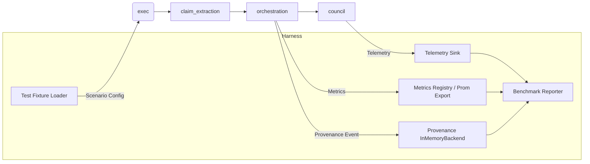

# End-to-End Verification Strategy (V3)

## Objectives
- Exercise the complete worker → council → orchestration pipeline under production-like conditions.
- Produce verifiable artefacts for **decisions**, **claims**, and **compliance** so that every scenario can be audited through provenance, metrics, and logs.
- Track latency/throughput benchmarks (Tier‑1 targets: `council_consensus_ms ≤ 5000`, `api_p95_ms ≤ 1000`) while the test runs.
- Validate that telemetry from the `observability` crate and the provenance service is emitted, persisted, and queryable.

## Target System Under Test
```
workers::executor  ──┐
                     │   Claim extraction + verification
                     ▼
             claim-extraction::processor
                     │   (evidence)
                     ▼
        orchestration::orchestrate_task
                     │   (CAWS runtime, provenance, persistence)
                     ▼
           council::ConsensusCoordinator
                     │
                     ▼
           persistence + provenance layer
```

The E2E harness should spin up the full graph with in-memory or test-specific back-ends (e.g., Postgres in Docker for persistence, in-memory provenance storage, deterministic telemetry collectors).

## Scenario Matrix
| Scenario | Purpose | Key Assertions | Observability Signals |
|----------|---------|----------------|------------------------|
| **Happy Path – Tier 2 change** | Worker produces compliant diff; council converges on `Accept`. | Final verdict `Accept`, verdict stored, provenance chain updated, no waivers. | `consensus_time_ms`, telemetry snapshots, `ProvenanceRecord` with decision hash. |
| **CAWS Short-Circuit** | Runtime validator rejects change before council evaluation. | Final verdict `Reject` with short-circuit marker, council bypassed, provenance contains validation failure. | `validation_result(short_circuit=true)`, `AgentTelemetryCollector::record_violation`. |
| **Claim Verification / Evidence Rich** | Input contains verifiable claims requiring research pipeline. | `ClaimExtractionResult` yields evidence, council sees claims coverage, provenance `claim_verification` populated. | Analytics engine records `BusinessMetrics`, telemetry includes claim coverage, SLO check for verification latency. |
| **Resilience & Retry** | Inject transient DB/provenance failures to validate retry + backoff. | Circuit breaker trips and recovers; idempotent writes succeed; errors logged at WARN with correlation IDs. | Retry counters, alert emitted only after threshold, provenance integrity check passes post-retry. |
| **Performance Benchmark (Load Smoke)** | Run N tasks to sample latency & resource metrics. | Ensure p95 consensus latency within Tier‑1 budget, resource planner logs device allocations. | Tracing spans (`arm` target), metrics exported to registry, benchmark report stored as artefact. |

## Harness Design

- **Scenario Config**: YAML/JSON describing task metadata, worker output, expected verdict and telemetry envelopes (stored under `tests/fixtures/e2e/`).
- **Telemetry Sink**: wraps `observability::AgentTelemetryCollector` + `tracing` subscriber capturing structured logs.
- **Metrics Registry**: use `observability::metrics::MetricRegistry` in memory; export to snapshot after run.
- **Provenance Storage**: leverage `ProvenanceService::with_defaults` with `InMemoryStorage` (or lightweight SQLite) to capture `ProvenanceRecord`s.
- **Benchmark Reporter**: aggregates metrics + timings into JSON artifact (saved in `target/e2e/` for CI upload).

## Implementation Phases
1. **Harness Foundations**
   - Build `tests/e2e/support/harness.rs` with builder pattern that wires runtime validator, coordinator, persistence, provenance, telemetry.
   - Implement `TelemetryCapture` trait wrapping `observability` structures + `tracing_subscriber::fmt::Collector`.
   - Add helper to run scenario config and return `ScenarioReport` (verdict, timings, telemetry snapshots, provenance chain).
2. **Scenario Suites**
   - Author scenario fixtures for each matrix entry (including worker outputs that trigger desired behaviour).
   - For performance benchmark, support parameter `iterations` and `warm_up` to gather p50/p95 metrics.
3. **Verification Layer**
   - Provide assertion helpers: `assert_verdict`, `assert_provenance`, `assert_metrics`, `assert_telemetry`.
   - Add schema validation against JSON schemas (reuse `agent-agency-contracts` for worker/final verdict payloads).
4. **CI Integration**
   - Create `cargo test --package integration-tests --test e2e` wrapper with feature flag `e2e`.
   - Capture `target/e2e/*.json` as CI artefacts; optionally push to analytics dashboard for regression tracking.

## Observability Hooks
- **Tracing**: Install `tracing_subscriber::Registry` with span recorder collecting `council`, `arm`, `provenance` targets. Assert span counts & durations.
- **Metrics**: Use `observability::metrics::MetricHandle` to read counters/gauges after scenario run (`consensus_time_ms`, `agent_success_rate`, `arm_latency_ms`).
- **Telemetry**: Snapshot `AgentPerformanceSnapshot` and verify fields (`response_time_ms`, `queue_depth`, `consecutive_failures`).
- **Provenance**: Use `ProvenanceService::verify_integrity` to ensure each `ProvenanceRecord` passes integrity checks; persist JSON for audit.

## Benchmark Reporting
Each end-to-end run should emit:
```json
{
  "scenario": "happy_path",
  "task_id": "T-12345",
  "consensus_time_ms": 1832,
  "verdict": "Accept",
  "telemetry": {
    "worker_response_ms": 540,
    "agent_success_rate": 0.97
  },
  "provenance_hash": "sha256:...",
  "metrics": {
    "consensus_time_p95": 2100,
    "arm_latency_p95": 180
  }
}
```

## Next Steps
1. Implement harness skeleton (see `tests/e2e/orchestrator_verifiable.rs`).
2. Add scenario fixture generation utility.
3. Integrate performance benchmark summariser (consider `criterion` or manual histogram).
4. Wire into CI with optional nightly run due to runtime cost.
