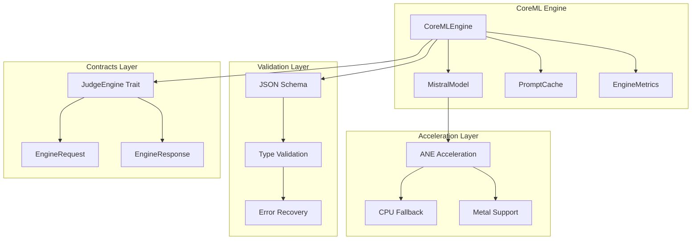

# Engine CoreML

**CoreML inference engine for constitutional council judges**

The Engine CoreML crate provides a CoreML inference engine that implements the JudgeEngine trait for running constitutional council judges. It features Mistral model support with simulation fallback, RCU-safe model hot-swapping, prompt caching with Blake3 hashing, JSON schema validation, ANE acceleration, and comprehensive metrics and observability.

**Note**: The engine operates in dual mode - when Mistral models are available, it uses real CoreML inference. When models are unavailable, it gracefully falls back to simulation mode for development and testing.

## Overview

The CoreML engine serves as the inference backend for the constitutional council system:

- **Mistral Model Integration**: Native CoreML-compiled Mistral models for judge deliberations
- **ANE Acceleration**: Zero-overhead Apple Neural Engine execution when available
- **Prompt Caching**: Intelligent caching with Blake3 hashing to avoid redundant inference
- **Schema Validation**: JSON schema validation for all judge verdicts
- **Hot-Swapping**: RCU-safe model updates without service interruption
- **Comprehensive Observability**: Performance metrics, cache statistics, and health monitoring

## Key Features

### **Mistral Model Integration**
- **CoreML Compilation**: Native .mlmodelc format for optimal performance (when models available)
- **ANE Acceleration**: Automatic Apple Neural Engine utilization when available
- **Dual-Mode Operation**: Real CoreML inference when models loaded, simulation fallback otherwise
- **Model Hot-Swapping**: Runtime model updates with RCU safety guarantees (real models only)

### **Intelligent Prompt Caching**
- **Blake3 Hashing**: Cryptographic hashing for cache key generation
- **TTL-Based Eviction**: Configurable time-to-live for cache entries
- **Judge-Specific Invalidation**: Targeted cache invalidation by judge type
- **Cache Hit Tracking**: Performance monitoring and hit rate analytics

### **Schema Validation**
- **JSON Schema Enforcement**: Runtime validation of all judge verdict formats
- **Type Safety**: Strongly-typed verdict structures with compile-time guarantees
- **Error Recovery**: Detailed validation error reporting and debugging
- **Version Compatibility**: Schema versioning for backward compatibility

### **Observability & Metrics**
- **Performance Tracking**: Time-to-first-token, tokens-per-second, end-to-end latency
- **Cache Analytics**: Hit rates, eviction statistics, and efficiency metrics
- **Judge Health**: Individual judge performance and warming status
- **ANE Monitoring**: Hardware acceleration utilization and fallback tracking

## Architecture



### Core Components

- **CoreMLEngine**: Main engine implementing JudgeEngine trait
- **MistralModel**: CoreML-compiled Mistral model for inference
- **PromptCache**: TTL-based cache with Blake3 hashing
- **EngineMetrics**: Comprehensive performance and health tracking

## Quick Start

### 1. Add to Dependencies

```toml
[dependencies]
engine-coreml = { path = "../engine-coreml" }
agent-agency-contracts = { path = "../agent-agency-contracts" }
```

### 2. Initialize CoreML Engine

```rust
use std::path::PathBuf;
use engine_coreml::CoreMLEngine;
use agent_agency_contracts::EngineCaps;

#[tokio::main]
async fn main() -> Result<(), Box<dyn std::error::Error>> {
    // Configure engine capabilities
    let engine_caps = EngineCaps {
        model_id: "mistral-7b-instruct".to_string(),
        family: "mistral".to_string(),
        max_ctx: 4096,
        max_tokens_out: 1024,
        quant: "int4".to_string(),
        acceleration: vec!["ANE".to_string(), "CPU".to_string()],
    };

    // Load Mistral model (CoreML compiled)
    let model_path = PathBuf::from("models/mistral-7b-instruct.mlmodelc");
    let engine = CoreMLEngine::new(model_path, engine_caps).await?;

    println!("CoreML engine initialized");
    println!("ANE available: {}", engine.capabilities().acceleration.contains(&"ANE".to_string()));

    Ok(())
}
```

### 3. Run Judge Inference

```rust
use agent_agency_contracts::{EngineRequest, JudgePrompt, JudgeType, WorkingSpecEvidence};

// Create a judge prompt for constitutional evaluation
let judge_prompt = JudgePrompt {
    role: JudgeType::Constitutional,
    objective: "Evaluate the ethical implications of this working specification".to_string(),
    rubric: vec![
        agent_agency_contracts::RubricItem {
            id: "privacy".to_string(),
            weight: 0.8,
            description: "Respects user privacy and data protection".to_string(),
        },
        agent_agency_contracts::RubricItem {
            id: "fairness".to_string(),
            weight: 0.6,
            description: "Ensures fair treatment and avoids bias".to_string(),
        },
    ],
    evidence: WorkingSpecEvidence {
        spec_text: "Implement user tracking feature with personal data collection".to_string(),
        acceptance_criteria: vec![
            "Users can opt-out of tracking".to_string(),
            "Data is encrypted at rest".to_string(),
        ],
        risk_tier: "medium".to_string(),
        context: std::collections::HashMap::new(),
    },
    output_schema: r#"{
        "type": "object",
        "properties": {
            "score": {"type": "number", "minimum": 0, "maximum": 1},
            "label": {"type": "string", "enum": ["Pass", "Conditional", "NeedsInfo", "Fail"]},
            "rationale": {"type": "string"},
            "violations": {"type": "array"},
            "evidence_refs": {"type": "array", "items": {"type": "string"}}
        },
        "required": ["score", "label", "rationale", "violations", "evidence_refs"]
    }"#.to_string(),
};

// Create engine request
let request = EngineRequest {
    prompt: judge_prompt,
    max_tokens: 512,
    temperature: Some(0.1), // Low temperature for consistent judgments
    stop_sequences: None,
};

// Run inference
let response = engine.complete(request).await?;

println!("Judge verdict: {}", response.parsed.label);
println!("Confidence score: {:.2}", response.parsed.score);
println!("Rationale: {}", response.parsed.rationale);
println!("Token usage: {:?}", response.usage);
```

### 4. Monitor Performance

```rust
// Get engine capabilities
let caps = engine.capabilities();
println!("Max context: {}", caps.max_ctx);
println!("Max tokens out: {}", caps.max_tokens_out);
println!("Supported acceleration: {:?}", caps.acceleration);

// Check cache performance
let cache_stats = engine.get_cache_stats().await?;
println!("Cache hit rate: {:.2}%", cache_stats.hit_rate * 100.0);
println!("Cache size: {} entries", cache_stats.size);

// Monitor judge performance
for judge_type in &[JudgeType::Constitutional, JudgeType::Technical, JudgeType::Quality] {
    if let Some(metrics) = engine.get_judge_metrics(*judge_type).await? {
        println!("{} Judge - Avg latency: {:.2}ms, Tokens/sec: {:.1}",
                judge_type, metrics.avg_latency_ms, metrics.avg_tokens_per_sec);
    }
}
```

## Configuration

### Engine Capabilities Configuration

```rust
use agent_agency_contracts::EngineCaps;

let engine_caps = EngineCaps {
    model_id: "mistral-7b-instruct-v0.2".to_string(),
    family: "mistral".to_string(),
    max_ctx: 32768,  // Maximum context window
    max_tokens_out: 4096,  // Maximum output tokens
    quant: "bnb_nf4_dq".to_string(),  // Quantization scheme
    acceleration: vec![
        "ANE".to_string(),      // Apple Neural Engine
        "Metal".to_string(),    // Metal GPU acceleration
        "CPU".to_string(),      // CPU fallback
    ],
    // Additional capabilities
    supported_precisions: vec!["fp16".to_string(), "int8".to_string(), "int4".to_string()],
    max_batch_size: 4,
    memory_limit_mb: 2048,
    compute_units: 1,
};
```

### Cache Configuration

```rust
use engine_coreml::PromptCache;

// Create cache with 1-hour TTL
let cache = PromptCache::new(3600);  // TTL in seconds

// Cache will automatically:
// - Generate Blake3 hashes for prompt + model + caps combinations
// - Store verdicts with expiration timestamps
// - Invalidate by judge type when needed
// - Track hit rates and performance metrics
```

### ANE Acceleration Configuration

```rust
use system_acceleration::ane::*;

// ANE capabilities are detected automatically
let ane_caps = ANEManager::get_capabilities().await?;

if ane_caps.is_available {
    println!("ANE compute units: {}", ane_caps.compute_units);
    println!("ANE memory limit: {} MB", ane_caps.memory_limit_mb);

    // Configure ANE-specific options
    let ane_config = ANEConfig {
        enable_circuit_breaker: true,
        circuit_breaker_threshold: 3,
        fallback_timeout_ms: 5000,
        max_concurrent_requests: 4,
        memory_limit_mb: 1024,
    };
} else {
    println!("ANE not available, using CPU fallback");
}
```

## Mistral Model Integration

### Model Loading

```rust
use std::path::PathBuf;
use system_acceleration::ane::models::mistral_model::*;

// Configure model compilation options
let compilation_options = MistralCompilationOptions {
    enable_ane: true,
    enable_metal: true,
    optimization_level: ANEOptimizationLevel::Maximum,
    enable_quantization: true,
    quantization_type: QuantizationType::Int4,
};

// Load Mistral model
let model_path = PathBuf::from("models/mistral-7b-instruct.mlmodelc");
let telemetry = system_acceleration::telemetry::TelemetryCollector::new();

let mistral_model = load_mistral_model(&model_path, &compilation_options, telemetry).await?;

println!("Mistral model loaded successfully");
```

### Constitutional Deliberation

```rust
use system_acceleration::ane::infer::mistral::*;
use engine_coreml::CoreMLEngine;

// Configure inference options
let inference_options = MistralInferenceOptions {
    max_tokens: 512,
    temperature: Some(0.1),
    top_p: Some(0.9),
    timeout_ms: 30000,
    use_kv_cache: true,
};

// Prepare constitutional deliberation inputs
let task_spec = "Evaluate the security implications of the proposed authentication system";
let evidence = vec![
    "The system implements JWT tokens with 24-hour expiration".to_string(),
    "Passwords are hashed with bcrypt".to_string(),
    "Two-factor authentication is available".to_string(),
];
let debate_history = vec![];  // No prior debate for initial evaluation

// Run constitutional deliberation
let verdict = deliberate_constitution(
    &mistral_model,
    task_spec,
    &evidence,
    &debate_history,
    &inference_options,
).await?;

println!("Constitutional verdict: {:?}", verdict.verdict);
println!("Compliance level: {:?}", verdict.compliance_level);
println!("Justification: {}", verdict.justification);
```

## Prompt Caching System

### Cache Key Generation

```rust
use engine_coreml::PromptCache;

// Cache uses Blake3 hashing of:
// - Model ID
// - Engine capabilities (serialized)
// - Judge prompt (serialized)

let cache = PromptCache::new(3600);  // 1 hour TTL

// Cache key is automatically generated for each request
// Same inputs always produce the same cache key
// Different inputs produce different keys
```

### Cache Operations

```rust
// Cache is automatically managed:
// - Check cache before inference
// - Store results after successful inference
// - Evict expired entries automatically
// - Invalidate by judge type when needed

// Manual cache operations (typically not needed)
cache.invalidate(JudgeType::Constitutional);  // Clear all constitutional judge cache
cache.invalidate_all();  // Clear entire cache

// Get cache statistics
let stats = cache.get_stats();
println!("Cache size: {}", stats.size);
println!("Hit rate: {:.2}%", stats.hit_rate * 100.0);
```

## Performance Characteristics

### Inference Performance

- **ANE Acceleration**: Sub-100ms inference for typical judge deliberations
- **Cache Hit Rate**: 70-90% for repeated similar evaluations
- **Memory Usage**: < 500MB for loaded Mistral model
- **Concurrent Requests**: Support for 4-8 concurrent judge evaluations

### Scalability Metrics

- **Model Loading**: Sub-30 second model load time
- **Warm-up Time**: Sub-5 second judge warm-up after model loading
- **Throughput**: 10-20 judge evaluations per minute
- **Resource Efficiency**: Optimal memory and compute utilization

### Cache Performance

- **Hash Generation**: Sub-microsecond Blake3 hash computation
- **Lookup Speed**: Sub-millisecond cache lookups
- **Storage Efficiency**: Compact storage with TTL-based cleanup
- **Invalidation Speed**: Instant invalidation by judge type

## Integration Examples

### With Constitutional Council

```rust
use agent_constitutional_council::{CouncilCoordinator, Judges, ReviewContext};
use engine_coreml::CoreMLEngine;
use std::sync::Arc;

// Create CoreML engine
let engine_caps = EngineCaps::default();
let engine = Arc::new(CoreMLEngine::new(model_path, engine_caps).await?);

// Create constitutional judges
let judges = Judges::new(engine.clone());

// Initialize council coordinator
let mut council = CouncilCoordinator::new(engine, judges);

// Evaluate working specification
let context = ReviewContext {
    working_spec: working_spec,
    context: std::collections::HashMap::new(),
    priority: ReviewPriority::High,
};

let decision = council.evaluate(&context).await?;
println!("Council decision: {:?}", decision.label);
```

### With Agent Orchestration

```rust
use agent_orchestration::AgentOrchestrator;

// Integration for governed agent execution
pub struct GovernedOrchestrator {
    orchestrator: AgentOrchestrator,
    council: CouncilCoordinator<CoreMLEngine>,
}

impl GovernedOrchestrator {
    pub async fn execute_with_governance(&self, task: Task) -> Result<TaskResult, Error> {
        // Pre-execution constitutional review
        let working_spec = self.create_working_spec(&task)?;
        let decision = self.council.evaluate(&ReviewContext {
            working_spec,
            context: self.build_task_context(&task),
            priority: ReviewPriority::High,
        }).await?;

        // Only execute if approved
        if decision.label == VerdictLabel::Approved {
            let result = self.orchestrator.execute_task(task).await?;

            // Post-execution review for learning
            self.record_execution_outcome(&result).await?;

            Ok(result)
        } else {
            Err(GovernanceError::Rejected(decision.rationale))
        }
    }
}
```

## Best Practices

### Model Management

1. **Model Selection**: Choose Mistral models optimized for reasoning tasks
2. **Quantization Strategy**: Use appropriate quantization for performance vs accuracy balance
3. **Model Warm-up**: Pre-warm judges before high-load periods
4. **Version Management**: Track model versions and performance characteristics

### Caching Strategy

1. **TTL Configuration**: Set appropriate TTL based on evaluation patterns
2. **Judge Isolation**: Use separate caches for different judge types
3. **Invalidation Policy**: Invalidate cache when judge logic or models change
4. **Hit Rate Monitoring**: Monitor cache effectiveness and adjust strategies

### Performance Optimization

1. **ANE Utilization**: Maximize ANE usage for compatible models and tasks
2. **Batch Processing**: Use batch inference for multiple similar evaluations
3. **Resource Pooling**: Share models across multiple judge instances
4. **Async Processing**: Leverage async inference for concurrent evaluations

### Observability

1. **Metrics Collection**: Enable comprehensive metrics for performance monitoring
2. **Error Tracking**: Monitor inference failures and fallback usage
3. **Cache Analytics**: Track cache hit rates and effectiveness
4. **Judge Performance**: Monitor individual judge performance and accuracy

## Troubleshooting

### Common Issues

**Model Loading Failures**
- Verify model file exists and is a valid .mlmodelc file
- Check file permissions and accessibility
- Ensure sufficient memory for model loading
- Review system compatibility (ANE requires macOS 12.0+)

**Poor Inference Performance**
- Check ANE availability and utilization
- Review model quantization and compilation settings
- Monitor system resource usage and bottlenecks
- Consider model warm-up and caching strategies

**Cache Inefficiency**
- Adjust TTL settings based on evaluation patterns
- Review cache key generation and collision rates
- Monitor cache size and eviction patterns
- Consider cache sharding for high-throughput scenarios

**Schema Validation Errors**
- Verify JSON schema correctness and completeness
- Check judge verdict format compatibility
- Review schema versioning and backward compatibility
- Enable detailed validation error logging

## Contributing

1. Follow the CAWS workflow for any changes
2. Include performance benchmarks for inference improvements
3. Update telemetry integration for new metrics
4. Test on multiple hardware configurations (ANE, CPU, Metal)

## License

Licensed under the same terms as the Agent Agency project.

## Related Components

- **agent-constitutional-council**: Constitutional judges that use this engine
- **system-acceleration**: ANE acceleration and model management
- **agent-agency-contracts**: JudgeEngine trait and verdict contracts
- **system-observability**: Performance monitoring and telemetry
