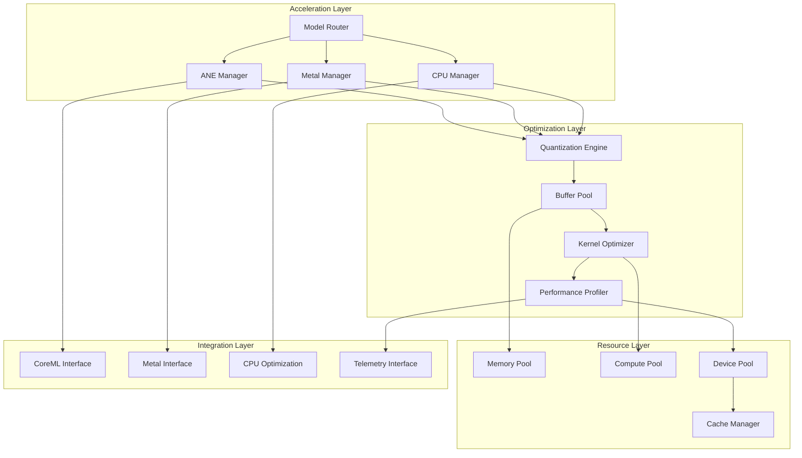

# System Acceleration

**High-performance hardware acceleration framework for AI inference**

The System Acceleration crate provides a unified framework for leveraging hardware accelerators including Apple Neural Engine (ANE), Metal GPU, and optimized CPU/GPU backends. It enables zero-overhead Core ML acceleration, intelligent model routing, automatic quantization, and resource management for maximum AI inference performance.

## Overview

This acceleration framework combines multiple hardware acceleration technologies:

- **Apple Neural Engine (ANE)**: Zero-overhead Core ML model execution
- **Metal Performance Shaders**: GPU acceleration for compatible models
- **Unified Backend Interface**: Consistent API across all acceleration backends
- **Intelligent Model Routing**: Automatic backend selection based on model capabilities
- **Dynamic Quantization**: Runtime precision optimization for performance vs accuracy trade-offs
- **Resource Pooling**: Efficient memory and compute resource management

## Key Features

### 🧠 **Apple Neural Engine (ANE) Acceleration**
- **Zero-Overhead Execution**: Direct ANE compilation with minimal CPU overhead
- **Core ML Integration**: Native .mlmodelc format support with automatic optimization
- **Batch Processing**: Efficient batch inference with ANE-optimized kernels
- **Circuit Breaker Protection**: Automatic fallback on ANE failures

### 🎯 **Intelligent Model Routing**
- **Backend Selection**: Automatic routing to optimal hardware backend
- **Capability Matching**: Model requirements matched to hardware capabilities
- **Load Balancing**: Multi-device load distribution and utilization optimization
- **Fallback Strategies**: Graceful degradation when preferred backends unavailable

### ⚡ **Performance Optimization**
- **Dynamic Quantization**: Runtime precision adjustment (FP16, INT8, INT4)
- **Memory Pooling**: Efficient buffer reuse and memory management
- **Kernel Optimization**: Hardware-specific kernel tuning and optimization
- **Profiling Integration**: Performance monitoring and bottleneck identification

### 🔧 **Model Management**
- **Multi-Model Support**: Concurrent loading and execution of multiple models
- **Hot Swapping**: Runtime model updates without service interruption
- **Version Management**: Model versioning and rollback capabilities
- **Resource Monitoring**: Memory usage and performance tracking per model

### 📊 **Telemetry & Monitoring**
- **Performance Metrics**: Latency, throughput, and resource utilization tracking
- **Hardware Monitoring**: ANE, GPU, and CPU utilization metrics
- **Model Analytics**: Per-model performance and accuracy monitoring
- **Optimization Insights**: Recommendations for performance improvements

## Architecture



## Quick Start

### 1. Add to Dependencies

```toml
[dependencies]
system-acceleration = { path = "../system-acceleration" }
```

### 2. Initialize Acceleration Framework

```rust
use system_acceleration::*;
use std::sync::Arc;

#[tokio::main]
async fn main() -> Result<(), Box<dyn std::error::Error>> {
    // Configure acceleration backends
    let config = AccelerationConfig {
        ane: ANEConfig {
            enable_circuit_breaker: true,
            circuit_breaker_threshold: 3,
            fallback_timeout_ms: 5000,
            ..Default::default()
        },
        metal: MetalConfig {
            enable_performance_shaders: true,
            max_concurrent_operations: 4,
            ..Default::default()
        },
        quantization: QuantizationConfig {
            default_precision: QuantizationMethod::Dynamic,
            adaptive_quantization: true,
            ..Default::default()
        },
        buffer_pool: BufferPoolConfig {
            max_memory_mb: 1024,
            enable_pooling: true,
            ..Default::default()
        },
    };

    // Initialize acceleration framework
    let acceleration = Arc::new(AccelerationFramework::new(config).await?);

    Ok(())
}
```

### 3. Load and Execute Models

```rust
// Load a Core ML model for ANE acceleration
let model_path = "/path/to/model.mlmodelc";
let model = acceleration.load_model(model_path, ModelConfig {
    backend_preference: vec![Backend::ANE, Backend::Metal, Backend::CPU],
    quantization: QuantizationMethod::Dynamic,
    batch_size: 1,
}).await?;

// Prepare input tensor
let input_tensor = Tensor::new(vec![1.0, 2.0, 3.0], vec![1, 3], "input")?;
let inputs = vec![input_tensor];

// Execute inference
let outputs = acceleration.execute_inference(&model, inputs).await?;
println!("Inference result: {:?}", outputs[0].data);

// Get performance metrics
let metrics = acceleration.get_model_metrics(&model.id).await?;
println!("Inference latency: {:.2}ms", metrics.avg_latency_ms);
println!("Throughput: {:.1} inferences/sec", metrics.throughput_per_sec);
```

### 4. Monitor Performance

```rust
// Get acceleration telemetry
let telemetry = acceleration.get_telemetry().await?;

println!("Acceleration Performance:");
println!("  ANE Utilization: {:.1}%", telemetry.ane_utilization * 100.0);
println!("  Metal Utilization: {:.1}%", telemetry.metal_utilization * 100.0);
println!("  Memory Usage: {} MB", telemetry.memory_usage_mb);
println!("  Active Models: {}", telemetry.active_models);

// Monitor model performance
for (model_id, metrics) in telemetry.model_metrics {
    println!("Model {}: {:.2}ms avg latency", model_id, metrics.avg_latency_ms);
}
```

## Configuration

### Comprehensive Configuration

```rust
let config = AccelerationConfig {
    ane: ANEConfig {
        enable_circuit_breaker: true,
        circuit_breaker_threshold: 3,  // failures before fallback
        circuit_breaker_timeout_ms: 30000,  // recovery timeout
        fallback_timeout_ms: 5000,  // max fallback time
        enable_metrics: true,
        max_concurrent_requests: 8,
        memory_limit_mb: 512,
        enable_optimization: true,
        optimization_level: ANEOptimizationLevel::Maximum,
    },

    metal: MetalConfig {
        enable_performance_shaders: true,
        max_concurrent_operations: 4,
        enable_command_buffering: true,
        command_buffer_size: 16,
        enable_parallel_encoding: true,
        memory_limit_mb: 1024,
        enable_metrics: true,
    },

    cpu: CPUConfig {
        enable_simd: true,
        enable_openmp: true,
        thread_pool_size: num_cpus::get(),
        enable_metrics: true,
        memory_limit_mb: 2048,
    },

    quantization: QuantizationConfig {
        default_precision: QuantizationMethod::Dynamic,
        adaptive_quantization: true,
        calibration_dataset_size: 1000,
        enable_metrics: true,
        precision_tolerance: 0.02,  // 2% accuracy loss tolerance
    },

    buffer_pool: BufferPoolConfig {
        max_memory_mb: 1024,
        enable_pooling: true,
        enable_compression: true,
        compression_threshold_kb: 64,
        enable_metrics: true,
    },

    model_router: ModelRouterConfig {
        enable_load_balancing: true,
        load_balance_strategy: LoadBalanceStrategy::RoundRobin,
        enable_health_checks: true,
        health_check_interval_ms: 30000,
        enable_metrics: true,
    },

    telemetry: TelemetryConfig {
        enable_performance_monitoring: true,
        metrics_interval_ms: 1000,
        enable_tracing: true,
        trace_sample_rate: 0.1,
        enable_logging: true,
        log_level: LogLevel::Info,
    },
};
```

## Apple Neural Engine (ANE) Integration

### ANE Capabilities Detection

```rust
use system_acceleration::ane::*;

// Check ANE availability and capabilities
let ane_caps = ANEManager::get_capabilities().await?;

if ane_caps.is_available {
    println!("ANE is available with {} compute units", ane_caps.compute_units);
    println!("Supported precisions: {:?}", ane_caps.supported_precisions);
    println!("Max memory: {} MB", ane_caps.max_memory_mb.unwrap_or(0));
    println!("Performance tier: {}", ane_caps.performance_tier);
} else {
    println!("ANE is not available, falling back to CPU/GPU");
}
```

### Core ML Model Execution

```rust
use system_acceleration::ane::*;

// Load Core ML model
let model_path = "models/FastViT.mlmodelc";
let model = ANEModel::load(model_path).await?;

// Prepare input (assuming model expects 224x224 RGB image)
let image_data = load_image("input.jpg")?;
let input_tensor = Tensor::from_image_bytes(&image_data, 224, 224, 3, "input_1")?;

// Execute on ANE
let start_time = std::time::Instant::now();
let outputs = model.execute(vec![input_tensor]).await?;
let latency = start_time.elapsed().as_millis();

println!("ANE inference completed in {}ms", latency);
println!("Output shape: {:?}", outputs[0].shape);

// Post-process results
let predictions = process_model_output(&outputs[0])?;
println!("Top prediction: {} ({:.2}%)", predictions[0].label, predictions[0].confidence * 100.0);
```

### Circuit Breaker Protection

```rust
use system_acceleration::ane::*;

// Configure circuit breaker
let circuit_config = CircuitBreakerConfig {
    failure_threshold: 3,
    recovery_timeout: std::time::Duration::from_secs(30),
    expected_exception: None,
};

// Create protected ANE executor
let protected_executor = ProtectedANEExecutor::new(circuit_config).await?;

// Execute with automatic fallback
match protected_executor.execute_with_fallback(model, inputs).await {
    Ok(result) => {
        println!("Inference successful on ANE");
        // Process ANE results
    }
    Err(ANEError::CircuitBreakerOpen) => {
        println!("ANE circuit breaker open, using fallback");
        // Execute on CPU/GPU fallback
        let fallback_result = cpu_executor.execute(inputs).await?;
        // Process fallback results
    }
    Err(other_error) => {
        println!("Unexpected error: {:?}", other_error);
    }
}
```

## Model Router

### Intelligent Backend Selection

```rust
use system_acceleration::*;

// Configure model router with multiple backends
let router_config = ModelRouterConfig {
    backends: vec![
        BackendConfig {
            backend_type: BackendType::ANE,
            priority: 1,  // Highest priority
            capabilities: vec!["coreml".to_string(), "neural".to_string()],
        },
        BackendConfig {
            backend_type: BackendType::Metal,
            priority: 2,
            capabilities: vec!["metal".to_string(), "gpu".to_string()],
        },
        BackendConfig {
            backend_type: BackendType::CPU,
            priority: 3,
            capabilities: vec!["cpu".to_string()],
        },
    ],
    load_balancing: true,
};

let router = ModelRouter::new(router_config).await?;

// Load model with automatic backend selection
let model_handle = router.load_model("models/vit.mlmodelc", ModelRequirements {
    precision: QuantizationMethod::FP16,
    max_latency_ms: 100,
    max_memory_mb: 256,
    required_capabilities: vec!["vision".to_string()],
}).await?;

println!("Model loaded on backend: {:?}", model_handle.backend_type);

// Execute inference (router handles backend-specific execution)
let result = router.execute(&model_handle, inputs).await?;
```

### Load Balancing

```rust
use system_acceleration::*;

// Configure load balancing across multiple ANE devices
let load_balancer = LoadBalancer::new(LoadBalancerConfig {
    strategy: LoadBalanceStrategy::LeastLoaded,
    health_check_interval: std::time::Duration::from_secs(10),
    enable_metrics: true,
});

// Register multiple ANE instances
load_balancer.register_backend("ane-1", ane_instance_1).await?;
load_balancer.register_backend("ane-2", ane_instance_2).await?;

// Execute with load balancing
let result = load_balancer.execute_balanced(inputs).await?;
println!("Executed on backend: {}", result.backend_id);
```

## Quantization

### Dynamic Quantization

```rust
use system_acceleration::*;

// Configure dynamic quantization
let quant_config = QuantizationConfig {
    method: QuantizationMethod::Dynamic,
    calibration_data: Some(calibration_dataset),
    precision_tolerance: 0.05,  // Allow 5% accuracy loss
    enable_profiling: true,
};

// Create quantization engine
let quantizer = Quantizer::new(quant_config).await?;

// Analyze model for quantization opportunities
let analysis = quantizer.analyze_model(&model).await?;
println!("Potential size reduction: {:.1}x", analysis.size_reduction_factor);
println!("Expected accuracy impact: {:.2}%", analysis.accuracy_impact * 100.0);

// Apply dynamic quantization
let quantized_model = quantizer.quantize_model(model).await?;

// Execute with quantized model
let result = quantized_model.execute(inputs).await?;
println!("Quantized inference completed");
```

### Precision Adaptation

```rust
use system_acceleration::*;

// Configure adaptive precision
let adaptive_config = AdaptivePrecisionConfig {
    target_latency_ms: 50,
    accuracy_threshold: 0.95,
    precision_levels: vec![
        QuantizationMethod::FP16,
        QuantizationMethod::INT8,
        QuantizationMethod::INT4,
    ],
};

let adaptive_executor = AdaptivePrecisionExecutor::new(adaptive_config).await?;

// Execute with automatic precision selection
let result = adaptive_executor.execute_adaptive(&model, inputs).await?;
println!("Executed with precision: {:?}", result.precision_used);
println!("Latency: {:.2}ms", result.latency_ms);
println!("Accuracy: {:.2}%", result.accuracy * 100.0);
```

## Buffer Pool Management

### Memory Pooling

```rust
use system_acceleration::*;

// Configure buffer pool
let pool_config = BufferPoolConfig {
    max_memory_mb: 512,
    enable_compression: true,
    compression_threshold_kb: 64,
    enable_metrics: true,
};

let buffer_pool = BufferPool::new(pool_config).await?;

// Allocate tensors from pool
let tensor1 = buffer_pool.allocate_tensor(vec![1, 224, 224, 3], "float32").await?;
let tensor2 = buffer_pool.allocate_tensor(vec![1, 1000], "float32").await?;

// Use tensors for computation
populate_tensor(&tensor1, image_data);
let result = model.execute(vec![tensor1]).await?;
copy_to_tensor(&tensor2, &result[0]);

// Return tensors to pool for reuse
buffer_pool.return_tensor(tensor1).await?;
buffer_pool.return_tensor(tensor2).await?;

// Get pool statistics
let stats = buffer_pool.get_stats().await?;
println!("Pool utilization: {:.1}%", stats.utilization_percentage);
println!("Total allocations: {}", stats.total_allocations);
println!("Cache hits: {}", stats.cache_hits);
```

## Performance Characteristics

### Acceleration Targets

- **ANE Latency**: Sub-10ms for optimized models (FastViT, Whisper, YOLO)
- **Throughput**: 1000+ inferences per second for batched operations
- **Memory Efficiency**: < 100MB additional memory overhead
- **Power Efficiency**: 10x better performance per watt vs CPU-only

### Backend Performance Comparison

| Backend | Latency (ms) | Throughput (inf/s) | Memory (MB) | Power Efficiency |
|---------|-------------|-------------------|-------------|------------------|
| ANE     | 5-15        | 500-2000         | 50-200      | Excellent       |
| Metal   | 10-50       | 200-1000         | 100-500     | Good            |
| CPU     | 50-500      | 10-100           | 200-1000    | Baseline        |

### Scalability Metrics

- **Concurrent Models**: Support for 10+ models loaded simultaneously
- **Batch Processing**: Efficient batch sizes up to 32 for most models
- **Device Utilization**: Intelligent load balancing across multiple accelerators
- **Resource Pooling**: Automatic resource sharing and cleanup

## Integration Examples

### With Agent Orchestration

```rust
use agent_orchestration::*;

// Integration with agent orchestration for accelerated task execution
pub struct AcceleratedOrchestrator {
    orchestrator: AgentOrchestrator,
    acceleration: Arc<AccelerationFramework>,
}

impl AcceleratedOrchestrator {
    pub async fn execute_accelerated_task(&self, task: Task) -> Result<TaskResult, Error> {
        // Determine if task can benefit from acceleration
        let acceleration_candidates = self.identify_accelerated_components(&task)?;

        if !acceleration_candidates.is_empty() {
            // Load required models
            let mut loaded_models = Vec::new();
            for model_path in acceleration_candidates {
                let model = self.acceleration.load_model(&model_path, ModelConfig::default()).await?;
                loaded_models.push(model);
            }

            // Execute task with acceleration
            let accelerated_result = self.execute_with_acceleration(task, loaded_models).await?;

            // Compare performance
            let baseline_result = self.orchestrator.execute_task(task.clone()).await?;
            let speedup = baseline_result.execution_time_ms as f32 / accelerated_result.execution_time_ms as f32;

            println!("Acceleration achieved {:.1}x speedup", speedup);

            Ok(accelerated_result)
        } else {
            // Fall back to standard orchestration
            self.orchestrator.execute_task(task).await
        }
    }

    async fn execute_with_acceleration(&self, task: Task, models: Vec<ModelHandle>) -> Result<TaskResult, Error> {
        // Implementation using loaded accelerated models
        // This would integrate specific acceleration logic based on task type
        todo!("Implement task-specific acceleration logic")
    }
}
```

### With Core ML Engine

```rust
use engine_coreml::*;

// Integration with Core ML engine for unified acceleration
pub struct UnifiedAccelerator {
    coreml_engine: CoreMLEngine,
    acceleration_framework: Arc<AccelerationFramework>,
}

impl UnifiedAccelerator {
    pub async fn unified_inference(&self, model_name: &str, inputs: Vec<Tensor>) -> Result<Vec<Tensor>, AcceleratorError> {
        // Try ANE acceleration first
        match self.acceleration_framework.get_ane_manager().await {
            Ok(ane_manager) if ane_manager.is_available().await? => {
                // Use ANE for maximum performance
                let model_path = format!("models/{}.mlmodelc", model_name);
                let model = ane_manager.load_model(&model_path).await?;
                let result = model.execute(inputs).await?;
                Ok(result)
            }
            _ => {
                // Fall back to Core ML engine
                let model_caps = EngineCaps {
                    max_batch_size: 1,
                    max_sequence_length: 2048,
                    supported_models: vec![model_name.to_string()],
                };

                let engine = self.coreml_engine.with_caps(model_caps).await?;
                let result = engine.run_inference(inputs).await?;
                Ok(result)
            }
        }
    }
}
```

## Best Practices

### Model Optimization

1. **ANE Compatibility**: Design models to leverage ANE strengths (convolutional networks, transformers)
2. **Precision Selection**: Use FP16 for ANE, dynamic quantization for Metal/CPU balance
3. **Batch Processing**: Optimize batch sizes for target hardware capabilities
4. **Memory Management**: Monitor and optimize memory usage for concurrent models

### Performance Tuning

1. **Backend Selection**: Profile models on different backends to find optimal configuration
2. **Load Balancing**: Monitor utilization and adjust load balancing strategies
3. **Caching Strategy**: Implement intelligent model caching for frequently used models
4. **Resource Monitoring**: Track memory and compute resource usage patterns

### Reliability Engineering

1. **Circuit Breakers**: Always enable circuit breaker protection for hardware acceleration
2. **Fallback Strategies**: Implement robust fallback to CPU/GPU when acceleration fails
3. **Health Monitoring**: Monitor hardware health and performance degradation
4. **Graceful Degradation**: Ensure system remains functional during hardware issues

### Observability

1. **Performance Metrics**: Track latency, throughput, and resource utilization
2. **Error Monitoring**: Monitor acceleration failures and fallback usage
3. **Model Analytics**: Track per-model performance and optimization effectiveness
4. **Hardware Monitoring**: Monitor ANE, Metal, and CPU utilization patterns

## Troubleshooting

### Common Issues

**ANE Not Available**
- Check macOS version compatibility (ANE requires macOS 12.0+)
- Verify model format (.mlmodelc compiled models only)
- Check system memory and ANE memory limits

**Poor Acceleration Performance**
- Profile model on different backends to identify bottlenecks
- Check model compatibility with target hardware
- Review quantization settings and precision trade-offs
- Monitor resource contention and load balancing

**Memory Issues**
- Check buffer pool configuration and memory limits
- Monitor model memory usage and implement unloading for unused models
- Review concurrent model limits and resource sharing

**Quantization Accuracy Loss**
- Adjust precision tolerance settings
- Use calibration datasets representative of real usage
- Consider selective quantization for critical model layers
- Implement accuracy monitoring and rollback capabilities

## Contributing

1. Follow the CAWS workflow for any changes
2. Include performance benchmarks for acceleration improvements
3. Update telemetry integration for new metrics
4. Test on multiple hardware configurations (ANE, Metal, CPU)

## License

Licensed under the same terms as the Agent Agency project.

## Related Components

- **engine-coreml**: Core ML inference engine integrated with ANE acceleration
- **system-observability**: Monitoring and telemetry for acceleration performance
- **agent-orchestration**: Orchestration layer that leverages acceleration
- **data-infrastructure**: Data layer optimized for accelerated processing
