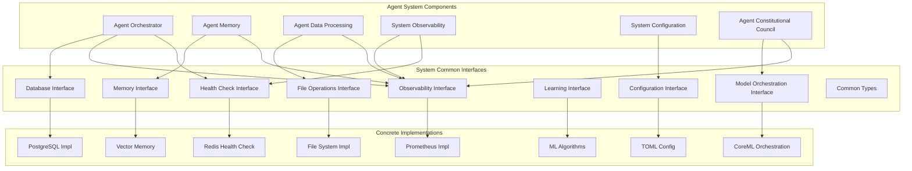

# System Common Interfaces

**Shared Interface Layer for Breaking Circular Dependencies in Agent Agency V3**

The System Common Interfaces crate provides a comprehensive set of shared interfaces, types, and abstractions that enable loose coupling and dependency injection across the entire Agent Agency V3 system. By centralizing common interfaces, this crate eliminates circular dependencies while maintaining clean architectural boundaries.

## Overview

This interface foundation combines multiple critical abstraction layers:

- **Database Interfaces**: Generic database operations with backend-agnostic APIs
- **Observability Interfaces**: Metrics, logging, tracing, and monitoring abstractions
- **Health Check Interfaces**: Service health monitoring and dependency checking
- **Configuration Types**: Shared configuration structures and validation
- **File Operation Interfaces**: Safe file system operations with rollback capabilities
- **Learning Interfaces**: Machine learning and optimization abstractions
- **Model Orchestration Interfaces**: AI model management and inference coordination
- **Memory Interfaces**: Agent memory and context management abstractions
- **Common Types**: Shared data types and error handling across the system

## Key Features

### 🔗 **Dependency Injection Architecture**
- **Trait-based Interfaces**: All services defined as traits for dependency injection
- **Runtime Polymorphism**: Concrete implementations provided at runtime
- **Clean Architecture**: Clear separation between interface contracts and implementations
- **Testability**: Easy mocking and testing through interface abstractions

### 🗄️ **Database Abstraction Layer**
- **Backend Agnostic**: Support for PostgreSQL, SQLite, MongoDB, and custom backends
- **Type Safety**: Strongly typed database operations with compile-time guarantees
- **Connection Management**: Automatic connection pooling and health monitoring
- **Migration Support**: Schema migration and version management interfaces

### 📊 **Observability Interfaces**
- **Metrics Collection**: Counters, gauges, histograms with rich labeling
- **Distributed Tracing**: Request tracing across service boundaries
- **Structured Logging**: Consistent log formats with context propagation
- **Health Monitoring**: Service health checks and dependency monitoring

### ❤️ **Health Check Framework**
- **Service Health**: Component-level health assessment
- **Dependency Checks**: External service and database health validation
- **Circuit Breakers**: Automatic failure detection and recovery
- **Scheduled Monitoring**: Periodic health assessment and alerting

### ⚙️ **Configuration Management**
- **Layered Configuration**: Environment, file, and programmatic configuration
- **Validation**: Schema-based configuration validation
- **Hot Reloading**: Runtime configuration updates without service restart
- **Secret Management**: Secure handling of sensitive configuration values

### 📁 **File Operation Interfaces**
- **Atomic Operations**: All-or-nothing file operations with rollback
- **Workspace Isolation**: Sandboxed file operations with resource limits
- **Version Control**: File versioning and change tracking
- **Security**: Safe file access with permission validation

### 🧠 **Learning and Optimization**
- **Algorithm Abstractions**: Machine learning algorithm interfaces
- **Experience Management**: Learning from task execution experiences
- **Performance Optimization**: Continuous improvement and adaptation
- **Pattern Recognition**: Identifying and learning from successful patterns

### 🤖 **Model Orchestration**
- **Inference Coordination**: Managing multiple AI model instances
- **Load Balancing**: Intelligent distribution of inference requests
- **Model Lifecycle**: Model loading, unloading, and resource management
- **Performance Monitoring**: Model performance tracking and optimization

### 🧠 **Memory Management**
- **Agent Memory**: Persistent storage of agent experiences and knowledge
- **Context Management**: Working memory and context preservation
- **Knowledge Graphs**: Relationship-based knowledge representation
- **Retrieval Interfaces**: Efficient memory retrieval and search

## Architecture



### Interface Design Principles

The interfaces follow consistent design principles:

1. **Async by Default**: All operations are async for scalability
2. **Error Handling**: Comprehensive error types with context
3. **Type Safety**: Strong typing with generics where appropriate
4. **Resource Management**: Automatic cleanup and resource management
5. **Observability**: Built-in metrics and tracing hooks
6. **Backwards Compatibility**: Version-aware interface evolution

## Quick Start

### 1. Add to Dependencies

```toml
[dependencies]
system-common-interfaces = { path = "../system-common-interfaces" }
async-trait = "0.1"
serde = { version = "1.0", features = ["derive"] }
```

### 2. Using Database Interface

```rust
use system_common_interfaces::{DatabaseInterface, DbValue, QueryParams, Result};
use async_trait::async_trait;

// Define a service that depends on database interface
struct UserService<D: DatabaseInterface> {
    database: D,
}

#[async_trait]
impl<D: DatabaseInterface> UserService<D> {
    async fn create_user(&self, name: &str, email: &str) -> Result<User> {
        let mut params = std::collections::HashMap::new();
        params.insert("name".to_string(), DbValue::String(name.to_string()));
        params.insert("email".to_string(), DbValue::String(email.to_string()));
        params.insert("created_at".to_string(), DbValue::Timestamp(chrono::Utc::now()));

        let query_params = QueryParams {
            table: "users".to_string(),
            operation: crate::database::QueryOperation::Insert(params),
            ..Default::default()
        };

        let result = self.database.execute_query(query_params).await?;
        // Parse result and return User
        Ok(User {
            id: result.inserted_id.unwrap(),
            name: name.to_string(),
            email: email.to_string(),
        })
    }

    async fn get_user(&self, user_id: &str) -> Result<Option<User>> {
        let query_params = QueryParams {
            table: "users".to_string(),
            operation: crate::database::QueryOperation::Select {
                columns: vec!["id".to_string(), "name".to_string(), "email".to_string()],
                conditions: Some(vec![crate::types::Filter {
                    field: "id".to_string(),
                    operator: crate::types::FilterOperator::Equals,
                    value: DbValue::String(user_id.to_string()),
                }]),
                ..Default::default()
            },
            ..Default::default()
        };

        let result = self.database.execute_query(query_params).await?;
        // Parse result and return Option<User>
        if let Some(row) = result.rows.first() {
            Ok(Some(User {
                id: user_id.to_string(),
                name: row.columns.get("name").unwrap().clone().into_string()?,
                email: row.columns.get("email").unwrap().clone().into_string()?,
            }))
        } else {
            Ok(None)
        }
    }
}
```

### 3. Using Observability Interface

```rust
use system_common_interfaces::{ObservabilityInterface, MetricType, TracingInterface};
use async_trait::async_trait;
use std::collections::HashMap;

// Service with observability
struct PaymentService<O: ObservabilityInterface + TracingInterface> {
    observability: O,
}

#[async_trait]
impl<O: ObservabilityInterface + TracingInterface> PaymentService<O> {
    async fn process_payment(&self, amount: f64, currency: &str) -> Result<PaymentResult> {
        // Start tracing span
        let span = self.observability.start_span(
            "payment_processing",
            HashMap::from([
                ("amount".to_string(), amount.to_string()),
                ("currency".to_string(), currency.to_string()),
            ])
        ).await?;

        // Record metrics
        self.observability.increment_counter(
            "payment_requests_total",
            HashMap::from([("currency".to_string(), currency.to_string())])
        ).await?;

        // Process payment (simplified)
        let start_time = std::time::Instant::now();
        let result = self.perform_payment_processing(amount, currency).await;
        let duration = start_time.elapsed();

        // Record performance metrics
        self.observability.record_histogram(
            "payment_processing_duration_seconds",
            duration.as_secs_f64(),
            HashMap::from([("currency".to_string(), currency.to_string())])
        ).await?;

        match result {
            Ok(payment_result) => {
                // Record success metrics
                self.observability.increment_counter(
                    "payment_success_total",
                    HashMap::from([("currency".to_string(), currency.to_string())])
                ).await?;

                self.observability.finish_span(span, true).await?;
                Ok(payment_result)
            }
            Err(e) => {
                // Record error metrics
                self.observability.increment_counter(
                    "payment_errors_total",
                    HashMap::from([("currency".to_string(), currency.to_string())])
                ).await?;

                // Log error
                self.observability.log_error(
                    "payment_processing_failed",
                    &format!("Payment processing failed: {}", e),
                    HashMap::from([
                        ("amount".to_string(), amount.to_string()),
                        ("currency".to_string(), currency.to_string()),
                        ("error".to_string(), e.to_string()),
                    ])
                ).await?;

                self.observability.finish_span(span, false).await?;
                Err(e)
            }
        }
    }
}
```

### 4. Using Health Check Interface

```rust
use system_common_interfaces::{HealthCheck, HealthCheckResult, HealthStatus};
use async_trait::async_trait;

// Implement custom health check
struct DatabaseHealthCheck<D: DatabaseInterface> {
    database: D,
    name: String,
}

#[async_trait]
impl<D: DatabaseInterface> HealthCheck for DatabaseHealthCheck<D> {
    fn name(&self) -> &str {
        &self.name
    }

    async fn check(&self) -> HealthCheckResult {
        // Perform health check
        let start_time = std::time::Instant::now();

        let query_result = self.database.execute_query(QueryParams {
            table: "health_check".to_string(),
            operation: crate::database::QueryOperation::Select {
                columns: vec!["1".to_string()],
                limit: Some(1),
                ..Default::default()
            },
            ..Default::default()
        }).await;

        let duration = start_time.elapsed();

        match query_result {
            Ok(_) => HealthCheckResult {
                name: self.name.clone(),
                status: HealthStatus::Healthy,
                duration_ms: duration.as_millis() as u64,
                message: Some("Database connection successful".to_string()),
                details: None,
            },
            Err(e) => HealthCheckResult {
                name: self.name.clone(),
                status: HealthStatus::Unhealthy,
                duration_ms: duration.as_millis() as u64,
                message: Some(format!("Database health check failed: {}", e)),
                details: Some(serde_json::json!({
                    "error": e.to_string(),
                    "connection_string": "[REDACTED]"
                })),
            },
        }
    }
}

// Register health checks
let health_registry = HealthCheckRegistry::new();
health_registry.register(Box::new(DatabaseHealthCheck {
    database: database_impl,
    name: "database".to_string(),
}));

// Execute health checks
let health_report = health_registry.execute_all().await?;
println!("Overall health: {:?}", health_report.summary.status);
for check_result in &health_report.checks {
    println!("  {}: {:?}", check_result.name, check_result.status);
}
```

### 5. Using Configuration Types

```rust
use system_common_interfaces::{ConfigLayer, ConfigSource, ConfigValidation};
use serde::{Deserialize, Serialize};

// Define configuration structure
#[derive(Debug, Clone, Serialize, Deserialize)]
struct AppConfig {
    database_url: String,
    redis_url: String,
    api_port: u16,
    enable_metrics: bool,
    log_level: String,
}

// Implement configuration loading
impl AppConfig {
    async fn load() -> Result<Self> {
        let mut config = Self::default();

        // Load from multiple sources
        config.load_from_env()?;
        config.load_from_file("config.toml").await?;
        config.load_from_args()?;

        // Validate configuration
        config.validate()?;

        Ok(config)
    }

    fn load_from_env(&mut self) -> Result<()> {
        if let Ok(url) = std::env::var("DATABASE_URL") {
            self.database_url = url;
        }
        if let Ok(url) = std::env::var("REDIS_URL") {
            self.redis_url = url;
        }
        if let Ok(port) = std::env::var("API_PORT") {
            self.api_port = port.parse()?;
        }
        Ok(())
    }

    async fn load_from_file(&mut self, path: &str) -> Result<()> {
        if tokio::fs::metadata(path).await.is_ok() {
            let content = tokio::fs::read_to_string(path).await?;
            let file_config: Self = toml::from_str(&content)?;
            self.merge(file_config);
        }
        Ok(())
    }

    fn merge(&mut self, other: Self) {
        // Merge logic - other takes precedence
        if !other.database_url.is_empty() {
            self.database_url = other.database_url;
        }
        if !other.redis_url.is_empty() {
            self.redis_url = other.redis_url;
        }
        if other.api_port != 0 {
            self.api_port = other.api_port;
        }
        // ... merge other fields
    }
}

impl Default for AppConfig {
    fn default() -> Self {
        Self {
            database_url: "postgres://localhost/app".to_string(),
            redis_url: "redis://localhost:6379".to_string(),
            api_port: 8080,
            enable_metrics: true,
            log_level: "info".to_string(),
        }
    }
}

impl ConfigValidation for AppConfig {
    fn validate(&self) -> Result<()> {
        if self.database_url.is_empty() {
            return Err("database_url is required".into());
        }
        if self.api_port == 0 {
            return Err("api_port must be greater than 0".into());
        }
        Ok(())
    }
}
```

### 6. Using Learning Interfaces

```rust
use system_common_interfaces::{LearningInterface, Experience, LearningContext, AlgorithmConfig};
use async_trait::async_trait;

// Service with learning capabilities
struct AdaptiveService<L: LearningInterface> {
    learner: L,
}

#[async_trait]
impl<L: LearningInterface> AdaptiveService<L> {
    async fn execute_task_with_learning(&self, task: Task) -> Result<TaskResult> {
        // Create learning context
        let context = LearningContext {
            task_id: task.id.clone(),
            task_type: task.task_type.clone(),
            domain: task.domain.clone(),
            entities: task.entities.clone(),
            temporal_context: Some(task.deadline.map(|d| crate::learning::TemporalContext {
                start_time: chrono::Utc::now(),
                deadline: d,
                priority: task.priority.into(),
                recurrence_pattern: None,
            })),
            metadata: std::collections::HashMap::new(),
        };

        // Get learning insights before execution
        let insights = self.learner.analyze_context(&context).await?;
        println!("Learning insights: {:?}", insights);

        // Adapt execution strategy based on insights
        let adapted_strategy = self.adapt_strategy(&task, &insights);

        // Execute task
        let start_time = std::time::Instant::now();
        let result = self.execute_task_with_strategy(&task, &adapted_strategy).await;
        let execution_time = start_time.elapsed();

        // Create experience for learning
        let experience = Experience {
            id: uuid::Uuid::new_v4(),
            context: context.clone(),
            input: serde_json::json!({
                "task": task,
                "strategy": adapted_strategy,
            }),
            output: match &result {
                Ok(r) => serde_json::json!(r),
                Err(e) => serde_json::json!({"error": e.to_string()}),
            },
            outcome: crate::learning::ExperienceOutcome {
                success: result.is_ok(),
                performance_score: Some(self.calculate_performance_score(&result)),
                learned_capabilities: vec!["task_execution".to_string()],
                failure_reasons: result.as_ref().err().map(|e| vec![e.to_string()]).unwrap_or_default(),
                success_factors: if result.is_ok() { vec!["adaptive_strategy".to_string()] } else { vec![] },
                execution_time_ms: Some(execution_time.as_millis() as u64),
                tokens_used: None,
                feedback: None,
            },
            memory_type: crate::memory::MemoryType::Episodic,
            timestamp: chrono::Utc::now(),
            metadata: std::collections::HashMap::new(),
        };

        // Store experience for future learning
        self.learner.store_experience(experience).await?;

        result
    }

    async fn get_optimization_recommendations(&self, context: &LearningContext) -> Result<Vec<crate::learning::OptimizationRecommendation>> {
        self.learner.generate_recommendations(context).await
    }
}
```

## Interface Specifications

### Database Interface

```rust
#[async_trait]
pub trait DatabaseInterface: Send + Sync {
    /// Execute a database query
    async fn execute_query(&self, params: QueryParams) -> Result<QueryResult>;

    /// Execute a database transaction
    async fn execute_transaction(&self, operations: Vec<QueryParams>) -> Result<Vec<QueryResult>>;

    /// Get database connection health
    async fn health_check(&self) -> Result<HealthStatus>;

    /// Get database statistics
    async fn get_statistics(&self) -> Result<DatabaseStats>;
}
```

### Observability Interface

```rust
#[async_trait]
pub trait ObservabilityInterface: Send + Sync {
    /// Record a counter metric
    async fn counter(&self, name: &str, value: u64, labels: HashMap<String, String>) -> Result<()>;

    /// Increment a counter by 1
    async fn increment_counter(&self, name: &str, labels: HashMap<String, String>) -> Result<()>;

    /// Record a gauge metric
    async fn gauge(&self, name: &str, value: f64, labels: HashMap<String, String>) -> Result<()>;

    /// Record a histogram metric
    async fn histogram(&self, name: &str, value: f64, labels: HashMap<String, String>) -> Result<()>;

    /// Record timing for an operation
    async fn timing(&self, name: &str, duration: Duration, labels: HashMap<String, String>) -> Result<()>;
}

#[async_trait]
pub trait TracingInterface: Send + Sync {
    /// Start a new trace span
    async fn start_span(&self, name: &str, attributes: HashMap<String, String>) -> Result<SpanHandle>;

    /// Add attributes to an existing span
    async fn add_span_attributes(&self, span: &SpanHandle, attributes: HashMap<String, String>) -> Result<()>;

    /// Finish a span
    async fn finish_span(&self, span: SpanHandle, success: bool) -> Result<()>;
}
```

### Health Check Interface

```rust
#[async_trait]
pub trait HealthCheck: Send + Sync {
    /// Get the name of this health check
    fn name(&self) -> &str;

    /// Execute the health check
    async fn check(&self) -> HealthCheckResult;

    /// Get health check metadata
    fn metadata(&self) -> HealthCheckInfo {
        HealthCheckInfo {
            name: self.name().to_string(),
            description: None,
            timeout: None,
            tags: vec![],
        }
    }
}

pub struct HealthCheckRegistry {
    checks: HashMap<String, Box<dyn HealthCheck>>,
}

impl HealthCheckRegistry {
    pub fn new() -> Self;
    pub fn register(&mut self, check: Box<dyn HealthCheck>);
    pub async fn execute_all(&self) -> Result<HealthReport>;
    pub async fn execute_check(&self, name: &str) -> Result<HealthCheckResult>;
}
```

### Configuration Interface

```rust
#[async_trait]
pub trait ConfigInterface: Send + Sync {
    /// Load configuration from a source
    async fn load(&mut self, source: ConfigSource) -> Result<()>;

    /// Validate configuration
    async fn validate(&self) -> Result<ValidationResult>;

    /// Get configuration value
    async fn get(&self, key: &str) -> Result<Option<ConfigValue>>;

    /// Set configuration value
    async fn set(&mut self, key: &str, value: ConfigValue) -> Result<()>;

    /// Watch for configuration changes
    async fn watch<F>(&self, callback: F) -> Result<()>
    where
        F: Fn(ConfigChange) + Send + Sync + 'static;
}
```

### File Operations Interface

```rust
#[async_trait]
pub trait FileOperationsInterface: Send + Sync {
    /// Read file content
    async fn read_file(&self, path: &std::path::Path) -> Result<Vec<u8>>;

    /// Write file content
    async fn write_file(&self, path: &std::path::Path, content: &[u8]) -> Result<()>;

    /// Check if file exists
    async fn file_exists(&self, path: &std::path::Path) -> Result<bool>;

    /// Get file metadata
    async fn get_metadata(&self, path: &std::path::Path) -> Result<FileMetadata>;

    /// List directory contents
    async fn list_directory(&self, path: &std::path::Path) -> Result<Vec<DirectoryEntry>>;

    /// Create directory
    async fn create_directory(&self, path: &std::path::Path) -> Result<()>;

    /// Remove file or directory
    async fn remove(&self, path: &std::path::Path) -> Result<()>;

    /// Move/rename file or directory
    async fn move_item(&self, from: &std::path::Path, to: &std::path::Path) -> Result<()>;

    /// Copy file or directory
    async fn copy_item(&self, from: &std::path::Path, to: &std::path::Path) -> Result<()>;
}
```

### Learning Interface

```rust
#[async_trait]
pub trait LearningInterface: Send + Sync {
    /// Analyze context for learning insights
    async fn analyze_context(&self, context: &LearningContext) -> Result<LearningInsights>;

    /// Store an experience for learning
    async fn store_experience(&self, experience: Experience) -> Result<()>;

    /// Retrieve relevant experiences
    async fn retrieve_experiences(&self, context: &LearningContext, limit: usize) -> Result<Vec<Experience>>;

    /// Generate optimization recommendations
    async fn generate_recommendations(&self, context: &LearningContext) -> Result<Vec<OptimizationRecommendation>>;

    /// Get learning statistics
    async fn get_statistics(&self) -> Result<LearningStatistics>;

    /// Update learning model with new data
    async fn update_model(&self, experiences: Vec<Experience>) -> Result<()>;
}
```

### Model Orchestration Interface

```rust
#[async_trait]
pub trait ModelOrchestrator: Send + Sync {
    /// Route inference request to appropriate model
    async fn route_inference(&self, request: InferenceRequest) -> Result<RoutingDecision>;

    /// Execute inference on routed model
    async fn execute_inference(&self, request: InferenceRequest, routing: &RoutingDecision) -> Result<InferenceResponse>;

    /// Get model capabilities and status
    async fn get_model_capabilities(&self, model_id: &str) -> Result<ModelCapabilities>;

    /// Scale model instances based on load
    async fn scale_model(&self, model_id: &str, target_instances: usize) -> Result<()>;

    /// Get orchestration statistics
    async fn get_statistics(&self) -> Result<OrchestrationStatistics>;

    /// Register new model instance
    async fn register_model(&self, model: ModelInstance) -> Result<()>;

    /// Unregister model instance
    async fn unregister_model(&self, model_id: &str) -> Result<()>;
}
```

### Memory Interface

```rust
#[async_trait]
pub trait MemoryInterface: Send + Sync {
    /// Store agent experience in memory
    async fn store_experience(&self, experience: AgentExperience) -> Result<()>;

    /// Retrieve contextual memories
    async fn retrieve_contextual_memories(&self, context: &TaskContext, limit: usize) -> Result<Vec<MemoryResult>>;

    /// Search memories by content
    async fn search_memories(&self, query: &str, filters: MemoryFilters, limit: usize) -> Result<Vec<MemoryResult>>;

    /// Update existing memory
    async fn update_memory(&self, memory_id: &MemoryId, updates: MemoryUpdates) -> Result<()>;

    /// Delete memory
    async fn delete_memory(&self, memory_id: &MemoryId) -> Result<()>;

    /// Get memory statistics
    async fn get_statistics(&self) -> Result<MemoryStatistics>;

    /// Consolidate and optimize memory storage
    async fn consolidate_memories(&self) -> Result<ConsolidationResult>;
}
```

## Performance Characteristics

### Interface Overhead

- **Trait Dispatch**: Minimal runtime overhead for dynamic dispatch
- **Async Operations**: Efficient async/await implementation with tokio
- **Memory Usage**: Low memory footprint with shared trait objects
- **Serialization**: Efficient JSON serialization for data transfer

### Scalability

- **Concurrent Access**: Thread-safe interfaces supporting high concurrency
- **Resource Pooling**: Built-in connection pooling for database and external services
- **Load Balancing**: Intelligent distribution across multiple service instances
- **Horizontal Scaling**: Support for distributing load across multiple nodes

### Type Safety

- **Compile-time Checks**: Strong typing prevents runtime errors
- **Generic Constraints**: Appropriate generic bounds for type safety
- **Error Propagation**: Comprehensive error types with context
- **Validation**: Runtime validation with detailed error messages

## Integration Examples

### With Agent Orchestrator

```rust
use system_common_interfaces::*;
use async_trait::async_trait;

// Orchestrator using common interfaces
pub struct AgentOrchestrator<D, O, H>
where
    D: DatabaseInterface,
    O: ObservabilityInterface,
    H: HealthCheck,
{
    database: D,
    observability: O,
    health_check: H,
}

#[async_trait]
impl<D, O, H> AgentOrchestrator<D, O, H>
where
    D: DatabaseInterface,
    O: ObservabilityInterface,
    H: HealthCheck,
{
    pub async fn new(database: D, observability: O, health_check: H) -> Result<Self> {
        Ok(Self {
            database,
            observability,
            health_check,
        })
    }

    pub async fn execute_task(&self, task: Task) -> Result<TaskResult> {
        // Start observability
        let span = self.observability.start_span(
            "task_execution",
            HashMap::from([("task_id".to_string(), task.id.to_string())])
        ).await?;

        // Record metrics
        self.observability.increment_counter(
            "tasks_started",
            HashMap::from([("task_type".to_string(), task.task_type.clone())])
        ).await?;

        // Execute task logic
        let start_time = std::time::Instant::now();
        let result = self.perform_task_execution(&task).await;
        let duration = start_time.elapsed();

        // Record performance
        self.observability.timing(
            "task_execution_duration",
            duration,
            HashMap::from([("task_type".to_string(), task.task_type.clone())])
        ).await?;

        match &result {
            Ok(_) => {
                self.observability.increment_counter(
                    "tasks_completed",
                    HashMap::from([("status".to_string(), "success".to_string())])
                ).await?;
            }
            Err(_) => {
                self.observability.increment_counter(
                    "tasks_completed",
                    HashMap::from([("status".to_string(), "error".to_string())])
                ).await?;
            }
        }

        // Store result in database
        self.store_task_result(&task, &result).await?;

        self.observability.finish_span(span, result.is_ok()).await?;

        result
    }

    async fn perform_task_execution(&self, task: &Task) -> Result<TaskResult> {
        // Task execution logic
        // This would use the actual agent execution logic
        Ok(TaskResult {
            task_id: task.id.clone(),
            status: TaskStatus::Completed,
            result: serde_json::json!({"success": true}),
            execution_time_ms: 1000,
        })
    }

    async fn store_task_result(&self, task: &Task, result: &Result<TaskResult>) -> Result<()> {
        let mut params = HashMap::new();
        params.insert("task_id".to_string(), DbValue::String(task.id.to_string()));
        params.insert("status".to_string(), DbValue::String(
            match result {
                Ok(_) => "completed",
                Err(_) => "failed",
            }.to_string()
        ));
        params.insert("result".to_string(), DbValue::Json(
            match result {
                Ok(r) => serde_json::to_value(r)?,
                Err(e) => serde_json::json!({"error": e.to_string()}),
            }
        ));

        let query = QueryParams {
            table: "task_results".to_string(),
            operation: QueryOperation::Insert(params),
            ..Default::default()
        };

        self.database.execute_query(query).await?;
        Ok(())
    }

    pub async fn health_status(&self) -> HealthStatus {
        match self.health_check.check().await {
            HealthCheckResult { status, .. } => status,
        }
    }
}
```

### With System Observability

```rust
use system_common_interfaces::*;

// Observability service using common interfaces
pub struct ObservabilityService<D, T>
where
    D: DatabaseInterface,
    T: TracingInterface,
{
    database: D,
    tracer: T,
}

impl<D, T> ObservabilityService<D, T>
where
    D: DatabaseInterface,
    T: TracingInterface,
{
    pub async fn record_system_metrics(&self) -> Result<()> {
        let span = self.tracer.start_span(
            "record_system_metrics",
            HashMap::new()
        ).await?;

        // Collect system metrics
        let metrics = self.collect_system_metrics().await?;

        // Store in database
        for (metric_name, value) in metrics {
            let mut params = HashMap::new();
            params.insert("metric_name".to_string(), DbValue::String(metric_name.clone()));
            params.insert("value".to_string(), DbValue::Float(value));
            params.insert("timestamp".to_string(), DbValue::Timestamp(chrono::Utc::now()));

            let query = QueryParams {
                table: "system_metrics".to_string(),
                operation: QueryOperation::Insert(params),
                ..Default::default()
            };

            self.database.execute_query(query).await?;
        }

        self.tracer.finish_span(span, true).await?;
        Ok(())
    }

    async fn collect_system_metrics(&self) -> Result<HashMap<String, f64>> {
        // System metrics collection logic
        let mut metrics = HashMap::new();

        // CPU usage
        metrics.insert("cpu_usage_percent".to_string(), 45.2);

        // Memory usage
        metrics.insert("memory_usage_mb".to_string(), 1024.5);

        // Disk usage
        metrics.insert("disk_usage_percent".to_string(), 67.8);

        Ok(metrics)
    }
}
```

## Best Practices

### Interface Design

1. **Minimal Interfaces**: Keep interfaces focused on specific responsibilities
2. **Async by Default**: Design for asynchronous operations from the start
3. **Error Context**: Provide rich error information for debugging
4. **Version Compatibility**: Plan for interface evolution and versioning
5. **Performance Awareness**: Consider performance implications of interface design

### Implementation Guidelines

1. **Dependency Injection**: Use constructor injection for interface dependencies
2. **Resource Management**: Implement proper cleanup and resource management
3. **Error Handling**: Comprehensive error handling with appropriate error types
4. **Observability**: Built-in metrics and tracing for all implementations
5. **Testing**: Easy to mock and test through interface abstractions

### Usage Patterns

1. **Trait Objects**: Use `Arc<dyn Trait>` for runtime polymorphism
2. **Generic Bounds**: Use generic bounds for compile-time polymorphism
3. **Builder Pattern**: Use builders for complex interface construction
4. **Configuration**: External configuration for interface behavior
5. **Health Checks**: Implement health checks for all service interfaces

## Troubleshooting

### Common Issues

**Circular Dependencies**
- **Cause**: Direct dependencies between implementation crates
- **Solution**: Move shared types to common interfaces, use trait objects for dynamic dispatch

**Trait Bound Errors**
- **Cause**: Missing trait bounds on generic parameters
- **Solution**: Add appropriate trait bounds (`Send + Sync`, specific interface traits)

**Async Trait Limitations**
- **Cause**: Complex async trait method signatures
- **Solution**: Simplify method signatures, use associated types where appropriate

**Performance Overhead**
- **Cause**: Excessive dynamic dispatch or boxing
- **Solution**: Use monomorphization where possible, optimize hot paths

**Type Safety Issues**
- **Cause**: Weak typing in interface definitions
- **Solution**: Strengthen type constraints, use associated types for related types

## Contributing

1. Follow the CAWS workflow for any changes
2. Include comprehensive tests for new interfaces and types
3. Update documentation for interface changes and new abstractions
4. Run integration tests to ensure interface compatibility

## License

Licensed under the same terms as the Agent Agency project.

## Related Components

- **data-infrastructure**: Provides database implementations for DatabaseInterface
- **system-observability**: Implements ObservabilityInterface and TracingInterface
- **system-configuration**: Uses ConfigurationInterface for config management
- **agent-memory**: Implements MemoryInterface for agent memory operations
- **system-acceleration**: Uses ModelOrchestrationInterface for model management
