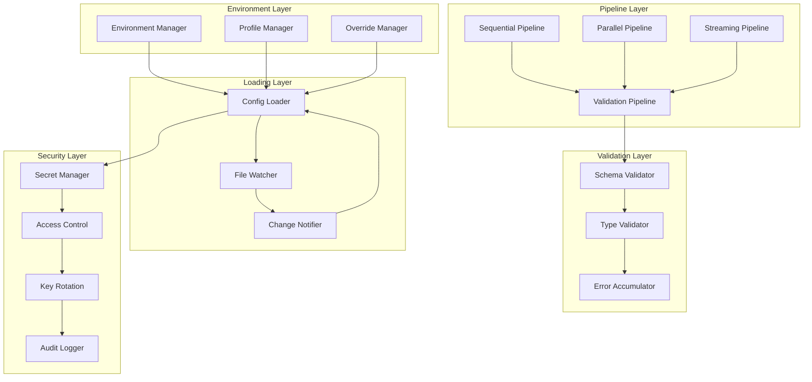

# System Configuration

**Unified configuration management and pipeline patterns for AI agent systems**

The System Configuration crate provides a comprehensive configuration management platform that combines environment-aware configuration loading, hot-reloading capabilities, and standardized pipeline patterns into a unified system designed for high-performance AI agent workloads.

## Overview

This configuration platform consolidates multiple critical configuration capabilities:

- **Environment Management**: Environment-aware configuration with dev/staging/prod/test profiles
- **Configuration Loading**: Hot-reloadable configuration with file watching and change notifications
- **Pipeline Patterns**: Standardized pipeline abstractions for sequential, parallel, streaming, and validation workflows
- **Configuration Validation**: Schema-based validation with error accumulation and reporting
- **Secret Management**: Secure credential handling with encryption and access controls

## Key Features

### 🌍 **Environment-Aware Configuration**
- **Multi-Environment Support**: Development, staging, production, and test environments
- **Environment Variables**: Hierarchical environment variable loading with overrides
- **Profile-Based Configuration**: Environment-specific configuration profiles and overrides
- **Runtime Environment Detection**: Automatic environment detection and configuration adaptation

### 🔄 **Hot-Reloadable Configuration**
- **File Watching**: Real-time configuration file monitoring and automatic reloading
- **Change Notifications**: Event-driven configuration change notifications to subscribers
- **Atomic Reloads**: Thread-safe configuration updates without service interruption
- **Rollback Support**: Configuration rollback capabilities for failed deployments

### 🔧 **Pipeline Patterns**
- **Sequential Pipelines**: Ordered stage execution with data flow between stages
- **Parallel Pipelines**: Concurrent execution with result aggregation and synchronization
- **Streaming Pipelines**: Continuous data processing with backpressure handling
- **Validation Pipelines**: Multi-stage validation with comprehensive error reporting

### ✅ **Configuration Validation**
- **Schema Validation**: JSON Schema-based configuration validation
- **Type Safety**: Strongly-typed configuration structures with compile-time guarantees
- **Error Accumulation**: Comprehensive error reporting with actionable error messages
- **Validation Pipelines**: Multi-stage validation workflows with early termination options

### 🔐 **Secret Management**
- **Secure Storage**: Encrypted secret storage with hardware security module integration
- **Access Controls**: Fine-grained access control for secret retrieval and usage
- **Key Rotation**: Automated key rotation with zero-downtime secret updates
- **Audit Logging**: Complete audit trails for secret access and modifications

## Architecture



## Quick Start

### 1. Add to Dependencies

```toml
[dependencies]
system-configuration = { path = "../system-configuration" }
```

### 2. Initialize Configuration System

```rust
use system_configuration::*;
use std::sync::Arc;

#[tokio::main]
async fn main() -> Result<(), Box<dyn std::error::Error>> {
    // Initialize environment manager
    let environment = Environment::from_env_var().unwrap_or(Environment::Development);

    // Create configuration loader with hot-reloading
    let mut loader = ConfigLoader::builder()
        .with_config_path("config/")
        .with_reload_interval(std::time::Duration::from_secs(30))
        .build()
        .await?;

    // Load configuration with environment-specific overrides
    let config = loader.load_config(&environment).await?;

    println!("Configuration loaded for environment: {}", environment.as_str());
    println!("Active configuration keys: {}", config.keys().len());

    Ok(())
}
```

### 3. Use Pipeline Patterns

```rust
use system_configuration::*;

// Create a sequential pipeline
let pipeline_config = SequentialPipelineConfig {
    name: "data_processing_pipeline".to_string(),
    description: Some("Process and validate incoming data".to_string()),
    enable_metrics: true,
    enable_tracing: true,
    timeout: std::time::Duration::from_secs(300),
    max_concurrent_operations: 5,
    ..Default::default()
};

let mut pipeline: SequentialPipeline<DataBatch> = SequentialPipeline::new(pipeline_config);

// Add processing stages
pipeline.add_stage(Box::new(ValidationStage::new(validation_rules))).await?;
pipeline.add_stage(Box::new(TransformationStage::new(transform_config))).await?;
pipeline.add_stage(Box::new(StorageStage::new(storage_config))).await?;

// Execute pipeline
let input_data = DataBatch::from_json(json_data)?;
let result = pipeline.execute(input_data).await?;

println!("Pipeline execution completed: {} stages processed", result.stage_count);
```

### 4. Monitor Configuration Changes

```rust
use system_configuration::*;

// Create configuration watcher
let watcher_id = loader.add_watcher(move |new_config| {
    println!("Configuration updated! Keys: {}", new_config.len());

    // Check for specific configuration changes
    if let Some(database_url) = new_config.get("database.url") {
        println!("Database URL updated: {:?}", database_url);
        // Reconnect to database with new URL
    }

    if let Some(feature_flags) = new_config.get("features") {
        println!("Feature flags updated: {:?}", feature_flags);
        // Update feature flag state
    }

    Ok(())
}).await?;

// Start hot-reloading
loader.start_watching().await?;

// Configuration changes will now trigger the watcher callback
```

## Configuration

### Environment Configuration

```rust
use system_configuration::*;

// Configure environment-specific settings
let env_config = EnvironmentConfig {
    environment: Environment::Production,
    base_path: "config/".to_string(),
    override_path: Some("config/overrides/".to_string()),
    secret_path: Some("secrets/".to_string()),
    cache_config: CacheConfig {
        enable_caching: true,
        cache_ttl: std::time::Duration::from_secs(300),
        max_cache_size: 1000,
    },
    validation_config: ValidationConfig {
        enable_validation: true,
        strict_mode: true,
        fail_on_warnings: false,
        schema_path: Some("schemas/".to_string()),
    },
};

// Load environment configuration
let env_manager = EnvironmentManager::new(env_config).await?;
let current_env = env_manager.detect_environment().await?;

println!("Current environment: {}", current_env.as_str());
println!("Configuration base path: {}", env_config.base_path);
```

### Pipeline Configuration

```rust
use system_configuration::*;

// Sequential pipeline configuration
let seq_config = SequentialPipelineConfig {
    name: "document_processing".to_string(),
    description: Some("Process documents through validation, OCR, and indexing".to_string()),
    enable_metrics: true,
    enable_tracing: true,
    timeout: std::time::Duration::from_secs(600), // 10 minutes
    max_concurrent_operations: 3,
    enable_circuit_breaker: true,
    circuit_breaker_threshold: 5,
    circuit_breaker_recovery_timeout: std::time::Duration::from_secs(120),
    enable_health_monitoring: true,
    health_check_interval: std::time::Duration::from_secs(60),
};

// Parallel pipeline configuration
let par_config = ParallelPipelineConfig {
    name: "batch_inference".to_string(),
    description: Some("Parallel model inference across multiple GPUs".to_string()),
    enable_metrics: true,
    enable_tracing: true,
    timeout: std::time::Duration::from_secs(300),
    max_concurrent_operations: 8,
    aggregation_strategy: AggregationStrategy::AllRequired,
    error_handling: ErrorHandlingStrategy::FailFast,
    enable_load_balancing: true,
    load_balance_strategy: LoadBalanceStrategy::RoundRobin,
};

// Streaming pipeline configuration
let stream_config = StreamingPipelineConfig {
    name: "real_time_analytics".to_string(),
    description: Some("Real-time data analytics with backpressure handling".to_string()),
    enable_metrics: true,
    enable_tracing: true,
    timeout: std::time::Duration::from_secs(3600), // 1 hour
    buffer_size: 10000,
    max_concurrent_operations: 10,
    backpressure_strategy: BackpressureStrategy::DropOldest,
    enable_health_monitoring: true,
    health_check_interval: std::time::Duration::from_secs(30),
};
```

### Configuration Loading Configuration

```rust
use system_configuration::*;

// Advanced loader configuration
let loader_config = ConfigLoaderConfig {
    config_path: "config/".to_string(),
    file_patterns: vec![
        "*.yaml".to_string(),
        "*.yml".to_string(),
        "*.json".to_string(),
        "*.toml".to_string(),
    ],
    reload_interval: std::time::Duration::from_secs(30),
    enable_file_watching: true,
    watch_debounce_ms: 500,
    max_config_size_kb: 1024,
    enable_compression: true,
    compression_threshold_kb: 64,
    validation_config: ValidationConfig {
        enable_validation: true,
        strict_mode: true,
        fail_on_warnings: false,
        schema_path: Some("schemas/config/".to_string()),
    },
    security_config: SecurityConfig {
        enable_encryption: true,
        key_rotation_days: 30,
        audit_log_path: Some("logs/config_audit.log".to_string()),
    },
};

// Create advanced loader
let loader = ConfigLoader::with_config(loader_config).await?;
```

## Pipeline Patterns

### Sequential Pipeline

```rust
use system_configuration::*;

// Implement custom pipeline stages
#[derive(Debug)]
struct ValidationStage {
    rules: Vec<ValidationRule>,
}

impl PipelineStage for ValidationStage {
    type Input = DataBatch;
    type Output = ValidatedData;
    type Error = ValidationError;

    async fn execute(&self, input: Self::Input) -> Result<Self::Output, Self::Error> {
        // Validate input data
        for rule in &self.rules {
            rule.validate(&input)?;
        }

        Ok(ValidatedData::from_batch(input))
    }

    fn name(&self) -> &str {
        "validation_stage"
    }

    fn description(&self) -> &str {
        "Validate input data against business rules"
    }
}

// Use in sequential pipeline
let mut pipeline: SequentialPipeline<DataBatch> = SequentialPipeline::new(config);
pipeline.add_stage(Box::new(ValidationStage::new(rules))).await?;
pipeline.add_stage(Box::new(ProcessingStage::new())).await?;
pipeline.add_stage(Box::new(StorageStage::new())).await?;

let result = pipeline.execute(input_data).await?;
println!("Pipeline completed: {} stages, {}ms total",
         result.metrics.stage_count, result.metrics.total_duration_ms);
```

### Parallel Pipeline

```rust
use system_configuration::*;

// Parallel processing with result aggregation
#[derive(Debug)]
struct InferenceStage {
    model_path: String,
}

impl ParallelStage for InferenceStage {
    type Input = DataBatch;
    type Output = InferenceResult;
    type Error = InferenceError;

    async fn execute_parallel(&self, inputs: Vec<Self::Input>) -> Vec<Result<Self::Output, Self::Error>> {
        // Execute inference in parallel across multiple inputs
        let mut results = Vec::new();

        for input in inputs {
            let result = self.run_inference(&input).await;
            results.push(result);
        }

        results
    }

    fn name(&self) -> &str {
        "inference_stage"
    }
}

// Configure parallel pipeline
let par_config = ParallelPipelineConfig {
    name: "parallel_inference".to_string(),
    max_concurrent_operations: 4,
    aggregation_strategy: AggregationStrategy::MajorityRequired,
    ..Default::default()
};

let mut pipeline: ParallelPipeline<DataBatch> = ParallelPipeline::new(par_config);
pipeline.add_stage(Box::new(InferenceStage::new("model1.mlmodelc"))).await?;
pipeline.add_stage(Box::new(InferenceStage::new("model2.mlmodelc"))).await?;

let results = pipeline.execute_batch(input_batches).await?;
println!("Parallel execution completed: {} successful, {} failed",
         results.success_count, results.failure_count);
```

### Streaming Pipeline

```rust
use system_configuration::*;

// Streaming data processing with backpressure
#[derive(Debug)]
struct StreamingProcessor {
    buffer: Arc<RwLock<VecDeque<DataItem>>>,
}

impl StreamingStage for StreamingProcessor {
    type Input = DataItem;
    type Output = ProcessedItem;
    type Error = ProcessingError;

    async fn process_stream(
        &self,
        mut input_stream: impl Stream<Item = Self::Input> + Unpin,
        output_sink: impl Sink<Self::Output, Error = Self::Error> + Unpin,
    ) -> Result<(), Self::Error> {
        while let Some(item) = input_stream.next().await {
            // Process item
            let processed = self.process_item(item).await?;

            // Send to output (with backpressure handling)
            output_sink.send(processed).await?;
        }

        Ok(())
    }

    fn name(&self) -> &str {
        "streaming_processor"
    }
}

// Configure streaming pipeline
let stream_config = StreamingPipelineConfig {
    buffer_size: 10000,
    backpressure_strategy: BackpressureStrategy::DropOldest,
    enable_metrics: true,
    ..Default::default()
};

let pipeline: StreamingPipeline<DataItem> = StreamingPipeline::new(stream_config);
let processor = StreamingProcessor::new();

// Start streaming processing
pipeline.start_streaming(processor, input_stream, output_sink).await?;
```

## Configuration Validation

### Schema-Based Validation

```rust
use system_configuration::*;

// Define configuration schema
let schema = r#"
{
    "$schema": "http://json-schema.org/draft-07/schema#",
    "type": "object",
    "properties": {
        "database": {
            "type": "object",
            "properties": {
                "host": {"type": "string"},
                "port": {"type": "integer", "minimum": 1, "maximum": 65535},
                "ssl": {"type": "boolean"}
            },
            "required": ["host", "port"]
        },
        "api": {
            "type": "object",
            "properties": {
                "rate_limit": {"type": "integer", "minimum": 1},
                "timeout_seconds": {"type": "integer", "minimum": 1}
            }
        }
    },
    "required": ["database"]
}
"#;

// Create validator
let validator = SchemaValidator::new(schema)?;

// Validate configuration
let config_value = serde_json::json!({
    "database": {
        "host": "localhost",
        "port": 5432,
        "ssl": true
    },
    "api": {
        "rate_limit": 1000,
        "timeout_seconds": 30
    }
});

let validation_result = validator.validate(&config_value)?;
if validation_result.is_valid {
    println!("Configuration is valid");
} else {
    println!("Configuration validation errors:");
    for error in validation_result.errors {
        println!("  - {}", error);
    }
}
```

## Secret Management

### Secure Secret Storage

```rust
use system_configuration::*;

// Initialize secret manager
let secret_config = SecretConfig {
    storage_path: "secrets/".to_string(),
    encryption_key: "your-encryption-key".to_string(),
    enable_hsm: true,
    key_rotation_days: 30,
    access_logging: true,
};

let secret_manager = SecretManager::new(secret_config).await?;

// Store sensitive configuration
secret_manager.store_secret(
    "database.password",
    SecretValue::String("super-secret-password".to_string()),
    AccessPolicy {
        allowed_roles: vec!["admin".to_string(), "service".to_string()],
        max_access_count: Some(1000),
        expiration_days: Some(90),
    }
).await?;

// Retrieve secret (with access control)
let password = secret_manager.get_secret::<String>("database.password", "service").await?;
println!("Retrieved database password securely");
```

### Key Rotation

```rust
use system_configuration::*;

// Configure key rotation
let rotation_config = KeyRotationConfig {
    rotation_interval_days: 30,
    enable_automatic_rotation: true,
    backup_old_keys: true,
    backup_retention_days: 365,
    notification_webhook: Some("https://notify.example.com/key-rotation".to_string()),
};

// Create key rotation manager
let rotation_manager = KeyRotationManager::new(rotation_config).await?;

// Manually trigger key rotation
let rotation_result = rotation_manager.rotate_keys().await?;
println!("Key rotation completed:");
println!("  Keys rotated: {}", rotation_result.keys_rotated);
println!("  Secrets re-encrypted: {}", rotation_result.secrets_updated);
println!("  Backup created: {}", rotation_result.backup_created);
```

## Performance Characteristics

### Configuration Loading Performance

- **Cold Start**: Sub-100ms for typical configuration loading
- **Hot Reload**: Sub-10ms for incremental configuration updates
- **Memory Usage**: < 50MB for configuration storage and caching
- **Concurrent Access**: Support for 1000+ concurrent configuration reads

### Pipeline Performance

- **Sequential Pipelines**: Overhead < 5ms per stage transition
- **Parallel Pipelines**: Near-linear scaling with CPU cores
- **Streaming Pipelines**: Sub-millisecond latency for backpressure handling
- **Throughput**: 1000+ operations per second depending on stage complexity

### Validation Performance

- **Schema Validation**: Sub-millisecond for typical configurations
- **Type Validation**: Compile-time guarantees with zero runtime overhead
- **Error Accumulation**: Efficient error collection without performance impact
- **Concurrent Validation**: Support for parallel validation of multiple configurations

## Integration Examples

### With Agent Orchestration

```rust
use agent_orchestration::*;
use system_configuration::*;

// Configuration-driven agent orchestration
pub struct ConfigurableOrchestrator {
    orchestrator: AgentOrchestrator,
    config_loader: ConfigLoader,
    pipeline_factory: PipelineFactory,
}

impl ConfigurableOrchestrator {
    pub async fn execute_with_config(&self, task: Task) -> Result<TaskResult, Error> {
        // Load task-specific configuration
        let task_config = self.config_loader.load_task_config(&task.id).await?;

        // Create execution pipeline based on configuration
        let pipeline = self.pipeline_factory.create_pipeline(&task_config.pipeline_type).await?;

        // Add stages based on configuration
        for stage_config in &task_config.stages {
            let stage = self.create_stage_from_config(stage_config).await?;
            pipeline.add_stage(stage).await?;
        }

        // Execute with monitoring
        let result = pipeline.execute(task).await?;

        // Update configuration based on execution results
        self.update_config_from_results(&task.id, &result).await?;

        Ok(result)
    }
}
```

### With Data Infrastructure

```rust
use data_infrastructure::*;
use system_configuration::*;

// Configuration-managed data infrastructure
pub struct ConfigurableDataInfrastructure {
    data_infra: DataInfrastructure,
    config_manager: ConfigManager,
}

impl ConfigurableDataInfrastructure {
    pub async fn initialize_from_config(&mut self) -> Result<(), Error> {
        // Load database configuration
        let db_config = self.config_manager.load_database_config().await?;

        // Configure database connection
        self.data_infra.configure_database(&db_config).await?;

        // Load caching configuration
        let cache_config = self.config_manager.load_cache_config().await?;
        self.data_infra.configure_caching(&cache_config).await?;

        // Load API configuration
        let api_config = self.config_manager.load_api_config().await?;
        self.data_infra.configure_api(&api_config).await?;

        // Set up hot-reloading for configuration changes
        self.setup_config_watching().await?;

        Ok(())
    }

    async fn setup_config_watching(&self) -> Result<(), Error> {
        // Watch for configuration changes
        self.config_manager.add_watcher(|changes| {
            // Handle database configuration changes
            if changes.contains_key("database") {
                // Reconfigure database connection
                self.reconfigure_database().await?;
            }

            // Handle cache configuration changes
            if changes.contains_key("cache") {
                // Update cache settings
                self.reconfigure_cache().await?;
            }

            Ok(())
        }).await?;
    }
}
```

## Best Practices

### Configuration Design

1. **Hierarchical Configuration**: Use environment-specific overrides with base configurations
2. **Schema-First Design**: Define configuration schemas before implementation
3. **Validation at Load Time**: Validate all configuration at startup to catch errors early
4. **Immutable Configurations**: Treat loaded configurations as immutable to prevent runtime inconsistencies

### Pipeline Design

1. **Stage Isolation**: Design pipeline stages to be independent and testable
2. **Error Handling**: Implement comprehensive error handling with proper error propagation
3. **Resource Management**: Properly manage resources in pipeline stages with cleanup
4. **Monitoring Integration**: Integrate metrics collection from the beginning

### Security Considerations

1. **Secret Isolation**: Keep secrets separate from regular configuration
2. **Access Control**: Implement proper access controls for configuration management
3. **Audit Logging**: Enable comprehensive audit logging for configuration changes
4. **Encryption**: Use encryption for sensitive configuration data

### Performance Optimization

1. **Caching Strategy**: Implement intelligent caching for frequently accessed configurations
2. **Lazy Loading**: Load configuration on-demand to reduce startup time
3. **Background Updates**: Use background configuration updates to avoid blocking operations
4. **Resource Limits**: Set appropriate resource limits to prevent configuration-related issues

## Troubleshooting

### Common Issues

**Configuration Loading Failures**
- Verify file permissions and paths
- Check JSON/YAML syntax for configuration files
- Ensure environment variables are properly set
- Review schema validation errors

**Pipeline Execution Issues**
- Check stage dependencies and ordering
- Verify resource availability for pipeline stages
- Review error handling and recovery strategies
- Monitor pipeline metrics for bottlenecks

**Hot-Reload Problems**
- Check file system permissions for watching
- Verify watch debounce settings are appropriate
- Review notification delivery and handling
- Monitor for file system event storms

**Secret Management Issues**
- Verify encryption keys are properly configured
- Check access policies and permissions
- Review key rotation schedules and execution
- Monitor audit logs for unauthorized access

## Contributing

1. Follow the CAWS workflow for any changes
2. Include comprehensive configuration examples for new features
3. Update pipeline patterns documentation for new abstractions
4. Run configuration validation tests for schema changes

## License

Licensed under the same terms as the Agent Agency project.

## Related Components

- **data-infrastructure**: Uses configuration for database, cache, and API settings
- **agent-orchestration**: Leverages pipeline patterns for task execution
- **system-observability**: Provides monitoring for configuration and pipeline performance
- **system-quality-security**: Uses configuration validation and secret management
