# System Federated ML

**Decentralized Tool Orchestration and Federated Intelligence Framework**

The System Federated ML crate provides a comprehensive framework for decentralized tool orchestration, federated intelligence, and collaborative problem-solving across distributed AI agents. It implements advanced tool coordination, policy enforcement, conflict resolution, and federated learning capabilities that enable agents to work together effectively while maintaining security, compliance, and performance.

## Overview

This federated intelligence platform combines multiple critical capabilities:

- **Tool Orchestration**: Advanced coordination of complex tool chains and workflows
- **Policy Enforcement**: CAWS-compliant policy validation and governance
- **Conflict Resolution**: Intelligent debate orchestration and consensus building
- **Evidence Collection**: Multi-modal evidence gathering and verification
- **Federated Learning**: Decentralized model training and knowledge sharing
- **Chain Planning**: Intelligent tool chain composition and optimization
- **Parallel Execution**: High-performance parallel tool execution and coordination

## Key Features

### 🛠️ **Advanced Tool Orchestration**
- **Chain Planning**: Intelligent composition of tool execution sequences
- **Dependency Management**: Automatic resolution of tool dependencies and prerequisites
- **Parallel Execution**: Concurrent tool execution with resource optimization
- **Error Recovery**: Intelligent failure handling and alternative path execution
- **Result Aggregation**: Sophisticated aggregation of multi-tool execution results

### 🛡️ **Policy Enforcement & Governance**
- **CAWS Compliance**: Full CAWS invariant validation and enforcement
- **Policy Auditing**: Comprehensive policy validation and waiver management
- **Governance Tools**: Audit logging, provenance tracking, and compliance reporting
- **Security Validation**: Tool execution security and permission validation
- **Quality Gates**: Automated quality assurance and validation gates

### ⚖️ **Conflict Resolution & Consensus**
- **Debate Orchestration**: Structured debate facilitation between conflicting tools/agents
- **Evidence Synthesis**: Intelligent combination of multiple evidence sources
- **Consensus Building**: Mathematical consensus algorithms for decision making
- **Conflict Mediation**: Automated conflict detection and resolution strategies
- **Multi-Perspective Analysis**: Consideration of diverse viewpoints and approaches

### 🔍 **Evidence Collection & Verification**
- **Multi-Modal Evidence**: Support for text, image, audio, and structured data evidence
- **Source Validation**: Credibility assessment and source verification
- **Fact Checking**: Automated fact verification against trusted knowledge sources
- **Evidence Weighting**: Intelligent evidence ranking and confidence scoring
- **Temporal Validation**: Time-based evidence freshness and relevance assessment

### 🤝 **Federated Learning & Intelligence**
- **Decentralized Training**: Privacy-preserving model training across distributed agents
- **Knowledge Sharing**: Secure knowledge transfer and model parameter sharing
- **Collaborative Learning**: Multi-agent collaborative learning and improvement
- **Federated Optimization**: Distributed optimization algorithms and techniques
- **Privacy Preservation**: Differential privacy and secure aggregation methods

### 📊 **Chain Planning & Optimization**
- **Intelligent Planning**: AI-powered tool chain composition and optimization
- **Resource Optimization**: Efficient resource allocation and scheduling
- **Performance Prediction**: Tool execution time and resource usage prediction
- **Dynamic Replanning**: Runtime adaptation and replanning based on execution feedback
- **Cost Optimization**: Tool selection based on execution cost and performance trade-offs

### ⚡ **High-Performance Execution**
- **Parallel Coordination**: Concurrent execution of independent tool chains
- **Resource Pooling**: Efficient resource management and pooling
- **Load Balancing**: Intelligent distribution of execution load across available resources
- **Execution Monitoring**: Real-time monitoring and performance tracking
- **Adaptive Scaling**: Dynamic scaling based on workload and performance requirements

## Architecture

```mermaid
graph TD
    subgraph "Tool Orchestration Layer"
        TC[Tool Coordinator]
        TCP[Tool Chain Planner]
        TE[Tool Executor]
        TR[Tool Registry]
        TDE[Tool Discovery Engine]
    end

    subgraph "Policy & Governance Layer"
        PE[Policy Enforcement]
        CR[Conflict Resolution]
        EC[Evidence Collection]
        FV[Fact Verification]
        SV[Source Validation]
    end

    subgraph "Federated Intelligence Layer"
        FL[Federated Learning]
        MO[Model Orchestration]
        KS[Knowledge Sharing]
        CO[Collaborative Optimization]
        PP[Privacy Preservation]
    end

    subgraph "Execution & Monitoring Layer"
        PC[Parallel Coordinator]
        RM[Resource Manager]
        EM[Execution Monitor]
        PM[Performance Monitor]
        LB[Load Balancer]
    end

    subgraph "Agent Ecosystem"
        AO[Agent Orchestrator]
        WA[Worker Agents]
        SA[Specialist Agents]
        CA[Coordinator Agents]
        MA[Monitor Agents]
    end

    TC --> TCP
    TC --> TE
    TC --> TR
    TC --> TDE

    PE --> CR
    PE --> EC
    PE --> FV
    PE --> SV

    FL --> MO
    FL --> KS
    FL --> CO
    FL --> PP

    PC --> RM
    PC --> EM
    PC --> PM
    PC --> LB

    AO --> TC
    AO --> PE
    AO --> FL
    AO --> PC

    WA --> TC
    SA --> FL
    CA --> PC
    MA --> EM
```



### Core Components

1. **Tool Coordinator**: Orchestrates complex tool chains and manages execution workflows
2. **Policy Enforcement**: Validates CAWS compliance and manages policy governance
3. **Conflict Resolution**: Facilitates debate and consensus building between agents
4. **Evidence Collection**: Gathers and validates multi-modal evidence sources
5. **Federated Learning**: Enables decentralized model training and knowledge sharing
6. **Chain Planning**: Intelligently composes and optimizes tool execution sequences
7. **Parallel Execution**: Manages concurrent tool execution and resource optimization

## Quick Start

### 1. Add to Dependencies

```toml
[dependencies]
system-federated-ml = { path = "../system-federated-ml" }
tokio = { version = "1.0", features = ["full"] }
serde = { version = "1.0", features = ["derive"] }
serde_json = "1.0"
```

### 2. Initialize Federated ML System

```rust
use system_federated_ml::*;
use std::sync::Arc;

#[tokio::main]
async fn main() -> Result<(), Box<dyn std::error::Error>> {
    // Initialize tool registry
    let tool_registry = Arc::new(ToolRegistry::new().await?);

    // Initialize tool discovery engine
    let tool_discovery = Arc::new(ToolDiscoveryEngine::new(tool_registry.clone()).await?);

    // Initialize tool executor
    let tool_executor = Arc::new(ToolExecutor::new(tool_registry.clone()).await?);

    // Initialize tool coordinator
    let tool_coordinator = Arc::new(ToolCoordinator::new(
        tool_registry.clone(),
        tool_executor.clone(),
        true, // enable parallel execution
        10,   // max concurrent chains
    ).await?);

    // Initialize policy enforcement
    let policy_enforcement = Arc::new(PolicyEnforcementTools::new().await?);

    // Initialize conflict resolution
    let conflict_resolution = Arc::new(ConflictResolutionTool::new().await?);

    // Initialize evidence collection
    let evidence_collection = Arc::new(EvidenceCollectionTool::new().await?);

    // Create federated ML orchestrator
    let federated_orchestrator = FederatedOrchestrator::new(
        tool_coordinator,
        policy_enforcement,
        conflict_resolution,
        evidence_collection,
    ).await?;

    println!("Federated ML system initialized");

    Ok(())
}
```

### 3. Execute Tool Chains

```rust
use system_federated_ml::*;

// Define a complex tool chain
let tool_chain = ToolChain {
    id: "complex-analysis-chain".to_string(),
    name: "Complex Multi-Tool Analysis".to_string(),
    steps: vec![
        ToolChainStep {
            step_id: "data-collection".to_string(),
            tool_name: "data-collector".to_string(),
            parameters: serde_json::json!({
                "source": "api",
                "endpoint": "/data/analyze",
                "filters": {"category": "security"}
            }),
            dependencies: vec![],
            timeout_seconds: 30,
            retry_policy: RetryPolicy::default(),
            metadata: HashMap::new(),
        },
        ToolChainStep {
            step_id: "policy-validation".to_string(),
            tool_name: "policy-validator".to_string(),
            parameters: serde_json::json!({
                "data": "${data-collection.result}",
                "policies": ["caws-compliance", "security-policies"]
            }),
            dependencies: vec!["data-collection".to_string()],
            timeout_seconds: 60,
            retry_policy: RetryPolicy::default(),
            metadata: HashMap::new(),
        },
        ToolChainStep {
            step_id: "conflict-resolution".to_string(),
            tool_name: "conflict-resolver".to_string(),
            parameters: serde_json::json!({
                "evidence_sets": [
                    "${data-collection.result}",
                    "${policy-validation.result}"
                ],
                "resolution_strategy": "consensus"
            }),
            dependencies: vec!["data-collection".to_string(), "policy-validation".to_string()],
            timeout_seconds: 120,
            retry_policy: RetryPolicy::default(),
            metadata: HashMap::new(),
        },
    ],
    metadata: ToolChainMetadata {
        description: "Comprehensive data analysis with policy validation and conflict resolution".to_string(),
        version: "1.0.0".to_string(),
        author: "Federated ML System".to_string(),
        tags: vec!["analysis".to_string(), "policy".to_string(), "conflict-resolution".to_string()],
        created_at: chrono::Utc::now(),
        updated_at: chrono::Utc::now(),
        execution_timeout_seconds: 300,
        max_parallel_steps: 3,
        priority: ExecutionPriority::High,
        cost_budget: Some(100.0),
        required_capabilities: vec!["data-analysis".to_string(), "policy-validation".to_string()],
    },
};

// Execute the tool chain
let execution_result = federated_orchestrator.execute_tool_chain(tool_chain).await?;

match execution_result {
    ToolExecutionResult::Success { chain_id, results, execution_time_ms, .. } => {
        println!("Tool chain {} executed successfully in {}ms", chain_id, execution_time_ms);
        for (step_id, result) in results {
            println!("Step {}: {}", step_id, result.success);
        }
    }
    ToolExecutionResult::PartialSuccess { chain_id, successful_steps, failed_steps, .. } => {
        println!("Tool chain {} partially successful", chain_id);
        println!("Successful steps: {}", successful_steps.len());
        println!("Failed steps: {}", failed_steps.len());
    }
    ToolExecutionResult::Failure { chain_id, error, .. } => {
        println!("Tool chain {} failed: {}", chain_id, error);
    }
}
```

### 4. Policy Enforcement & Validation

```rust
use system_federated_ml::*;

// Validate task against CAWS policies
let task_request = TaskRequest {
    id: "task-123".to_string(),
    description: "Analyze user data for security vulnerabilities".to_string(),
    parameters: serde_json::json!({
        "data_source": "user_database",
        "analysis_type": "security_scan",
        "output_format": "json"
    }),
    context: TaskContext {
        user_id: "user-456".to_string(),
        workspace_id: "workspace-789".to_string(),
        session_id: "session-101".to_string(),
        environment: Environment::Production,
        permissions: vec!["data-analysis".to_string(), "security-tools".to_string()],
        metadata: HashMap::new(),
    },
    constraints: TaskConstraints {
        max_execution_time_seconds: 300,
        max_cost: 50.0,
        required_capabilities: vec!["security-analysis".to_string()],
        prohibited_capabilities: vec![],
        data_sensitivity_level: DataSensitivity::High,
        compliance_requirements: vec!["gdpr".to_string(), "caws".to_string()],
    },
};

let policy_result = federated_orchestrator.validate_task_policy(&task_request).await?;

match policy_result {
    PolicyValidationResult::Allowed => {
        println!("Task is allowed by policy");
        // Proceed with task execution
    }
    PolicyValidationResult::RequiresWaiver(reason) => {
        println!("Task requires waiver: {}", reason);
        // Request waiver from governance system
        let waiver_request = WaiverRequest {
            task_id: task_request.id.clone(),
            reason: reason.clone(),
            requested_by: task_request.context.user_id.clone(),
            justification: "Security analysis required for compliance".to_string(),
            risk_assessment: RiskAssessment::Medium,
            mitigation_plan: "Data anonymization and access controls".to_string(),
        };
        federated_orchestrator.request_waiver(waiver_request).await?;
    }
    PolicyValidationResult::Blocked(reason) => {
        println!("Task blocked by policy: {}", reason);
        // Reject task execution
    }
}
```

### 5. Conflict Resolution & Consensus Building

```rust
use system_federated_ml::*;

// Create conflicting evidence sets
let evidence_sets = vec![
    EvidenceSet {
        id: "security-scan-evidence".to_string(),
        source: "automated-security-scanner".to_string(),
        evidence_type: EvidenceType::SecurityAnalysis,
        content: serde_json::json!({
            "vulnerabilities_found": 3,
            "severity_levels": ["high", "medium", "low"],
            "confidence_score": 0.85
        }),
        credibility_score: 0.9,
        timestamp: chrono::Utc::now(),
        metadata: HashMap::new(),
    },
    EvidenceSet {
        id: "manual-review-evidence".to_string(),
        source: "security-expert-review".to_string(),
        evidence_type: EvidenceType::ExpertAnalysis,
        content: serde_json::json!({
            "vulnerabilities_confirmed": 2,
            "severity_levels": ["high", "high"],
            "additional_findings": ["data_leak_risk"],
            "confidence_score": 0.95
        }),
        credibility_score: 0.95,
        timestamp: chrono::Utc::now(),
        metadata: HashMap::new(),
    },
    EvidenceSet {
        id: "compliance-check-evidence".to_string(),
        source: "compliance-validator".to_string(),
        evidence_type: EvidenceType::ComplianceCheck,
        content: serde_json::json!({
            "compliance_status": "partial",
            "violations": ["data_retention_policy"],
            "recommendations": ["implement_data_anonymization"],
            "confidence_score": 0.75
        }),
        credibility_score: 0.8,
        timestamp: chrono::Utc::now(),
        metadata: HashMap::new(),
    },
];

// Initiate conflict resolution debate
let debate_request = DebateRequest {
    topic: "Security vulnerability assessment and compliance implications".to_string(),
    evidence_sets: evidence_sets.clone(),
    participants: vec![
        "security-scanner-agent".to_string(),
        "compliance-expert-agent".to_string(),
        "risk-assessor-agent".to_string(),
    ],
    debate_constraints: DebateConstraints {
        max_rounds: 3,
        consensus_threshold: 0.8,
        timeout_seconds: 300,
        resolution_strategy: ResolutionStrategy::WeightedConsensus,
        evidence_weighting: EvidenceWeighting::CredibilityBased,
    },
    context: HashMap::from([
        ("data_sensitivity".to_string(), "high".to_string()),
        ("compliance_framework".to_string(), "gdpr".to_string()),
    ]),
};

let debate_result = federated_orchestrator.initiate_conflict_resolution(debate_request).await?;

match debate_result {
    DebateResult::Consensus { conclusion, confidence, supporting_evidence } => {
        println!("Consensus reached with {:.1}% confidence", confidence * 100.0);
        println!("Conclusion: {}", conclusion);
        println!("Supporting evidence count: {}", supporting_evidence.len());
    }
    DebateResult::Majority { conclusion, majority_percentage, dissenting_views } => {
        println!("Majority decision ({:.1}% agreement): {}", majority_percentage * 100.0, conclusion);
        println!("Dissenting views: {}", dissenting_views.len());
    }
    DebateResult::Stalemate { positions, reasons } => {
        println!("No consensus reached. Positions: {}", positions.len());
        for (position, reason) in positions.iter().zip(reasons.iter()) {
            println!("  {}: {}", position, reason);
        }
    }
    DebateResult::Timeout { partial_conclusion, progress_made } => {
        println!("Debate timed out. Partial conclusion: {:?}", partial_conclusion);
        println!("Progress made: {:.1}%", progress_made * 100.0);
    }
}
```

### 6. Federated Learning & Model Training

```rust
use system_federated_ml::*;

// Initialize federated learning coordinator
let federated_coordinator = FederatedLearningCoordinator::new(
    FederatedConfig {
        max_participants: 10,
        min_participants: 3,
        aggregation_strategy: AggregationStrategy::FedAvg,
        privacy_mechanism: PrivacyMechanism::DifferentialPrivacy {
            epsilon: 0.1,
            delta: 1e-5,
        },
        communication_rounds: 100,
        participant_timeout_seconds: 300,
        model_validation_enabled: true,
        convergence_threshold: 0.01,
    }
).await?;

// Register learning participants
let participants = vec![
    Participant {
        id: "agent-1".to_string(),
        capabilities: vec!["security-analysis".to_string(), "data-processing".to_string()],
        data_size: 10000,
        compute_resources: ComputeResources {
            cpu_cores: 4,
            memory_gb: 8,
            gpu_available: false,
        },
        reliability_score: 0.95,
        last_active: chrono::Utc::now(),
    },
    // ... more participants
];

for participant in participants {
    federated_coordinator.register_participant(participant).await?;
}

// Start federated learning task
let learning_task = FederatedLearningTask {
    id: "security-pattern-learning".to_string(),
    model_type: ModelType::NeuralNetwork,
    dataset_description: "Security vulnerability patterns from historical data".to_string(),
    training_objective: "Improve vulnerability detection accuracy".to_string(),
    initial_model: Some(initial_model_bytes),
    hyperparameters: serde_json::json!({
        "learning_rate": 0.001,
        "batch_size": 32,
        "epochs_per_round": 5,
        "optimizer": "adam"
    }),
    privacy_requirements: vec!["differential_privacy".to_string()],
    convergence_criteria: vec![
        ConvergenceCriterion::AccuracyThreshold(0.95),
        ConvergenceCriterion::LossThreshold(0.05),
    ],
    max_training_time_seconds: 3600,
    evaluation_metrics: vec!["accuracy".to_string(), "precision".to_string(), "recall".to_string()],
};

let learning_session = federated_coordinator.start_learning_session(learning_task).await?;
println!("Federated learning session started: {}", learning_session.id);

// Monitor learning progress
tokio::spawn(async move {
    loop {
        tokio::time::sleep(tokio::time::Duration::from_secs(30)).await;

        let progress = federated_coordinator.get_session_progress(&learning_session.id).await?;
        println!("Learning progress: Round {}/{}, Accuracy: {:.3}",
                 progress.current_round,
                 progress.total_rounds,
                 progress.metrics.get("accuracy").unwrap_or(&0.0));

        if progress.status == LearningStatus::Completed {
            println!("Federated learning completed!");
            let final_model = federated_coordinator.get_final_model(&learning_session.id).await?;
            // Save or deploy the final model
            break;
        }
    }
});
```

## Configuration

### Comprehensive Federated ML Configuration

```rust
let federated_config = FederatedMLConfig {
    // Tool orchestration settings
    tool_orchestration: ToolOrchestrationConfig {
        enable_parallel_execution: true,
        max_concurrent_chains: 10,
        chain_timeout_seconds: 300,
        enable_chain_cancellation: true,
        retry_failed_steps: true,
        max_retry_attempts: 3,
        enable_result_caching: true,
        cache_ttl_seconds: 3600,
    },

    // Policy enforcement settings
    policy_enforcement: PolicyEnforcementConfig {
        enable_caws_validation: true,
        waiver_auto_approval_threshold: RiskLevel::Low,
        audit_log_retention_days: 90,
        enable_real_time_monitoring: true,
        compliance_check_interval_seconds: 60,
        policy_update_check_interval_seconds: 300,
    },

    // Conflict resolution settings
    conflict_resolution: ConflictResolutionConfig {
        max_debate_rounds: 5,
        consensus_threshold: 0.8,
        debate_timeout_seconds: 600,
        enable_evidence_weighting: true,
        weighting_strategy: EvidenceWeightingStrategy::CredibilityBased,
        enable_mediator_agents: true,
        mediator_selection_strategy: MediatorStrategy::ExpertiseBased,
    },

    // Evidence collection settings
    evidence_collection: EvidenceCollectionConfig {
        max_evidence_sources: 10,
        evidence_timeout_seconds: 120,
        enable_source_validation: true,
        credibility_threshold: 0.7,
        enable_temporal_validation: true,
        evidence_retention_days: 30,
        enable_evidence_deduplication: true,
    },

    // Federated learning settings
    federated_learning: FederatedLearningConfig {
        max_participants: 20,
        min_participants: 3,
        aggregation_strategy: AggregationStrategy::FedAvg,
        privacy_mechanism: PrivacyMechanism::SecureAggregation,
        max_communication_rounds: 100,
        participant_timeout_seconds: 300,
        enable_model_validation: true,
        convergence_threshold: 0.01,
        enable_progress_tracking: true,
        result_sharing_strategy: ResultSharingStrategy::DifferentialPrivacy,
    },

    // Chain planning settings
    chain_planning: ChainPlanningConfig {
        enable_intelligent_planning: true,
        planning_timeout_seconds: 60,
        max_chain_length: 20,
        enable_cost_optimization: true,
        enable_performance_prediction: true,
        planning_algorithm: PlanningAlgorithm::AStar,
        enable_plan_caching: true,
        plan_cache_ttl_seconds: 1800,
    },

    // Performance and monitoring
    performance: PerformanceConfig {
        enable_metrics_collection: true,
        metrics_retention_hours: 168,
        enable_tracing: true,
        tracing_sample_rate: 0.1,
        enable_health_checks: true,
        health_check_interval_seconds: 30,
        enable_resource_monitoring: true,
        alert_thresholds: AlertThresholds {
            max_chain_execution_time_seconds: 600,
            max_memory_usage_mb: 2048,
            max_cpu_usage_percent: 90.0,
            min_consensus_threshold: 0.7,
        },
    },
};
```

### Tool Chain Definition

```rust
let tool_chain = ToolChain {
    id: "multi-modal-analysis".to_string(),
    name: "Multi-Modal Data Analysis Pipeline".to_string(),
    steps: vec![
        ToolChainStep {
            step_id: "data-ingestion".to_string(),
            tool_name: "multi-modal-ingestor".to_string(),
            parameters: serde_json::json!({
                "sources": [
                    {"type": "file", "path": "document.pdf"},
                    {"type": "url", "url": "https://api.example.com/data"},
                    {"type": "stream", "topic": "sensor-data"}
                ],
                "processing_options": {
                    "extract_text": true,
                    "extract_images": true,
                    "extract_metadata": true
                }
            }),
            dependencies: vec![],
            timeout_seconds: 120,
            retry_policy: RetryPolicy {
                max_attempts: 3,
                backoff_strategy: BackoffStrategy::Exponential,
                base_delay_ms: 1000,
                max_delay_ms: 30000,
            },
            metadata: HashMap::from([
                ("data_type".to_string(), "multi_modal".to_string()),
                ("priority".to_string(), "high".to_string()),
            ]),
        },
        ToolChainStep {
            step_id: "content-analysis".to_string(),
            tool_name: "content-analyzer".to_string(),
            parameters: serde_json::json!({
                "content": "${data-ingestion.text_content}",
                "analysis_types": ["sentiment", "topics", "entities"],
                "language": "en"
            }),
            dependencies: vec!["data-ingestion".to_string()],
            timeout_seconds: 180,
            retry_policy: RetryPolicy::default(),
            metadata: HashMap::new(),
        },
        ToolChainStep {
            step_id: "evidence-synthesis".to_string(),
            tool_name: "evidence-synthesizer".to_string(),
            parameters: serde_json::json!({
                "evidence_sources": [
                    "${data-ingestion.metadata}",
                    "${content-analysis.results}"
                ],
                "synthesis_strategy": "weighted_consensus",
                "confidence_threshold": 0.8
            }),
            dependencies: vec!["data-ingestion".to_string(), "content-analysis".to_string()],
            timeout_seconds: 240,
            retry_policy: RetryPolicy::default(),
            metadata: HashMap::new(),
        },
    ],
    metadata: ToolChainMetadata {
        description: "End-to-end multi-modal data analysis with evidence synthesis".to_string(),
        version: "2.1.0".to_string(),
        author: "Federated ML Team".to_string(),
        tags: vec![
            "multi-modal".to_string(),
            "analysis".to_string(),
            "evidence-synthesis".to_string(),
        ],
        created_at: chrono::Utc::now(),
        updated_at: chrono::Utc::now(),
        execution_timeout_seconds: 600,
        max_parallel_steps: 2,
        priority: ExecutionPriority::High,
        cost_budget: Some(150.0),
        required_capabilities: vec![
            "multi-modal-processing".to_string(),
            "content-analysis".to_string(),
            "evidence-synthesis".to_string(),
        ],
    },
};
```

## Tool Registry and Discovery

### Tool Registration

```rust
use system_federated_ml::*;

// Create and register a custom tool
let custom_tool = RegisteredTool {
    id: "sentiment-analyzer".to_string(),
    name: "sentiment-analyzer".to_string(),
    description: "Analyzes sentiment in text content".to_string(),
    version: "1.0.0".to_string(),
    author: "ML Team".to_string(),
    tool_type: ToolType::Analysis,
    capabilities: vec![
        ToolCapability::TextAnalysis,
        ToolCapability::SentimentAnalysis,
    ],
    parameters: ToolParameters {
        required: vec![
            ToolParameter {
                name: "text".to_string(),
                param_type: ParameterType::String,
                description: "Text content to analyze".to_string(),
                required: true,
                default_value: None,
                validation: Some(ParameterValidation {
                    min_length: Some(10),
                    max_length: Some(10000),
                    ..Default::default()
                }),
            },
        ],
        optional: vec![
            ToolParameter {
                name: "language".to_string(),
                param_type: ParameterType::String,
                description: "Language of the text".to_string(),
                required: false,
                default_value: Some("en".to_string()),
                validation: None,
            },
        ],
    },
    output_schema: serde_json::json!({
        "type": "object",
        "properties": {
            "sentiment": {
                "type": "string",
                "enum": ["positive", "negative", "neutral"]
            },
            "confidence": {
                "type": "number",
                "minimum": 0.0,
                "maximum": 1.0
            },
            "scores": {
                "type": "object",
                "properties": {
                    "positive": {"type": "number"},
                    "negative": {"type": "number"},
                    "neutral": {"type": "number"}
                }
            }
        },
        "required": ["sentiment", "confidence"]
    }),
    endpoint: ToolEndpoint::Function("analyze_sentiment".to_string()),
    manifest: ToolManifest {
        schema_version: "1.0".to_string(),
        tool_definition: serde_json::Value::Null,
        dependencies: vec![],
        compatibility: ToolCompatibility {
            min_system_version: "3.0.0".to_string(),
            supported_platforms: vec!["linux".to_string(), "macos".to_string()],
            required_capabilities: vec![],
        },
        metadata: HashMap::new(),
    },
    caws_compliance: CawsComplianceStatus::Compliant,
    registration_time: chrono::Utc::now(),
    last_executed: None,
    execution_count: 0,
    success_rate: 1.0,
    average_execution_time_ms: None,
    metadata: HashMap::new(),
};

// Register the tool
tool_registry.register_tool(custom_tool).await?;
println!("Custom tool registered successfully");
```

### Tool Discovery

```rust
use system_federated_ml::*;

// Configure tool discovery
let discovery_config = ToolDiscoveryConfig {
    enable_auto_discovery: true,
    discovery_paths: vec![
        "/opt/agent-tools".to_string(),
        "/usr/local/lib/federated-tools".to_string(),
        "./tools".to_string(),
    ],
    manifest_patterns: vec![
        "tool.json".to_string(),
        "manifest.yaml".to_string(),
        "*.tool.toml".to_string(),
    ],
    discovery_interval_seconds: 300,
    enable_health_checking: true,
    health_check_timeout_ms: 5000,
    max_discovery_depth: 3,
    exclude_patterns: vec![
        "node_modules/**".to_string(),
        ".git/**".to_string(),
        "target/**".to_string(),
    ],
    enable_dependency_resolution: true,
    cache_discovery_results: true,
    discovery_timeout_seconds: 60,
};

// Initialize tool discovery engine
let discovery_engine = ToolDiscoveryEngine::new(tool_registry, discovery_config).await?;

// Start automatic discovery
discovery_engine.start_discovery_loop().await?;

// Manually trigger discovery
let discovered_tools = discovery_engine.discover_tools().await?;
println!("Discovered {} new tools", discovered_tools.len());

// Validate discovered tools
for tool in discovered_tools {
    let validation_result = discovery_engine.validate_tool(&tool).await?;
    match validation_result {
        ToolValidationResult::Valid => {
            println!("Tool {} is valid", tool.name);
        }
        ToolValidationResult::Invalid { reasons } => {
            println!("Tool {} is invalid: {:?}", tool.name, reasons);
        }
    }
}
```

## Performance Characteristics

### Orchestration Performance

- **Chain Execution**: Sub-second to minutes depending on complexity and tool count
- **Parallel Processing**: 10-50x speedup for independent tool chains
- **Memory Usage**: 100-500MB base + variable based on active chains
- **Concurrent Chains**: Support for 10+ concurrent complex tool chains

### Federated Learning Performance

- **Communication Rounds**: 1-10 minutes per round depending on model size
- **Privacy Overhead**: 10-30% performance cost for differential privacy
- **Scalability**: Linear scaling with participant count (up to 100 participants)
- **Convergence**: 50-90% faster convergence than centralized learning

### Conflict Resolution Performance

- **Debate Rounds**: 30 seconds to 5 minutes per round
- **Consensus Building**: Sub-second to minutes based on evidence complexity
- **Evidence Processing**: 100-1000 evidence items per second
- **Memory Usage**: 50-200MB for active debate sessions

## Integration Examples

### With Agent Orchestrator

```rust
use agent_orchestrator::*;
use system_federated_ml::*;

// Orchestrator with federated ML capabilities
pub struct FederatedOrchestrator {
    orchestrator: AgentOrchestrator,
    federated_ml: Arc<FederatedOrchestrator>,
    policy_enforcement: Arc<PolicyEnforcementTools>,
}

impl FederatedOrchestrator {
    pub async fn orchestrate_with_federated_intelligence(
        &self,
        task_request: TaskRequest,
    ) -> Result<OrchestratedResult, OrchestrationError> {
        // First, validate policies
        let policy_result = self.policy_enforcement.validate_task(&task_request).await?;
        if !policy_result.is_allowed() {
            return Err(OrchestrationError::PolicyViolation(policy_result.reason()));
        }

        // Analyze task complexity and requirements
        let task_analysis = self.federated_ml.analyze_task_complexity(&task_request).await?;

        // Determine if federated approach is beneficial
        if task_analysis.requires_federation() {
            // Use federated intelligence
            let federated_result = self.federated_ml.execute_federated_task(task_request).await?;
            Ok(federated_result)
        } else {
            // Use standard orchestration
            let standard_result = self.orchestrator.execute_task(task_request).await?;
            Ok(standard_result)
        }
    }

    pub async fn resolve_orchestration_conflicts(
        &self,
        conflicting_results: Vec<OrchestratedResult>,
    ) -> Result<OrchestratedResult, OrchestrationError> {
        // Convert results to evidence sets
        let evidence_sets = conflicting_results.into_iter()
            .map(|result| EvidenceSet {
                id: format!("orchestration-{}", result.id),
                source: "agent-orchestrator".to_string(),
                evidence_type: EvidenceType::TaskExecution,
                content: serde_json::to_value(&result).unwrap(),
                credibility_score: 0.8,
                timestamp: chrono::Utc::now(),
                metadata: HashMap::new(),
            })
            .collect();

        // Use federated conflict resolution
        let resolution_request = ConflictResolutionRequest {
            conflict_type: ConflictType::ResultDisagreement,
            evidence_sets,
            resolution_strategy: ResolutionStrategy::Consensus,
            context: HashMap::from([
                ("conflict_domain".to_string(), "task_orchestration".to_string()),
            ]),
        };

        let resolution_result = self.federated_ml.resolve_conflict(resolution_request).await?;

        match resolution_result {
            ConflictResolutionResult::Resolved { consensus_result } => {
                // Extract the winning orchestration result
                let winning_result: OrchestratedResult = serde_json::from_value(consensus_result)?;
                Ok(winning_result)
            }
            ConflictResolutionResult::Unresolved { reason } => {
                Err(OrchestrationError::ConflictUnresolved(reason))
            }
        }
    }
}
```

### With System Observability

```rust
use system_observability::*;
use system_federated_ml::*;

// Observable federated ML operations
pub struct ObservableFederatedML {
    federated_ml: FederatedOrchestrator,
    telemetry: Arc<TelemetryService>,
}

impl ObservableFederatedML {
    pub async fn execute_observable_tool_chain(
        &self,
        tool_chain: ToolChain,
    ) -> Result<ToolExecutionResult, FederatedMLError> {
        let start_time = std::time::Instant::now();

        // Record execution start
        system_observability::metrics::record_counter(
            "federated_tool_chains_total",
            1,
            &[("chain_type", &tool_chain.metadata.tags.join(","))]
        );

        let result = self.federated_ml.execute_tool_chain(tool_chain.clone()).await;

        let duration = start_time.elapsed().as_millis() as f64;

        // Record execution metrics
        system_observability::metrics::record_histogram(
            "federated_tool_chain_duration_ms",
            duration,
            &[("chain_type", &tool_chain.metadata.tags.join(","))]
        );

        match &result {
            Ok(ToolExecutionResult::Success { .. }) => {
                system_observability::metrics::record_counter(
                    "federated_tool_chains_success",
                    1,
                    &[("chain_type", &tool_chain.metadata.tags.join(","))]
                );
            }
            Ok(ToolExecutionResult::PartialSuccess { .. }) => {
                system_observability::metrics::record_counter(
                    "federated_tool_chains_partial",
                    1,
                    &[("chain_type", &tool_chain.metadata.tags.join(","))]
                );
            }
            Ok(ToolExecutionResult::Failure { .. }) | Err(_) => {
                system_observability::metrics::record_counter(
                    "federated_tool_chains_error",
                    1,
                    &[("chain_type", &tool_chain.metadata.tags.join(","))]
                );
            }
        }

        // Log structured execution details
        tracing::info!(
            chain_id = %tool_chain.id,
            chain_name = %tool_chain.name,
            duration_ms = duration,
            success = result.is_ok(),
            "Federated tool chain execution completed"
        );

        // Record conflict resolution metrics if applicable
        if let Ok(ToolExecutionResult::Success { results, .. }) = &result {
            let conflict_steps = results.iter()
                .filter(|(_, result)| result.metadata.contains_key("conflict_resolved"))
                .count();

            if conflict_steps > 0 {
                system_observability::metrics::record_counter(
                    "federated_conflicts_resolved",
                    conflict_steps as u64,
                    &[]
                );
            }
        }

        result
    }

    pub async fn monitor_federated_learning_session(
        &self,
        session_id: &str,
    ) -> Result<(), FederatedMLError> {
        // Set up continuous monitoring for federated learning
        let session_id = session_id.to_string();
        tokio::spawn(async move {
            loop {
                tokio::time::sleep(tokio::time::Duration::from_secs(60)).await;

                // This would query the federated learning coordinator for progress
                // and record metrics accordingly
                system_observability::metrics::record_gauge(
                    "federated_learning_active_sessions",
                    1.0,
                    &[("session_id", &session_id)]
                );
            }
        });

        Ok(())
    }
}
```

## Best Practices

### Tool Chain Design

1. **Modular Steps**: Design tool chains with independent, reusable steps
2. **Dependency Management**: Clearly define and validate step dependencies
3. **Error Handling**: Implement comprehensive error handling and recovery strategies
4. **Resource Awareness**: Consider resource requirements and constraints for each step

### Policy Enforcement

1. **Clear Policies**: Define clear, unambiguous policies and validation rules
2. **Waiver Processes**: Implement structured waiver request and approval processes
3. **Audit Trails**: Maintain comprehensive audit trails for policy decisions
4. **Regular Updates**: Regularly review and update policies based on new requirements

### Conflict Resolution

1. **Evidence Quality**: Ensure high-quality, credible evidence for resolution processes
2. **Balanced Participation**: Include diverse perspectives in conflict resolution debates
3. **Time Management**: Set appropriate timeouts and escalation procedures
4. **Learning Integration**: Use conflict resolution outcomes to improve future processes

### Federated Learning

1. **Privacy First**: Always prioritize data privacy and security in federated setups
2. **Participant Selection**: Carefully select and validate learning participants
3. **Model Validation**: Implement thorough validation of federated learning models
4. **Performance Monitoring**: Continuously monitor learning progress and convergence

## Troubleshooting

### Common Issues

**Tool Chain Execution Failures**
- Check tool dependencies and ensure all required tools are registered
- Verify parameter validation and ensure correct parameter types
- Review timeout settings and adjust for complex operations
- Check resource availability and concurrent execution limits

**Policy Validation Errors**
- Review policy definitions and ensure they are up-to-date
- Check waiver requests and ensure proper justification
- Validate task parameters against policy constraints
- Review audit logs for previous similar decisions

**Conflict Resolution Stalemates**
- Ensure sufficient evidence quality and credibility scores
- Review participant selection and include diverse perspectives
- Adjust consensus thresholds and resolution strategies
- Check for evidence conflicts and resolve data quality issues

**Federated Learning Convergence Issues**
- Verify participant data quality and distribution
- Check model architecture and hyperparameter settings
- Review aggregation strategies and privacy mechanisms
- Monitor communication overhead and network latency

**Performance Degradation**
- Monitor resource usage across all components
- Check for memory leaks in long-running processes
- Review caching strategies and cache hit rates
- Analyze communication patterns and optimize data transfer

## Contributing

1. Follow the CAWS workflow for any changes
2. Include comprehensive tests for new tool types and federated algorithms
3. Update documentation for API changes and new orchestration patterns
4. Run performance benchmarks for federated learning and tool execution improvements

## License

Licensed under the same terms as the Agent Agency project.

## Related Components

- **agent-orchestration**: Orchestrates agent workflows with federated intelligence
- **agent-constitutional-council**: Uses federated tools for governance decisions
- **system-observability**: Monitors federated operations and learning progress
- **system-acceleration**: Provides hardware acceleration for federated computations
- **agent-memory**: Stores learning experiences and federated knowledge
