# System Quality Security

Security and quality assurance framework for AI agent systems.

The System Quality Security crate provides a comprehensive security and quality assurance platform that consolidates authentication, authorization, input validation, integrity checking, provenance tracking, and automated quality gates into a unified security framework.

## Overview

This framework combines multiple critical security and quality capabilities:

- **Authentication & Authorization**: Multi-factor authentication and role-based access control
- **Input Validation & Sanitization**: Comprehensive input validation and malicious content detection
- **Integrity & Provenance**: Source code integrity verification and operation provenance tracking
- **Quality Gates**: Automated quality assurance and compliance checking
- **Security Auditing**: Comprehensive security monitoring and audit trails
- **Secret Management**: Secure credential storage and access control

## Key Features

### Authentication & Authorization
- Multi-Factor Authentication: Hardware-based and software-based MFA support
- Role-Based Access Control: Granular permissions and access management
- Session Management: Secure session handling with automatic expiration
- Identity Federation: Support for external identity providers

### Input Validation & Security
- Schema-Based Validation: JSON Schema validation for all inputs
- Malicious Content Detection: XSS, SQL injection, and other attack vector detection
- Rate Limiting: Configurable rate limiting to prevent abuse
- Content Sanitization: Automatic sanitization of user-generated content

### Integrity & Provenance
- Source Integrity: Cryptographic verification of source code integrity
- Provenance Tracking: Complete audit trail of all system operations
- Git Integration: Git-based provenance tracking and verification
- Digital Signatures: Cryptographic signing of critical operations

### Quality Gates
- Automated Testing: Integration with test frameworks and CI/CD pipelines
- Code Quality Checks: Static analysis, linting, and code coverage verification
- Security Scanning: Automated vulnerability scanning and security assessment
- Compliance Verification: Regulatory compliance checking and reporting

### Security Auditing & Monitoring
- Real-Time Monitoring: Continuous security monitoring and alerting
- Audit Trails: Comprehensive logging of all security-relevant events
- Compliance Reporting: Automated compliance reporting and documentation
- Incident Response: Structured incident detection and response capabilities

### Secret Management
- Secure Storage: Encrypted storage of sensitive credentials and secrets
- Access Control: Fine-grained access control for secret retrieval
- Key Rotation: Automated key rotation and lifecycle management
- Hardware Security: Hardware security module integration for enhanced protection

## Architecture

```mermaid
graph TB
    subgraph "Authentication Layer"
        Auth[Authentication Service]
        MFA[Multi-Factor Auth]
        RBAC[Role-Based Access Control]
        Sessions[Session Management]
    end

    subgraph "Input Security Layer"
        IV[Input Validation]
        Sanit[Content Sanitization]
        RL[Rate Limiting]
        MCD[Malicious Content Detection]
    end

    subgraph "Integrity Layer"
        SI[Source Integrity]
        Prov[Provenance Tracking]
        GitInt[Git Integration]
        DSig[Digital Signatures]
    end

    subgraph "Quality Assurance Layer"
        QG[Quality Gates]
        AT[Automated Testing]
        CQC[Code Quality Checks]
        SScan[Security Scanning]
    end

    subgraph "Monitoring Layer"
        RTM[Real-Time Monitoring]
        ATrails[Audit Trails]
        CRep[Compliance Reporting]
        IR[Incident Response]
    end

    subgraph "Secret Management Layer"
        SStore[Secure Storage]
        AC[Access Control]
        KRot[Key Rotation]
        HSM[Hardware Security Module]
    end

    subgraph "Core Services"
        Config[Configuration Service]
        DB[Database Layer]
        Cache[Caching Layer]
        Queue[Message Queue]
    end

    Auth --> RBAC
    Auth --> MFA
    Auth --> Sessions

    IV --> Sanit
    IV --> RL
    IV --> MCD

    SI --> Prov
    SI --> GitInt
    SI --> DSig

    QG --> AT
    QG --> CQC
    QG --> SScan

    RTM --> ATrails
    RTM --> CRep
    RTM --> IR

    SStore --> AC
    SStore --> KRot
    SStore --> HSM

    Auth --> Config
    IV --> Config
    SI --> Config
    QG --> Config
    RTM --> Config
    SStore --> Config

    Config --> DB
    Config --> Cache
    Config --> Queue
```



## Quick Start

### 1. Add to Dependencies

```toml
[dependencies]
system-quality-security = { path = "../system-quality-security" }
```

### 2. Initialize Security Framework

```rust
use system_quality_security::*;

#[tokio::main]
async fn main() -> Result<(), Box<dyn std::error::Error>> {
    // Initialize the security framework
    let security_config = SecurityConfig {
        authentication: AuthenticationConfig {
            mfa_required: true,
            session_timeout_minutes: 60,
            ..Default::default()
        },
        input_validation: InputValidationConfig {
            schema_validation: true,
            sanitization_enabled: true,
            ..Default::default()
        },
        integrity: IntegrityConfig {
            provenance_tracking: true,
            source_verification: true,
            ..Default::default()
        },
        quality_gates: QualityGatesConfig {
            test_coverage_minimum: 80.0,
            security_scan_enabled: true,
            ..Default::default()
        },
        auditing: AuditingConfig {
            real_time_monitoring: true,
            compliance_reporting: true,
            ..Default::default()
        },
    };

    let security_framework = SecurityFramework::new(security_config).await?;

    Ok(())
}
```

### 3. Authentication & Authorization

```rust
// Authenticate a user
let credentials = UserCredentials {
    username: "alice@example.com".to_string(),
    password: "secure_password".to_string(),
    mfa_code: Some("123456".to_string()),
};

let auth_result = security_framework.authenticate(credentials).await?;

if auth_result.success {
    println!("Authentication successful for user: {}", auth_result.user_id);

    // Check authorization for an action
    let permission = Permission {
        resource: "agent:execution".to_string(),
        action: "start".to_string(),
    };

    let authorized = security_framework.authorize(&auth_result.user_id, &permission).await?;
    println!("Authorized: {}", authorized);
} else {
    println!("Authentication failed: {:?}", auth_result.error);
}
```

### 4. Input Validation & Sanitization

```rust
// Validate and sanitize user input
let input_data = r#"{"name": "<script>alert('xss')</script>John", "age": 30}"#;

let validation_result = security_framework.validate_input(
    input_data,
    InputType::Json,
    ValidationLevel::Strict
).await?;

if validation_result.is_valid {
    println!("Input is valid and sanitized");

    // Access sanitized data
    let sanitized = validation_result.sanitized_data;
    println!("Sanitized data: {}", sanitized);
} else {
    println!("Validation failed: {:?}", validation_result.errors);
}
```

### 5. Quality Gate Enforcement

```rust
// Run quality gates for a code change
let code_change = CodeChange {
    files: vec!["src/main.rs".to_string(), "tests/main_test.rs".to_string()],
    branch: "feature/new-functionality".to_string(),
    commit_hash: "abc123".to_string(),
};

let quality_result = security_framework.enforce_quality_gates(code_change).await?;

println!("Quality gates passed: {}", quality_result.all_passed);

for gate in quality_result.gates {
    println!("Gate: {} - Status: {:?}", gate.name, gate.status);
    if let Some(details) = gate.details {
        println!("  Details: {}", details);
    }
}
```

### 6. Provenance Tracking

```rust
// Track an operation's provenance
let operation = SecurityOperation {
    operation_type: OperationType::CodeExecution,
    user_id: "alice".to_string(),
    resource_id: "agent-001".to_string(),
    metadata: HashMap::from([
        ("command".to_string(), "cargo build".to_string()),
        ("working_dir".to_string(), "/workspace/agent-agency".to_string()),
    ]),
};

let provenance_id = security_framework.track_operation(operation).await?;
println!("Operation tracked with provenance ID: {}", provenance_id);

// Later, retrieve provenance information
let provenance = security_framework.get_provenance(&provenance_id).await?;
println!("Operation performed by: {}", provenance.user_id);
println!("Timestamp: {:?}", provenance.timestamp);
println!("Integrity verified: {}", provenance.integrity_verified);
```

## Security Configuration

### Comprehensive Security Configuration

```rust
let security_config = SecurityConfig {
    authentication: AuthenticationConfig {
        mfa_required: true,
        mfa_methods: vec![MfaMethod::Totp, MfaMethod::HardwareToken],
        session_timeout_minutes: 60,
        max_login_attempts: 5,
        lockout_duration_minutes: 30,
        password_policy: PasswordPolicy {
            min_length: 12,
            require_uppercase: true,
            require_lowercase: true,
            require_digits: true,
            require_special_chars: true,
        },
    },
    input_validation: InputValidationConfig {
        schema_validation: true,
        sanitization_enabled: true,
        rate_limiting: RateLimitConfig {
            requests_per_minute: 100,
            burst_limit: 20,
        },
        content_scanning: ContentScanningConfig {
            xss_detection: true,
            sql_injection_detection: true,
            command_injection_detection: true,
            malware_scanning: true,
        },
    },
    integrity: IntegrityConfig {
        provenance_tracking: true,
        source_verification: true,
        git_signing_required: true,
        cryptographic_signing: SigningConfig {
            algorithm: SigningAlgorithm::Ed25519,
            key_rotation_days: 90,
        },
    },
    quality_gates: QualityGatesConfig {
        test_coverage_minimum: 80.0,
        security_scan_enabled: true,
        static_analysis_enabled: true,
        dependency_scanning: true,
        license_compliance_check: true,
    },
    auditing: AuditingConfig {
        real_time_monitoring: true,
        compliance_reporting: true,
        log_retention_days: 365,
        alert_config: AlertConfig {
            email_alerts: true,
            slack_alerts: true,
            security_incident_alerts: true,
        },
    },
    secret_management: SecretManagementConfig {
        encryption_algorithm: EncryptionAlgorithm::Aes256Gcm,
        key_rotation_enabled: true,
        hsm_integration: true,
        access_logging: true,
    },
};
```

## Authentication Methods

### Multi-Factor Authentication

```rust
// Setup MFA for a user
let mfa_setup = security_framework.setup_mfa(&user_id).await?;

println!("MFA Secret: {}", mfa_setup.secret);
println!("QR Code URL: {}", mfa_setup.qr_code_url);

// Verify MFA code
let verification = MfaVerification {
    user_id: user_id.clone(),
    code: "123456".to_string(),
};

let verified = security_framework.verify_mfa(verification).await?;
println!("MFA verification successful: {}", verified);
```

### Role-Based Access Control

```rust
// Define roles and permissions
let admin_role = Role {
    name: "admin".to_string(),
    permissions: vec![
        Permission::new("agent:*", "*"),
        Permission::new("system:*", "*"),
        Permission::new("security:*", "*"),
    ],
};

let developer_role = Role {
    name: "developer".to_string(),
    permissions: vec![
        Permission::new("agent:execution", "start"),
        Permission::new("agent:execution", "stop"),
        Permission::new("code:repository", "read"),
    ],
};

// Assign role to user
security_framework.assign_role(&user_id, &admin_role.name).await?;

// Check permission
let has_permission = security_framework.check_permission(
    &user_id,
    &Permission::new("agent:execution", "start")
).await?;
```

## Input Security

### Schema-Based Validation

```rust
// Define a JSON schema for validation
let schema = json!({
    "type": "object",
    "properties": {
        "name": {"type": "string", "minLength": 1, "maxLength": 100},
        "email": {"type": "string", "format": "email"},
        "age": {"type": "integer", "minimum": 0, "maximum": 150}
    },
    "required": ["name", "email"]
});

// Validate input against schema
let validation_result = security_framework.validate_against_schema(
    input_json,
    &schema
).await?;

if validation_result.is_valid {
    println!("Input conforms to schema");
} else {
    for error in validation_result.errors {
        println!("Validation error: {}", error.message);
    }
}
```

### Content Sanitization

```rust
// Sanitize HTML content
let malicious_html = r#"<script>alert('xss')</script><p>Hello <em>world</em></p>"#;

let sanitized = security_framework.sanitize_html(malicious_html).await?;
println!("Sanitized HTML: {}", sanitized);
// Output: <p>Hello <em>world</em></p>
```

## Quality Assurance

### Automated Quality Gates

```rust
// Configure quality gates
let quality_config = QualityGatesConfig {
    code_quality: CodeQualityGates {
        max_complexity: 10,
        max_lines_per_function: 50,
        require_doc_comments: true,
        forbid_todos_in_production: true,
    },
    testing: TestingGates {
        min_coverage: 80.0,
        require_integration_tests: true,
        require_e2e_tests: true,
        performance_regression_check: true,
    },
    security: SecurityGates {
        vulnerability_scan: true,
        dependency_check: true,
        secrets_detection: true,
        static_analysis: true,
    },
    compliance: ComplianceGates {
        license_check: true,
        data_privacy_check: true,
        accessibility_check: true,
    },
};

// Run quality gates
let results = security_framework.run_quality_gates(&quality_config).await?;

for result in results.gates {
    match result.status {
        GateStatus::Passed => println!("✅ {}", result.name),
        GateStatus::Failed => println!("❌ {}: {}", result.name, result.message),
        GateStatus::Warning => println!("⚠️ {}: {}", result.name, result.message),
    }
}
```

## Provenance & Integrity

### Source Code Integrity

```rust
// Verify source code integrity
let integrity_check = SourceIntegrityCheck {
    repository_url: "https://github.com/org/agent-agency".to_string(),
    commit_hash: "abc123def456".to_string(),
    files_to_check: vec!["src/main.rs".to_string(), "Cargo.toml".to_string()],
};

let integrity_result = security_framework.verify_source_integrity(integrity_check).await?;

println!("Integrity verified: {}", integrity_result.is_verified);
println!("Signature valid: {}", integrity_result.signature_valid);

if !integrity_result.is_verified {
    for issue in integrity_result.issues {
        println!("Integrity issue: {}", issue.description);
    }
}
```

### Operation Provenance

```rust
// Track complex operations with provenance
let operation_builder = ProvenanceBuilder::new()
    .operation_type(OperationType::Deployment)
    .user_id("alice")
    .resource_id("production-environment")
    .add_metadata("version", "1.2.3")
    .add_metadata("environment", "production")
    .add_metadata("rollback_plan", "rollback-to-v1.1.9");

let operation_id = security_framework.start_operation_tracking(operation_builder).await?;

// Perform deployment steps...
// ...

// Complete operation tracking
let final_provenance = security_framework.complete_operation_tracking(
    &operation_id,
    OperationStatus::Success,
    Some("Deployment completed successfully".to_string())
).await?;
```

## Secret Management

### Secure Secret Storage

```rust
// Store a secret
let secret = Secret {
    name: "database_password".to_string(),
    value: "super_secret_password".to_string(),
    secret_type: SecretType::Password,
    access_policy: AccessPolicy {
        allowed_users: vec!["alice".to_string(), "bob".to_string()],
        allowed_roles: vec!["admin".to_string(), "developer".to_string()],
        max_access_count: Some(100),
        expiration_hours: Some(24),
    },
};

let secret_id = security_framework.store_secret(secret).await?;
println!("Secret stored with ID: {}", secret_id);

// Retrieve a secret
let retrieved_secret = security_framework.retrieve_secret(
    &secret_id,
    &user_id
).await?;

println!("Retrieved secret: {}", retrieved_secret.value);
```

### Key Rotation

```rust
// Configure automatic key rotation
let rotation_config = KeyRotationConfig {
    enabled: true,
    rotation_interval_days: 30,
    overlap_period_hours: 24,
    notify_before_rotation_hours: 168, // 7 days
};

security_framework.configure_key_rotation(rotation_config).await?;

// Manually rotate keys
let rotation_result = security_framework.rotate_keys().await?;

println!("Keys rotated successfully: {}", rotation_result.success);
println!("Old keys valid until: {:?}", rotation_result.grace_period_end);
```

## Monitoring & Auditing

### Real-Time Security Monitoring

```rust
// Configure monitoring alerts
let monitoring_config = MonitoringConfig {
    alerts: vec![
        AlertRule {
            name: "failed_login_attempts".to_string(),
            condition: AlertCondition::Threshold {
                metric: "failed_logins".to_string(),
                operator: ComparisonOperator::GreaterThan,
                value: 5.0,
                window_minutes: 15,
            },
            severity: AlertSeverity::Medium,
            channels: vec![AlertChannel::Email, AlertChannel::Slack],
        },
        AlertRule {
            name: "suspicious_activity".to_string(),
            condition: AlertCondition::Anomaly {
                metric: "api_calls_per_minute".to_string(),
                sensitivity: 0.8,
            },
            severity: AlertSeverity::High,
            channels: vec![AlertChannel::Email, AlertChannel::Slack, AlertChannel::PagerDuty],
        },
    ],
    metrics: vec![
        MetricConfig {
            name: "authentication_attempts".to_string(),
            collection_interval_seconds: 60,
        },
        MetricConfig {
            name: "security_incidents".to_string(),
            collection_interval_seconds: 300,
        },
    ],
};

security_framework.configure_monitoring(monitoring_config).await?;
```

### Compliance Reporting

```rust
// Generate compliance reports
let compliance_config = ComplianceConfig {
    standards: vec![
        ComplianceStandard::GDPR,
        ComplianceStandard::SOX,
        ComplianceStandard::ISO27001,
    ],
    reporting_period: ReportingPeriod::Monthly,
    include_audit_trails: true,
    include_incident_reports: true,
};

let report = security_framework.generate_compliance_report(compliance_config).await?;

println!("Compliance Report Generated");
println!("Overall Score: {:.1}%", report.overall_compliance_score * 100.0);
println!("Critical Issues: {}", report.critical_issues.len());

for standard in report.standards {
    println!("{}: {:.1}% compliant", standard.name, standard.compliance_score * 100.0);
}
```

## Performance Characteristics

### Security Throughput

- Authentication: 10,000+ authentications per minute
- Input Validation: 50,000+ validations per minute
- Quality Gates: Complete CI/CD pipeline in < 5 minutes
- Provenance Tracking: 100,000+ operations tracked per hour

### Scalability Metrics

- Concurrent Users: Support for 100,000+ concurrent authenticated users
- Audit Trail Storage: Efficient storage of billions of audit events
- Secret Retrieval: Sub-millisecond secret retrieval with caching
- Monitoring: Real-time monitoring of millions of security events

## Integration Examples

### With CI/CD Pipeline

```rust
// Integrate security checks into CI/CD
let ci_integration = CIIntegration::new(security_framework);

let pipeline_config = PipelineConfig {
    pre_merge_checks: vec![
        CheckType::SecurityScan,
        CheckType::QualityGates,
        CheckType::ProvenanceVerification,
    ],
    post_merge_checks: vec![
        CheckType::IntegrationTests,
        CheckType::PerformanceTests,
    ],
    blocking_checks: vec![
        CheckType::SecurityScan,
        CheckType::QualityGates,
    ],
};

// Run pipeline checks
let pr_number = 123;
let check_results = ci_integration.run_pipeline_checks(pr_number, &pipeline_config).await?;

for result in check_results {
    if result.blocking && !result.passed {
        println!("Blocking check failed: {}", result.check_type);
        // Fail the pipeline
        return Err(PipelineError::CheckFailed(result.check_type));
    }
}
```

### With Application Framework

```rust
// Integrate security into web application
let app_integration = AppIntegration::new(security_framework);

let app_config = AppSecurityConfig {
    authentication_required: true,
    session_management: true,
    csrf_protection: true,
    input_validation: true,
    rate_limiting: true,
    audit_logging: true,
};

// Create secure web application
let secure_app = app_integration.create_secure_app(app_config).await?;

// Add protected routes
secure_app.add_route("/api/admin", admin_handler, vec![Role::Admin]);
secure_app.add_route("/api/user", user_handler, vec![Role::User, Role::Admin]);
```

## Best Practices

### Security Configuration

1. **Defense in Depth**: Implement multiple layers of security controls
2. **Principle of Least Privilege**: Grant minimum necessary permissions
3. **Zero Trust Architecture**: Never trust, always verify
4. **Regular Security Audits**: Conduct regular security assessments

### Quality Assurance

1. **Automated Testing**: Ensure comprehensive automated test coverage
2. **Continuous Integration**: Run quality gates on every code change
3. **Performance Monitoring**: Monitor and optimize system performance
4. **Documentation**: Maintain comprehensive security documentation

### Operational Security

1. **Incident Response**: Have documented incident response procedures
2. **Backup and Recovery**: Regular backups with security considerations
3. **Monitoring and Alerting**: 24/7 security monitoring and alerting
4. **Training and Awareness**: Regular security training for team members

## Troubleshooting

### Common Security Issues

**Authentication Failures**
- Verify MFA configuration and user setup
- Check password policy compliance
- Review account lockout settings

**Input Validation Errors**
- Review input schemas and validation rules
- Check sanitization configuration
- Verify rate limiting settings

**Quality Gate Failures**
- Review quality gate configurations
- Check test coverage requirements
- Verify security scan settings

**Provenance Issues**
- Ensure git signing is properly configured
- Verify cryptographic key setup
- Check provenance tracking configuration

## Contributing

1. Follow the CAWS workflow for any changes
2. Include comprehensive security testing for new features
3. Update security documentation for configuration changes
4. Run security audits for significant architectural changes

## License

Licensed under the same terms as the Agent Agency project.
