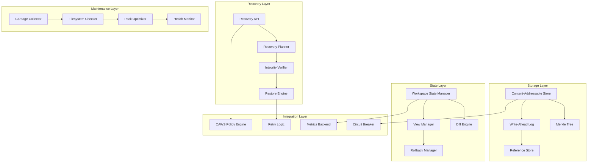

# System Resilience

**Git-like content-addressable storage with workspace state management and rollback capabilities**

The System Resilience crate provides a comprehensive resilience platform that combines content-addressable storage (CAS), Merkle tree integrity verification, crash-safe journaling, workspace state management, and automated recovery mechanisms into a unified system designed for high-reliability AI agent operations.

## Overview

This resilience platform consolidates multiple critical reliability capabilities:

- **Content-Addressable Storage**: Git-like blob storage with BLAKE3 hashing and deduplication
- **Merkle Tree Integrity**: Cryptographic integrity verification for all stored content
- **Crash-Safe Journaling**: WAL (Write-Ahead Logging) with directory fsyncs for atomic operations
- **Workspace State Management**: Stable workspace views with diff tracking and rollback capabilities
- **Automated Recovery**: Intelligent recovery planning and execution with CAWS policy integration
- **Garbage Collection**: Automated cleanup with reference counting and reachability analysis

## Key Features

### 🔐 **Content-Addressable Storage (CAS)**
- **BLAKE3 Hashing**: Cryptographic content addressing with collision resistance
- **Deduplication**: Automatic deduplication of identical content across versions
- **Chunking**: Intelligent content chunking for efficient storage and transfer
- **Compression**: Optional compression for storage efficiency

### 🌳 **Merkle Tree Integrity**
- **Cryptographic Integrity**: Merkle tree verification for all stored objects
- **Tamper Detection**: Immediate detection of content corruption or tampering
- **Incremental Verification**: Efficient verification of large content without full rehashing
- **Proof Generation**: Cryptographic proofs of content authenticity

### 📝 **Crash-Safe Journaling**
- **Write-Ahead Logging**: WAL implementation with atomic commit guarantees
- **Directory Fsync**: Crash-safe directory operations with proper ordering
- **Transaction Support**: ACID-compliant operations with rollback capabilities
- **Recovery Replay**: Automatic journal replay for crash recovery

### 🔄 **Workspace State Management**
- **Stable Views**: Immutable workspace snapshots with version control
- **Diff Tracking**: Efficient change detection and delta computation
- **Rollback Capabilities**: Point-in-time recovery with conflict resolution
- **Concurrent Access**: Multi-writer support with optimistic concurrency control

### 🛡️ **Automated Recovery**
- **Recovery Planning**: Intelligent restore planning with dependency analysis
- **Selective Restoration**: Filtered recovery based on paths, types, or time ranges
- **Integrity Verification**: Pre- and post-recovery integrity checks
- **CAWS Policy Integration**: Constitutional governance of recovery operations

### 🧹 **Garbage Collection**
- **Reference Counting**: Automatic cleanup of unreferenced content
- **Reachability Analysis**: Graph traversal for live object identification
- **Packing Optimization**: Content reorganization for storage efficiency
- **Retention Policies**: Configurable retention periods for different content types

## Architecture



## Quick Start

### 1. Add to Dependencies

```toml
[dependencies]
system-resilience = { path = "../system-resilience" }
```

### 2. Initialize Resilience System

```rust
use system_resilience::*;
use std::path::PathBuf;

#[tokio::main]
async fn main() -> Result<(), Box<dyn std::error::Error>> {
    // Configure resilience system
    let config = ResilienceConfig {
        storage_path: PathBuf::from("./resilience-store"),
        enable_compression: true,
        enable_encryption: false,
        max_blob_size: 100 * 1024 * 1024, // 100MB
        journal_config: JournalConfig {
            enable_wal: true,
            sync_interval_ms: 1000,
            max_log_size: 10 * 1024 * 1024, // 10MB
        },
        workspace_config: WorkspaceConfig {
            enable_state_tracking: true,
            max_concurrent_writers: 10,
            state_retention_days: 30,
        },
    };

    // Initialize resilience store
    let store = ResilienceStore::new(config).await?;

    println!("Resilience system initialized at: {}", config.storage_path.display());

    Ok(())
}
```

### 3. Record and Track Changes

```rust
use system_resilience::*;

// Create a recovery session
let session_meta = SessionMeta {
    description: "Update agent configuration".to_string(),
    author: "agent-orchestrator".to_string(),
    tags: vec!["config".to_string(), "agent".to_string()],
};

let session = store.begin_session(session_meta).await?;

// Record file changes
let changes = vec![
    FileChange {
        path: "config/agents.yaml".into(),
        change_type: ChangeType::Modified,
        content: Some(std::fs::read("config/agents.yaml")?),
        metadata: None,
    },
    FileChange {
        path: "models/new-model.bin".into(),
        change_type: ChangeType::Added,
        content: Some(std::fs::read("models/new-model.bin")?),
        metadata: None,
    },
];

for change in changes {
    let change_id = store.record_change(&session, change).await?;
    println!("Recorded change: {}", change_id);
}

// Create a checkpoint
let commit_id = store.checkpoint(&session, Some("Updated agent config and added new model".to_string())).await?;
println!("Created checkpoint: {}", commit_id);
```

### 4. Perform Recovery Operations

```rust
use system_resilience::*;

// Plan a restore operation
let target_ref = "HEAD~5"; // 5 commits ago
let filters = Some(RestoreFilters {
    globs: vec!["config/*.yaml".to_string()], // Only config files
    exclude_globs: vec!["config/secrets.yaml".to_string()], // Exclude secrets
    date_range: None,
    author_filter: None,
});

let restore_plan = store.plan_restore(target_ref, filters).await?;
println!("Restore plan created:");
println!("  Files to restore: {}", restore_plan.files_to_restore.len());
println!("  Files to delete: {}", restore_plan.files_to_delete.len());
println!("  Estimated size: {} bytes", restore_plan.total_size_bytes);

// Apply the restore
let restore_result = store.apply_restore(restore_plan).await?;
println!("Restore completed:");
println!("  Files restored: {}", restore_result.files_restored);
println!("  Files deleted: {}", restore_result.files_deleted);
println!("  Integrity verified: {}", restore_result.integrity_verified);
```

### 5. Monitor System Health

```rust
use system_resilience::*;

// Run filesystem check
let fsck_scope = FsckScope::Recent { days: 7 };
let fsck_report = store.fsck(fsck_scope).await?;

match fsck_report.status {
    FsckStatus::Ok => println!("✅ Filesystem integrity verified"),
    FsckStatus::IssuesFound => {
        println!("⚠️  Issues found during filesystem check:");
        for issue in &fsck_report.issues {
            println!("  - {}", issue);
        }
    }
    FsckStatus::Failed => println!("❌ Filesystem check failed"),
}

println!("Objects checked: {}", fsck_report.objects_checked);
println!("Refs checked: {}", fsck_report.refs_checked);

// Get recovery metrics
let metrics = store.get_metrics().await?;
println!("Recovery system metrics:");
println!("  Total sessions: {}", metrics.total_sessions);
println!("  Active sessions: {}", metrics.active_sessions);
println!("  Total commits: {}", metrics.total_commits);
println!("  Storage used: {} MB", metrics.storage_used_mb);
```

## Configuration

### Comprehensive Configuration

```rust
let config = ResilienceConfig {
    storage_path: PathBuf::from("./resilience-store"),
    enable_compression: true,
    compression_algorithm: CompressionAlgorithm::Zstd,
    enable_encryption: true,
    encryption_key_path: Some(PathBuf::from("./keys/resilience.key")),
    max_blob_size: 100 * 1024 * 1024, // 100MB

    journal_config: JournalConfig {
        enable_wal: true,
        wal_path: PathBuf::from("./resilience-store/journal"),
        sync_interval_ms: 1000,
        max_log_size: 10 * 1024 * 1024, // 10MB
        enable_compression: true,
        retention_days: 30,
    },

    cas_config: CasConfig {
        chunking_algorithm: ChunkingAlgorithm::RabinKarp,
        chunk_size_target: 64 * 1024, // 64KB
        enable_deduplication: true,
        hash_algorithm: HashAlgorithm::Blake3,
        enable_verification: true,
        verification_sample_rate: 0.1, // 10% sampling
    },

    merkle_config: MerkleConfig {
        tree_fanout: 16,
        enable_incremental_updates: true,
        enable_proof_generation: true,
        proof_cache_size: 1000,
    },

    workspace_config: WorkspaceConfig {
        enable_state_tracking: true,
        max_concurrent_writers: 10,
        state_compression: true,
        state_retention_days: 30,
        enable_diff_tracking: true,
        diff_algorithm: DiffAlgorithm::Myers,
    },

    gc_config: GcConfig {
        enable_automatic_gc: true,
        gc_interval_hours: 24,
        retention_policies: vec![
            RetentionPolicy {
                content_type: ContentType::Config,
                retention_days: 365,
            },
            RetentionPolicy {
                content_type: ContentType::Model,
                retention_days: 90,
            },
        ],
        enable_packing: true,
        pack_compression_level: 6,
    },

    recovery_config: RecoveryConfig {
        enable_recovery_planning: true,
        max_recovery_plan_size: 10000,
        enable_integrity_checks: true,
        recovery_timeout_seconds: 3600,
        enable_caws_integration: true,
    },
};
```

## Content-Addressable Storage

### Blob Storage Operations

```rust
use system_resilience::cas::*;

// Initialize CAS store
let cas_config = CasConfig::default();
let cas_store = ContentAddressableStore::new(cas_config).await?;

// Store content
let content = b"Hello, World! This is some content to store.";
let blob_id = cas_store.store_blob(content).await?;
println!("Content stored with ID: {}", blob_id);

// Retrieve content
let retrieved_content = cas_store.retrieve_blob(&blob_id).await?;
assert_eq!(content, retrieved_content.as_slice());

// Check if content exists
let exists = cas_store.has_blob(&blob_id).await?;
assert!(exists);

// Get blob metadata
let metadata = cas_store.get_blob_metadata(&blob_id).await?;
println!("Blob size: {} bytes", metadata.size);
println!("Compression: {:?}", metadata.compression_ratio);
println!("Created: {:?}", metadata.created_at);
```

### Merkle Tree Integrity

```rust
use system_resilience::merkle::*;

// Create a Merkle tree
let mut tree = MerkleTree::new();

// Add content to the tree
let content1 = b"First piece of content";
let content2 = b"Second piece of content";

tree.add_content(content1).await?;
tree.add_content(content2).await?;

// Get the root hash
let root_hash = tree.root_hash();
println!("Merkle root: {}", hex::encode(root_hash));

// Generate inclusion proof
let proof = tree.generate_proof(0).await?; // Proof for first content
let verified = proof.verify(root_hash, content1)?;
assert!(verified);

// Verify entire tree integrity
let is_valid = tree.verify_integrity().await?;
assert!(is_valid);
```

## Workspace State Management

### State Tracking and Diffs

```rust
use system_resilience::workspace_state::*;

// Create workspace state manager
let workspace_config = WorkspaceConfig {
    enable_state_tracking: true,
    max_concurrent_writers: 5,
    state_compression: true,
    state_retention_days: 30,
};

let state_manager = WorkspaceStateManager::new(
    PathBuf::from("./workspace"),
    workspace_config,
    Box::new(FileStorage::new(PathBuf::from("./workspace-states"), true))
);

// Capture workspace state
let baseline_state = state_manager.capture_state("baseline").await?;
println!("Baseline state captured: {}", baseline_state.id);

// Make some changes to the workspace
std::fs::write("workspace/new-file.txt", "New content")?;
std::fs::remove_file("workspace/old-file.txt")?;

// Capture updated state
let updated_state = state_manager.capture_state("after-changes").await?;

// Compute diff between states
let diff = state_manager.compute_diff(&baseline_state.id, &updated_state.id).await?;
println!("Files changed: {}", diff.changed_files.len());
println!("Files added: {}", diff.added_files.len());
println!("Files deleted: {}", diff.deleted_files.len());

// Show detailed changes
for change in &diff.changed_files {
    println!("Modified: {} (+{} -{} bytes)",
             change.path.display(),
             change.bytes_added,
             change.bytes_removed);
}
```

### Rollback Operations

```rust
use system_resilience::workspace_state::*;

// Create rollback manager
let rollback_manager = RollbackManager::new(state_manager);

// Create a rollback plan
let target_state = "baseline"; // Roll back to baseline state
let rollback_plan = rollback_manager.plan_rollback(target_state).await?;

println!("Rollback plan:");
println!("  Files to restore: {}", rollback_plan.files_to_restore.len());
println!("  Files to delete: {}", rollback_plan.files_to_delete.len());
println!("  Conflicts detected: {}", rollback_plan.conflicts.len());

// Handle conflicts if any
if !rollback_plan.conflicts.is_empty() {
    println!("Conflicts found:");
    for conflict in &rollback_plan.conflicts {
        println!("  {}: {}", conflict.file_path.display(), conflict.conflict_type);
        // Resolve conflicts...
    }
}

// Execute rollback
let rollback_result = rollback_manager.execute_rollback(rollback_plan).await?;
println!("Rollback completed:");
println!("  Files restored: {}", rollback_result.files_restored);
println!("  Files deleted: {}", rollback_result.files_deleted);
println!("  Conflicts resolved: {}", rollback_result.conflicts_resolved);
```

## Recovery Operations

### Selective Recovery

```rust
use system_resilience::*;

// Configure selective recovery
let restore_filters = RestoreFilters {
    globs: vec![
        "config/**/*.yaml".to_string(),
        "models/**/*.bin".to_string(),
    ],
    exclude_globs: vec![
        "config/secrets.yaml".to_string(),
        "**/temp/**".to_string(),
    ],
    date_range: Some(DateRange {
        from: chrono::Utc::now() - chrono::Duration::days(7),
        to: chrono::Utc::now(),
    }),
    author_filter: Some("agent-orchestrator".to_string()),
    content_type_filter: Some(vec![ContentType::Config, ContentType::Model]),
};

// Plan filtered restore
let restore_plan = store.plan_restore("HEAD~1", Some(restore_filters)).await?;

// Analyze the plan
println!("Filtered restore plan:");
println!("  Matching commits: {}", restore_plan.matching_commits.len());
println!("  Files to restore: {}", restore_plan.files_to_restore.len());
println!("  Total size: {} MB", restore_plan.total_size_bytes / 1024 / 1024);

// Execute filtered restore
let restore_result = store.apply_restore(restore_plan).await?;
println!("Filtered restore completed successfully");
```

### Integrity Verification

```rust
use system_resilience::*;

// Run comprehensive integrity check
let fsck_scope = FsckScope::Full;
let fsck_report = store.fsck(fsck_scope).await?;

println!("Filesystem integrity check results:");
println!("  Status: {:?}", fsck_report.status);
println!("  Objects checked: {}", fsck_report.objects_checked);
println!("  Objects corrupted: {}", fsck_report.objects_corrupted);
println!("  Refs checked: {}", fsck_report.refs_checked);
println!("  Refs dangling: {}", fsck_report.refs_dangling);

// Detailed issue analysis
if !fsck_report.issues.is_empty() {
    println!("Issues found:");
    for issue in &fsck_report.issues {
        println!("  - {}", issue);
    }
}

// Attempt automatic repair if possible
if fsck_report.status == FsckStatus::IssuesFound {
    let repair_result = store.attempt_repair().await?;
    println!("Repair attempt:");
    println!("  Issues fixed: {}", repair_result.issues_fixed);
    println!("  Issues remaining: {}", repair_result.issues_remaining);
}
```

## Garbage Collection

### Automated Cleanup

```rust
use system_resilience::gc::*;

// Configure garbage collector
let gc_config = GcConfig {
    enable_automatic_gc: true,
    gc_interval_hours: 24,
    aggressive_mode: false,
    retention_policies: vec![
        RetentionPolicy {
            content_type: ContentType::Config,
            retention_days: 365,
        },
        RetentionPolicy {
            content_type: ContentType::Model,
            retention_days: 90,
        },
        RetentionPolicy {
            content_type: ContentType::Log,
            retention_days: 30,
        },
    ],
};

let gc = GarbageCollector::new(gc_config).await?;

// Run garbage collection
let gc_result = gc.collect().await?;
println!("Garbage collection completed:");
println!("  Objects removed: {}", gc_result.objects_removed);
println!("  Space reclaimed: {} MB", gc_result.space_reclaimed_mb);
println!("  Objects packed: {}", gc_result.objects_packed);

// Get storage statistics
let stats = gc.get_storage_stats().await?;
println!("Storage utilization:");
println!("  Total objects: {}", stats.total_objects);
println!("  Live objects: {}", stats.live_objects);
println!("  Garbage objects: {}", stats.garbage_objects);
println!("  Storage efficiency: {:.1}%", stats.storage_efficiency * 100.0);
```

### Packing Optimization

```rust
use system_resilience::gc::*;

// Configure pack optimizer
let pack_config = PackConfig {
    enable_packing: true,
    pack_compression_level: 6,
    target_pack_size_mb: 100,
    enable_repacking: true,
    repack_threshold_ratio: 0.7, // Repack if < 70% efficient
};

let packer = PackOptimizer::new(pack_config).await?;

// Optimize storage layout
let pack_result = packer.optimize().await?;
println!("Storage optimization completed:");
println!("  Packs created: {}", pack_result.packs_created);
println!("  Packs repacked: {}", pack_result.packs_repacked);
println!("  Space saved: {} MB", pack_result.space_saved_mb);
println!("  Efficiency improvement: {:.1}%",
         (pack_result.new_efficiency - pack_result.old_efficiency) * 100.0);
```

## Performance Characteristics

### Storage Performance

- **Blob Storage**: Sub-millisecond for small blobs, proportional scaling for large content
- **Content Addressing**: BLAKE3 hashing at 1GB/s+ on modern hardware
- **Deduplication**: Near-instantaneous duplicate detection with hash lookup
- **Compression**: Configurable compression ratios with CPU/memory trade-offs

### Recovery Performance

- **Planning Phase**: Sub-second for typical recovery scenarios
- **Integrity Verification**: Proportional to content size, optimized with Merkle trees
- **Restore Operations**: Network/storage bound, with progress tracking
- **Concurrent Operations**: Support for multiple simultaneous recovery sessions

### Workspace Operations

- **State Capture**: Sub-second for typical workspace sizes
- **Diff Computation**: Proportional to changes, optimized with content addressing
- **Rollback Operations**: Time proportional to changes being rolled back
- **Concurrent Writers**: Optimistic concurrency with conflict detection

## Integration Examples

### With Agent Orchestration

```rust
use agent_orchestration::*;
use system_resilience::*;

// Resilient agent orchestration with automatic recovery
pub struct ResilientOrchestrator {
    orchestrator: AgentOrchestrator,
    resilience_store: Arc<ResilienceStore>,
    circuit_breaker: ResilienceCircuitBreaker,
}

impl ResilientOrchestrator {
    pub async fn execute_with_resilience(&self, task: Task) -> Result<TaskResult, Error> {
        // Begin recovery session
        let session = self.resilience_store.begin_session(SessionMeta {
            description: format!("Execute task: {}", task.id),
            author: "resilient-orchestrator".to_string(),
            tags: vec!["task-execution".to_string()],
        }).await?;

        // Record initial state
        self.record_workspace_state(&session, "pre-execution").await?;

        // Execute with circuit breaker protection
        let result = self.circuit_breaker.execute_with_protection(|| async {
            self.orchestrator.execute_task(task.clone()).await
        }).await;

        match result {
            Ok(task_result) => {
                // Record successful execution
                self.record_task_result(&session, &task_result).await?;
                self.resilience_store.checkpoint(&session, Some("Task completed successfully".to_string())).await?;
                Ok(task_result)
            }
            Err(error) => {
                // Record failure and attempt recovery
                self.record_execution_failure(&session, &error).await?;

                // Attempt automatic recovery
                match self.attempt_recovery(&session, &task).await? {
                    RecoveryOutcome::Recovered(recovered_result) => {
                        self.resilience_store.checkpoint(&session, Some("Task recovered automatically".to_string())).await?;
                        Ok(recovered_result)
                    }
                    RecoveryOutcome::Unrecoverable => {
                        self.resilience_store.checkpoint(&session, Some("Task failed permanently".to_string())).await?;
                        Err(error)
                    }
                }
            }
        }
    }

    async fn attempt_recovery(&self, session: &SessionRef, task: &Task) -> Result<RecoveryOutcome, Error> {
        // Implement recovery logic (retry, alternative approaches, etc.)
        todo!("Implement recovery strategies")
    }
}
```

### With Data Infrastructure

```rust
use data_infrastructure::*;
use system_resilience::*;

// Resilient data infrastructure with backup and recovery
pub struct ResilientDataInfrastructure {
    data_infra: DataInfrastructure,
    resilience_store: Arc<ResilienceStore>,
    backup_scheduler: BackupScheduler,
}

impl ResilientDataInfrastructure {
    pub async fn initialize_with_resilience(&mut self) -> Result<(), Error> {
        // Set up automatic backups
        self.backup_scheduler.schedule_backup(BackupSchedule {
            frequency: BackupFrequency::Daily,
            retention_days: 30,
            include_data: true,
            include_schema: true,
            compression_enabled: true,
        }).await?;

        // Set up health monitoring with automatic recovery
        self.setup_health_monitoring().await?;

        Ok(())
    }

    pub async fn perform_resilient_operation<F, Fut, T>(&self, operation: F) -> Result<T, Error>
    where
        F: FnOnce() -> Fut,
        Fut: Future<Output = Result<T, Error>>,
    {
        // Begin resilience session
        let session = self.resilience_store.begin_session(SessionMeta {
            description: "Data operation with resilience".to_string(),
            author: "data-infrastructure".to_string(),
            tags: vec!["data-operation".to_string()],
        }).await?;

        // Record pre-operation state
        self.record_data_state(&session, "pre-operation").await?;

        // Execute operation with retry logic
        let retry_config = RetryConfig {
            max_attempts: 3,
            base_delay_ms: 1000,
            max_delay_ms: 30000,
            backoff_multiplier: 2.0,
        };

        let result = self.retry_with_resilience(operation, retry_config).await;

        match &result {
            Ok(_) => {
                self.resilience_store.checkpoint(&session, Some("Operation completed successfully".to_string())).await?;
            }
            Err(error) => {
                // Record failure state
                self.record_operation_failure(&session, error).await?;

                // Trigger recovery if needed
                self.trigger_recovery(&session).await?;
            }
        }

        result
    }

    async fn trigger_recovery(&self, session: &SessionRef) -> Result<(), Error> {
        // Implement data recovery logic
        let recovery_plan = self.resilience_store.plan_restore("HEAD~1", None).await?;
        self.resilience_store.apply_restore(recovery_plan).await?;
        Ok(())
    }
}
```

## Best Practices

### Content Addressing

1. **Hash Algorithm Selection**: Use BLAKE3 for optimal performance and security
2. **Chunk Size Optimization**: Balance between deduplication and overhead
3. **Compression Strategy**: Enable compression for long-term storage efficiency
4. **Integrity Verification**: Regularly verify stored content integrity

### Recovery Planning

1. **Regular Backups**: Schedule automated backups based on data criticality
2. **Recovery Testing**: Regularly test recovery procedures and validate success
3. **Point-in-Time Recovery**: Maintain sufficient history for flexible recovery
4. **Selective Recovery**: Plan for partial recovery scenarios

### Workspace Management

1. **State Granularity**: Balance state capture frequency with storage overhead
2. **Diff Optimization**: Use efficient diff algorithms for large workspaces
3. **Conflict Resolution**: Implement clear conflict resolution strategies
4. **Retention Policies**: Configure appropriate state retention periods

### Performance Optimization

1. **Concurrent Access**: Design for multiple concurrent readers/writers
2. **Caching Strategy**: Implement intelligent caching for frequently accessed content
3. **Batch Operations**: Use batch operations for bulk storage and retrieval
4. **Resource Pooling**: Pool connections and resources for optimal utilization

## Troubleshooting

### Common Issues

**Storage Corruption**
- Run `fsck` to identify corrupted objects
- Use recovery procedures to restore from backups
- Verify hardware integrity and replace failing components

**Performance Degradation**
- Check storage utilization and run garbage collection
- Analyze access patterns and optimize data layout
- Monitor system resources and scale infrastructure

**Recovery Failures**
- Verify backup integrity before attempting recovery
- Check recovery plan for completeness and consistency
- Review system logs for recovery operation failures

**Workspace Conflicts**
- Implement conflict resolution strategies for concurrent access
- Use optimistic concurrency with proper conflict detection
- Consider workspace isolation for high-conflict scenarios

## Contributing

1. Follow the CAWS workflow for any changes
2. Include comprehensive tests for recovery scenarios
3. Update documentation for new resilience features
4. Run integrity verification tests for storage changes

## License

Licensed under the same terms as the Agent Agency project.

## Related Components

- **agent-orchestration**: Uses resilience for task execution recovery
- **data-infrastructure**: Provides resilient data storage and backup
- **system-observability**: Monitors resilience system health and performance
- **system-quality-security**: Integrates CAWS policies with recovery operations
