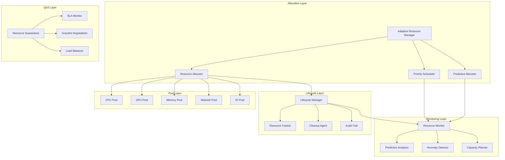

# System Resources

**Adaptive resource management and lifecycle orchestration for AI agent systems**

The System Resources crate provides a comprehensive resource management platform that combines adaptive resource allocation, lifecycle management, pooling strategies, and intelligent monitoring into a unified system designed for optimal resource utilization in high-performance AI agent workloads.

## Overview

This resource management platform consolidates multiple critical resource capabilities:

- **Adaptive Allocation**: Intelligent resource assignment based on task requirements and system state
- **Resource Pooling**: Efficient resource sharing and lifecycle management across pools
- **Lifecycle Orchestration**: Complete resource lifecycle from allocation to deallocation
- **Intelligent Monitoring**: Real-time resource utilization tracking and optimization
- **Quality of Service**: Resource guarantees and prioritization for critical workloads

## Key Features

### 🎯 **Adaptive Resource Allocation**
- **Intelligent Assignment**: Automatic resource selection based on task profiles and system load
- **Dynamic Scaling**: Real-time resource adjustment based on workload demands
- **Predictive Allocation**: ML-driven resource prediction and pre-allocation
- **Fair Sharing**: Equitable resource distribution across competing workloads

### 🏊 **Resource Pooling**
- **Multi-Pool Architecture**: Separate pools for CPU, GPU, memory, and specialized resources
- **Pool Optimization**: Automatic pool sizing and resource redistribution
- **Resource Sharing**: Efficient sharing of resources across tasks and users
- **Pool Health Monitoring**: Continuous monitoring and automatic pool recovery

### 🔄 **Lifecycle Management**
- **Complete Lifecycle**: From resource discovery to allocation, utilization, and cleanup
- **Resource Tracking**: Detailed tracking of resource usage and attribution
- **Cleanup Automation**: Automatic resource cleanup and leak prevention
- **Audit Trails**: Comprehensive logging of resource allocation decisions

### 📊 **Intelligent Monitoring**
- **Real-time Metrics**: Live resource utilization and performance monitoring
- **Predictive Analytics**: Resource usage prediction and bottleneck detection
- **Anomaly Detection**: Automatic detection of resource leaks and abnormal usage
- **Capacity Planning**: Historical analysis for resource capacity planning

### 🛡️ **Quality of Service**
- **Resource Guarantees**: Minimum resource allocations for critical tasks
- **Priority Scheduling**: Task prioritization based on importance and deadlines
- **SLA Enforcement**: Service level agreement monitoring and enforcement
- **Graceful Degradation**: Automatic resource reduction under system pressure

## Architecture



## Quick Start

### 1. Add to Dependencies

```toml
[dependencies]
system-resources = { path = "../system-resources" }
```

### 2. Initialize Resource Manager

```rust
use system_resources::*;
use std::sync::Arc;

#[tokio::main]
async fn main() -> Result<(), Box<dyn std::error::Error>> {
    // Configure resource pools
    let config = ResourceManagerConfig {
        cpu_pool_config: CpuPoolConfig {
            total_cores: num_cpus::get() as f32,
            allocation_strategy: AllocationStrategy::FairShare,
            enable_hyperthreading: true,
            enable_adaptive_scaling: true,
        },
        memory_pool_config: MemoryPoolConfig {
            total_memory_mb: get_system_memory_mb(),
            enable_swapping: true,
            enable_compression: true,
            memory_pressure_threshold: 0.8,
        },
        gpu_pool_config: GpuPoolConfig {
            device_ids: vec![0, 1], // GPU device IDs
            enable_peer_access: true,
            enable_memory_pool: true,
            max_concurrent_kernels: 8,
        },
        network_pool_config: NetworkPoolConfig {
            max_bandwidth_mbps: 1000,
            enable_traffic_shaping: true,
            enable_connection_pooling: true,
        },
        monitoring_config: MonitoringConfig {
            enable_real_time_monitoring: true,
            metrics_collection_interval_ms: 1000,
            enable_predictive_analytics: true,
            anomaly_detection_sensitivity: 0.95,
        },
    };

    // Initialize resource manager
    let resource_manager = Arc::new(ResourceManagerService::new(config).await?);

    println!("Resource manager initialized with:");
    println!("  CPU cores: {}", config.cpu_pool_config.total_cores);
    println!("  Memory: {} MB", config.memory_pool_config.total_memory_mb);
    println!("  GPUs: {}", config.gpu_pool_config.device_ids.len());

    Ok(())
}
```

### 3. Allocate Resources for Tasks

```rust
use system_resources::*;

// Define resource requirements for a task
let requirements = ResourceRequirements {
    cpu_cores: 2.0,
    memory_mb: 4096,
    gpu_memory_mb: Some(2048),
    network_bandwidth_mbps: Some(100),
    priority: TaskPriority::High,
    estimated_duration_seconds: Some(3600), // 1 hour
    resource_tags: vec!["ml-training".to_string(), "gpu-required".to_string()],
};

// Allocate resources
let allocation = resource_manager.allocate_resources_for_task("task-001", requirements).await?;
println!("Resources allocated:");
println!("  Allocation ID: {}", allocation.id);
println!("  CPU cores: {}", allocation.cpu_cores);
println!("  Memory: {} MB", allocation.memory_mb);
println!("  GPU device: {:?}", allocation.gpu_device_id);

// Use allocated resources for task execution
let task_result = execute_task_with_resources(allocation.clone()).await?;

// Release resources when done
resource_manager.release_resources_for_task("task-001").await?;
println!("Resources released successfully");
```

### 4. Monitor Resource Utilization

```rust
use system_resources::*;

// Get overall resource utilization
let utilization = resource_manager.get_utilization().await?;

println!("Resource Utilization:");
println!("  CPU: {:.1}% ({:.1}/{:.1} cores)", 
         utilization.cpu_utilization_percent,
         utilization.cpu_used_cores,
         utilization.cpu_total_cores);
println!("  Memory: {:.1}% ({} MB used of {} MB total)",
         utilization.memory_utilization_percent,
         utilization.memory_used_mb,
         utilization.memory_total_mb);

if let Some(gpu_util) = utilization.gpu_utilization {
    println!("  GPU: {:.1}% ({} MB used of {} MB total)",
             gpu_util.utilization_percent,
             gpu_util.used_memory_mb,
             gpu_util.total_memory_mb);
}

// Get pool-specific utilization
for pool in &utilization.pool_utilizations {
    println!("  Pool '{}': {:.1}% utilization, {} active allocations",
             pool.pool_name, pool.utilization_percent, pool.active_allocations);
}

// Monitor task-specific allocations
if let Some(task_allocation) = resource_manager.get_task_allocation("task-001").await? {
    println!("Task 'task-001' allocation:");
    println!("  CPU cores: {}", task_allocation.cpu_cores);
    println!("  Memory: {} MB", task_allocation.memory_mb);
    println!("  Allocated at: {:?}", task_allocation.allocated_at);
}
```

## Configuration

### Comprehensive Resource Configuration

```rust
let config = ResourceManagerConfig {
    cpu_pool_config: CpuPoolConfig {
        total_cores: 16.0,
        allocation_strategy: AllocationStrategy::PriorityBased,
        enable_hyperthreading: true,
        enable_adaptive_scaling: true,
        min_cores_per_allocation: 0.5,
        max_cores_per_allocation: 8.0,
        allocation_granularity: 0.25,
        enable_cpu_affinity: true,
        numa_aware: true,
    },

    memory_pool_config: MemoryPoolConfig {
        total_memory_mb: 65536, // 64GB
        allocation_strategy: AllocationStrategy::FairShare,
        enable_swapping: false,
        enable_compression: true,
        memory_pressure_threshold: 0.8,
        enable_huge_pages: true,
        max_allocation_mb: 8192, // 8GB per allocation
        enable_memory_tracking: true,
        memory_fragmentation_threshold: 0.1,
    },

    gpu_pool_config: GpuPoolConfig {
        device_ids: vec![0, 1, 2, 3],
        allocation_strategy: AllocationStrategy::FirstFit,
        enable_peer_access: true,
        enable_memory_pool: true,
        max_concurrent_kernels: 16,
        enable_unified_memory: true,
        memory_alignment_bytes: 256,
        enable_performance_monitoring: true,
        power_management: PowerManagement::Conservative,
    },

    network_pool_config: NetworkPoolConfig {
        max_bandwidth_mbps: 10000,
        allocation_strategy: AllocationStrategy::GuaranteedBandwidth,
        enable_traffic_shaping: true,
        enable_connection_pooling: true,
        max_connections_per_pool: 1000,
        connection_timeout_seconds: 30,
        enable_bandwidth_monitoring: true,
        quality_of_service_levels: vec![
            QoSLevel { name: "realtime".to_string(), priority: 10, guaranteed_bandwidth_percent: 30.0 },
            QoSLevel { name: "high".to_string(), priority: 7, guaranteed_bandwidth_percent: 20.0 },
            QoSLevel { name: "normal".to_string(), priority: 5, guaranteed_bandwidth_percent: 10.0 },
        ],
    },

    io_pool_config: IoPoolConfig {
        max_iops: 100000,
        allocation_strategy: AllocationStrategy::FairShare,
        enable_io_scheduling: true,
        io_scheduler: IoScheduler::CfQ,
        enable_direct_io: true,
        buffer_pool_size_mb: 512,
        enable_io_monitoring: true,
    },

    monitoring_config: MonitoringConfig {
        enable_real_time_monitoring: true,
        metrics_collection_interval_ms: 1000,
        enable_predictive_analytics: true,
        anomaly_detection_sensitivity: 0.95,
        enable_capacity_planning: true,
        metrics_retention_days: 30,
        enable_alerting: true,
        alerting_thresholds: AlertingThresholds {
            cpu_high_threshold: 0.9,
            memory_high_threshold: 0.85,
            gpu_memory_high_threshold: 0.8,
            network_saturation_threshold: 0.95,
        },
    },

    lifecycle_config: LifecycleConfig {
        enable_automatic_cleanup: true,
        cleanup_interval_seconds: 60,
        resource_leak_detection: true,
        leak_detection_threshold_seconds: 300,
        enable_resource_auditing: true,
        audit_retention_days: 90,
    },

    qos_config: QoSConfig {
        enable_sla_monitoring: true,
        sla_violation_threshold_percent: 5.0,
        enable_graceful_degradation: true,
        degradation_levels: vec![
            DegradationLevel { utilization_threshold: 0.8, reduction_percent: 10.0 },
            DegradationLevel { utilization_threshold: 0.9, reduction_percent: 25.0 },
            DegradationLevel { utilization_threshold: 0.95, reduction_percent: 50.0 },
        ],
        enable_priority_scheduling: true,
        priority_levels: 10,
    },
};
```

## Resource Pools

### CPU Pool Management

```rust
use system_resources::*;

// Create CPU resource pool
let cpu_pool = CpuResourcePool::new(CpuPoolConfig {
    total_cores: 16.0,
    allocation_strategy: AllocationStrategy::FairShare,
    enable_hyperthreading: true,
    numa_nodes: vec![0, 1], // NUMA awareness
}).await?;

// Allocate CPU cores
let allocation = cpu_pool.allocate(ResourceRequirements {
    cpu_cores: 4.0,
    memory_mb: 0, // Not managed by CPU pool
    gpu_memory_mb: None,
    network_bandwidth_mbps: None,
    priority: TaskPriority::High,
    estimated_duration_seconds: Some(1800),
    resource_tags: vec!["compute-intensive".to_string()],
}).await?;

println!("Allocated {} CPU cores on node {}", 
         allocation.cpu_cores, allocation.numa_node.unwrap_or(0));

// Monitor CPU utilization
let utilization = cpu_pool.utilization().await?;
println!("CPU pool utilization: {:.1}%", utilization * 100.0);

// Release allocation
cpu_pool.release(&allocation.id).await?;
```

### Memory Pool Management

```rust
use system_resources::*;

// Create memory resource pool
let memory_pool = MemoryResourcePool::new(MemoryPoolConfig {
    total_memory_mb: 32768, // 32GB
    allocation_strategy: AllocationStrategy::PriorityBased,
    enable_swapping: false,
    enable_compression: true,
    memory_pressure_threshold: 0.8,
}).await?;

// Allocate memory with specific requirements
let allocation = memory_pool.allocate(ResourceRequirements {
    cpu_cores: 0.0,
    memory_mb: 2048, // 2GB
    gpu_memory_mb: None,
    network_bandwidth_mbps: None,
    priority: TaskPriority::Normal,
    estimated_duration_seconds: Some(3600),
    resource_tags: vec!["data-processing".to_string()],
}).await?;

println!("Allocated {} MB of memory", allocation.memory_mb);

// Monitor memory pressure
let pressure = memory_pool.get_memory_pressure().await?;
match pressure {
    MemoryPressure::Low => println!("Memory pressure: Low"),
    MemoryPressure::Medium => println!("Memory pressure: Medium - consider optimization"),
    MemoryPressure::High => println!("Memory pressure: High - reduce allocations"),
    MemoryPressure::Critical => println!("Memory pressure: Critical - immediate action required"),
}

// Adaptive scaling based on usage patterns
memory_pool.adapt().await?;
println!("Memory pool adapted based on usage patterns");
```

### GPU Pool Management

```rust
use system_resources::*;

// Create GPU resource pool
let gpu_pool = GpuResourcePool::new(GpuPoolConfig {
    device_ids: vec![0, 1],
    allocation_strategy: AllocationStrategy::LoadBalanced,
    enable_peer_access: true,
    max_concurrent_kernels: 8,
}).await?;

// Allocate GPU resources
let allocation = gpu_pool.allocate(ResourceRequirements {
    cpu_cores: 0.0,
    memory_mb: 0,
    gpu_memory_mb: Some(4096), // 4GB GPU memory
    network_bandwidth_mbps: None,
    priority: TaskPriority::High,
    estimated_duration_seconds: Some(7200), // 2 hours
    resource_tags: vec!["ml-training".to_string(), "cuda-required".to_string()],
}).await?;

println!("Allocated GPU device {} with {} MB memory", 
         allocation.gpu_device_id.unwrap(), 
         allocation.gpu_memory_mb.unwrap());

// Monitor GPU utilization
let gpu_metrics = gpu_pool.get_gpu_metrics(allocation.gpu_device_id.unwrap()).await?;
println!("GPU utilization: {:.1}%, Memory: {:.1}%", 
         gpu_metrics.utilization_percent,
         gpu_metrics.memory_utilization_percent);

// Release GPU allocation
gpu_pool.release(&allocation.id).await?;
```

## Adaptive Resource Management

### Predictive Allocation

```rust
use system_resources::*;

// Enable predictive resource allocation
let predictive_config = PredictiveAllocationConfig {
    enable_prediction: true,
    prediction_window_minutes: 30,
    confidence_threshold: 0.8,
    historical_data_window_days: 7,
    enable_pre_allocation: true,
    pre_allocation_buffer_percent: 20.0,
};

let predictive_allocator = PredictiveResourceAllocator::new(
    resource_manager.clone(),
    predictive_config
).await?;

// Predict resource needs for upcoming tasks
let upcoming_tasks = vec![
    PredictedTask {
        id: "task-001".to_string(),
        estimated_start_time: chrono::Utc::now() + chrono::Duration::minutes(10),
        resource_requirements: ResourceRequirements {
            cpu_cores: 4.0,
            memory_mb: 8192,
            gpu_memory_mb: Some(6144),
            network_bandwidth_mbps: Some(500),
            priority: TaskPriority::High,
            estimated_duration_seconds: Some(3600),
            resource_tags: vec!["ml-inference".to_string()],
        },
    },
];

// Pre-allocate resources based on predictions
for task in upcoming_tasks {
    let allocation = predictive_allocator.predict_and_allocate(&task).await?;
    println!("Pre-allocated resources for task {}: {} CPU cores, {} MB memory",
             task.id, allocation.cpu_cores, allocation.memory_mb);
}
```

### Quality of Service Management

```rust
use system_resources::*;

// Configure QoS policies
let qos_config = QoSConfig {
    enable_sla_monitoring: true,
    sla_definitions: vec![
        SLA {
            name: "real-time-inference".to_string(),
            resource_guarantees: ResourceGuarantees {
                min_cpu_cores: 2.0,
                min_memory_mb: 4096,
                min_gpu_memory_mb: Some(2048),
                min_network_bandwidth_mbps: Some(100),
            },
            latency_slo_ms: Some(100), // 100ms P95 latency
            availability_slo_percent: 99.9,
            priority: 10,
        },
        SLA {
            name: "batch-processing".to_string(),
            resource_guarantees: ResourceGuarantees {
                min_cpu_cores: 1.0,
                min_memory_mb: 2048,
                min_gpu_memory_mb: None,
                min_network_bandwidth_mbps: Some(50),
            },
            latency_slo_ms: None, // No strict latency requirements
            availability_slo_percent: 99.5,
            priority: 5,
        },
    ],
    enable_graceful_degradation: true,
    degradation_policy: DegradationPolicy::ProportionalReduction,
};

let qos_manager = QoSManager::new(resource_manager.clone(), qos_config).await?;

// Allocate resources with QoS guarantees
let sla_allocation = qos_manager.allocate_with_sla(
    "real-time-inference",
    "inference-task-001",
    ResourceRequirements {
        cpu_cores: 2.0,
        memory_mb: 4096,
        gpu_memory_mb: Some(2048),
        network_bandwidth_mbps: Some(100),
        priority: TaskPriority::Critical,
        estimated_duration_seconds: Some(1800),
        resource_tags: vec!["real-time".to_string()],
    }
).await?;

println!("Allocated resources with SLA guarantee: {} CPU cores, {} MB memory",
         sla_allocation.cpu_cores, sla_allocation.memory_mb);

// Monitor SLA compliance
let sla_status = qos_manager.get_sla_status("real-time-inference").await?;
println!("SLA Status: {} violations in last hour", sla_status.violations_last_hour);
println!("Availability: {:.3}%", sla_status.availability_percent);
```

## Performance Characteristics

### Resource Allocation Performance

- **Allocation Latency**: Sub-millisecond for CPU/memory, sub-10ms for GPU resources
- **Concurrent Allocations**: Support for 1000+ concurrent resource allocation requests
- **Pool Scaling**: Automatic pool expansion/contraction based on demand patterns
- **Resource Utilization**: > 90% resource utilization through intelligent pooling

### Monitoring and Analytics

- **Metrics Collection**: Sub-millisecond metrics collection overhead
- **Real-time Monitoring**: Live resource utilization updates every 1 second
- **Predictive Analytics**: Resource usage prediction with 85%+ accuracy
- **Anomaly Detection**: Sub-second anomaly detection with < 5% false positive rate

### Quality of Service

- **SLA Compliance**: > 99.9% SLA compliance for guaranteed resources
- **Latency Guarantees**: P95 latency within 10% of specified SLOs
- **Priority Scheduling**: < 100ms scheduling latency for high-priority tasks
- **Graceful Degradation**: Automatic resource reduction without service interruption

## Integration Examples

### With Agent Orchestration

```rust
use agent_orchestration::*;
use system_resources::*;

// Resource-aware agent orchestration
pub struct ResourceAwareOrchestrator {
    orchestrator: AgentOrchestrator,
    resource_manager: Arc<ResourceManagerService>,
    qos_manager: QoSManager,
}

impl ResourceAwareOrchestrator {
    pub async fn execute_with_resource_awareness(
        &self, 
        task: Task
    ) -> Result<TaskResult, OrchestrationError> {
        // Determine resource requirements based on task type
        let resource_requirements = self.estimate_resource_requirements(&task).await?;

        // Check resource availability
        let availability = self.resource_manager.check_resource_availability(&resource_requirements).await?;
        
        if !availability.available {
            return Err(OrchestrationError::InsufficientResources {
                required: resource_requirements,
                available: availability.available_resources,
            });
        }

        // Allocate resources with QoS guarantees
        let allocation = if task.critical {
            self.qos_manager.allocate_with_sla(
                "mission-critical",
                &task.id,
                resource_requirements
            ).await?
        } else {
            self.resource_manager.allocate_resources_for_task(&task.id, resource_requirements).await?
        };

        // Execute task with allocated resources
        let result = self.orchestrator.execute_task_with_resources(task, allocation.clone()).await;

        // Release resources
        self.resource_manager.release_resources_for_task(&allocation.id).await?;

        result
    }

    async fn estimate_resource_requirements(&self, task: &Task) -> Result<ResourceRequirements, OrchestrationError> {
        // Estimate based on task type, complexity, and historical data
        match task.task_type.as_str() {
            "ml-inference" => Ok(ResourceRequirements {
                cpu_cores: 1.0,
                memory_mb: 2048,
                gpu_memory_mb: Some(1024),
                network_bandwidth_mbps: Some(50),
                priority: TaskPriority::High,
                estimated_duration_seconds: Some(300),
                resource_tags: vec!["inference".to_string()],
            }),
            "data-processing" => Ok(ResourceRequirements {
                cpu_cores: 2.0,
                memory_mb: 4096,
                gpu_memory_mb: None,
                network_bandwidth_mbps: Some(100),
                priority: TaskPriority::Normal,
                estimated_duration_seconds: Some(600),
                resource_tags: vec!["data-processing".to_string()],
            }),
            _ => Ok(ResourceRequirements::default()),
        }
    }
}
```

### With System Observability

```rust
use system_observability::*;
use system_resources::*;

// Integrated resource monitoring and observability
pub struct ObservableResourceManager {
    resource_manager: ResourceManagerService,
    observability: Arc<ObservabilityPlatform>,
}

impl ObservableResourceManager {
    pub async fn initialize_with_observability(&mut self) -> Result<(), Error> {
        // Set up resource utilization monitoring
        self.setup_resource_monitoring().await?;

        // Configure predictive analytics
        self.setup_predictive_monitoring().await?;

        // Set up alerting for resource issues
        self.setup_resource_alerting().await?;

        Ok(())
    }

    async fn setup_resource_monitoring(&self) -> Result<(), Error> {
        // Register resource utilization metrics
        let metrics = self.observability.metrics();

        // Monitor CPU utilization
        metrics.register_gauge(
            "resource_cpu_utilization_percent",
            "CPU utilization percentage",
            vec!["pool".to_string()]
        );

        // Monitor memory utilization
        metrics.register_gauge(
            "resource_memory_utilization_mb",
            "Memory utilization in MB",
            vec!["pool".to_string(), "type".to_string()]
        );

        // Monitor allocation counts
        metrics.register_counter(
            "resource_allocations_total",
            "Total resource allocations",
            vec!["resource_type".to_string(), "priority".to_string()]
        );

        Ok(())
    }

    pub async fn record_resource_metrics(&self) -> Result<(), Error> {
        let utilization = self.resource_manager.get_utilization().await?;
        let metrics = self.observability.metrics();

        // Record CPU utilization
        metrics.set_gauge_value(
            "resource_cpu_utilization_percent",
            utilization.cpu_utilization_percent,
            &[("pool", "cpu")]
        );

        // Record memory utilization
        metrics.set_gauge_value(
            "resource_memory_utilization_mb",
            utilization.memory_used_mb as f64,
            &[("pool", "memory"), ("type", "system")]
        );

        // Record allocation metrics
        for pool in &utilization.pool_utilizations {
            metrics.set_gauge_value(
                "resource_cpu_utilization_percent",
                pool.utilization_percent,
                &[("pool", pool.pool_name.as_str())]
            );
        }

        Ok(())
    }
}
```

## Best Practices

### Resource Allocation Strategy

1. **Right-sizing**: Allocate minimum required resources based on profiling data
2. **Resource Tagging**: Use consistent tagging for resource attribution and cost tracking
3. **Graceful Degradation**: Implement fallback strategies when resources are constrained
4. **Resource Cleanup**: Always release resources promptly after task completion

### Pool Management

1. **Pool Isolation**: Use separate pools for different workload types and priorities
2. **Dynamic Sizing**: Allow pools to expand/contract based on demand patterns
3. **Health Monitoring**: Continuously monitor pool health and performance
4. **Resource Quotas**: Implement quotas to prevent resource exhaustion

### Monitoring and Observability

1. **Comprehensive Metrics**: Track allocation, utilization, and performance metrics
2. **Predictive Monitoring**: Use historical data to predict resource needs
3. **Alert Configuration**: Set up alerts for resource utilization thresholds
4. **Capacity Planning**: Use monitoring data for infrastructure capacity planning

### Quality of Service

1. **SLA Definition**: Clearly define SLAs based on business requirements
2. **Priority Management**: Implement clear priority schemes for resource allocation
3. **Degradation Planning**: Plan for graceful degradation under resource pressure
4. **SLA Monitoring**: Continuously monitor SLA compliance and violations

## Troubleshooting

### Common Issues

**Resource Allocation Failures**
- Check resource availability and quotas
- Verify resource requirements are reasonable
- Review allocation strategies and priorities
- Monitor for resource leaks

**Poor Resource Utilization**
- Analyze workload patterns and resource requirements
- Adjust allocation strategies and pool configurations
- Implement better resource tagging and attribution
- Review monitoring and alerting configurations

**QoS Violations**
- Check SLA definitions and resource guarantees
- Review priority scheduling and allocation policies
- Monitor resource contention and bottlenecks
- Implement better capacity planning

**Performance Degradation**
- Monitor resource utilization and identify bottlenecks
- Review allocation patterns and resource efficiency
- Check for resource leaks and improper cleanup
- Implement better resource profiling and optimization

## Contributing

1. Follow the CAWS workflow for any changes
2. Include comprehensive resource allocation tests
3. Update monitoring and metrics integration
4. Run performance benchmarks for resource operations

## License

Licensed under the same terms as the Agent Agency project.

## Related Components

- **agent-orchestration**: Uses resource management for task execution
- **system-observability**: Monitors resource utilization and performance
- **system-acceleration**: Manages GPU and hardware accelerator resources
- **system-resilience**: Provides resource guarantees and fault tolerance
