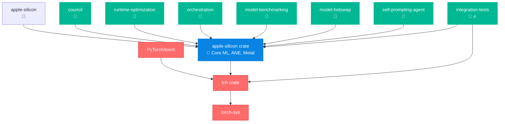

# Torch/Apple Silicon Dependency Graph

## Mermaid Diagram

## Detailed Analysis

🔍 AGENT AGENCY V3 TORCH/APPLE SILICON DEPENDENCY ANALYSIS
======================================================================

📋 WORKSPACE-LEVEL TORCH DEPENDENCIES:
----------------------------------------
  📦 tch
  📦 torch-sys

🍎 APPLE SILICON DEPENDENCY CHAIN:
----------------------------------------
  └─ apple-silicon 
  └─ council 
  └─ runtime-optimization 
  └─ orchestration 
  └─ model-benchmarking 
  └─ model-hotswap 
  └─ self-prompting-agent 
  └─ integration-tests 🔥

🔥 DIRECT TORCH USERS:
-------------------------
  ┌─ integration-tests
  │  └─ uses tch

⚠️  CRITICAL RISK ANALYSIS:
------------------------------
  ✅ 8 crates depend on apple-silicon
  ✅ 3 torch dependencies found

🎯 TORCH + APPLE SILICON INTEGRATION:
----------------------------------------
  🔗 integration-tests (uses both torch and apple-silicon)

💡 PROTECTION STRATEGIES:
-------------------------
  1. Never disable apple-silicon crate in workspace
  2. Keep torch workspace dependencies intact
  3. Monitor dependency chains during refactoring
  4. Test torch features before major changes
  5. 8 crates would break if apple-silicon is disabled